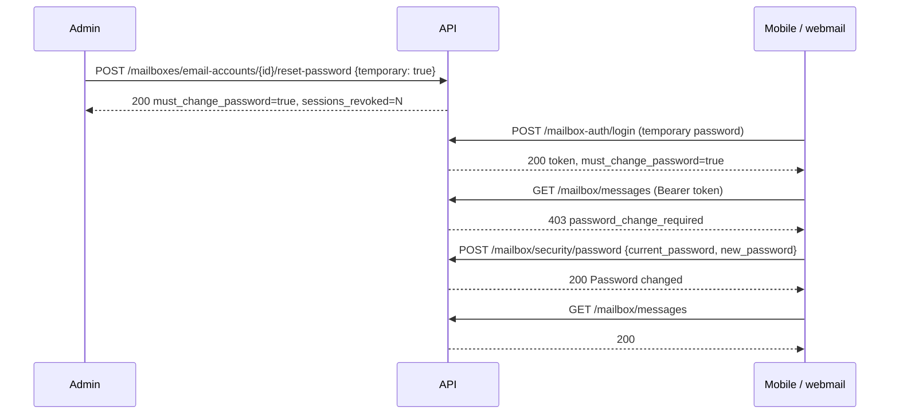

# Mailbox Authentication & Security

The credential surface for **mailbox holders** -- the people who own a
`user@domain` address and use the webmail or the mobile app. It is the third
credential tier (alongside API keys / dashboard sessions and operator sessions)
and deliberately shares nothing with the other two: its own table
(`mailbox_sessions`), its own cookie names, its own lockout bucket.

| Module | Mounted at | Auth |
|---|---|---|
| `worker/api/routes/mailbox_auth.py` | `/api/v1/mailbox-auth` | none (sign-in) / mailbox session (sign-out) |
| `worker/api/routes/mailbox_password.py` | `/api/v1/mailbox` | mailbox session, **including one carrying a temporary password** |
| `worker/api/routes/mailbox.py` (`/security*`) | `/api/v1/mailbox` | mailbox session |
| `worker/api/routes/mailboxes.py` (`/email-accounts/{id}/reset-password`) | `/api/v1/mailboxes` | API key / dashboard session (`write`) -- the admin side |

Passwords are **never checked against a stored copy**. Sign-in and password
change both verify by IMAP LOGIN against Dovecot, so the API can never disagree
with what a mail client would accept.

## Presenting the session

Two transports, chosen per request:

| Transport | When | CSRF |
|---|---|---|
| `Authorization: Bearer <token>` | Server-side callers (the webmail BFF) and native apps | not applicable |
| `mailyte_mailbox_session` cookie | A browser talking to the API directly | `X-CSRF-Token` must echo the `mailyte_mailbox_csrf` cookie on every non-GET |

Every `/api/v1/mailbox/*` route resolves the session first and answers one of:

| Status | `error_code` | Meaning |
|---|---|---|
| `401` | -- | No token, or the session is expired / revoked / for a non-active mailbox |
| `403` | `mfa_required` | Password step passed, TOTP code not yet presented |
| `403` | `password_change_required` | The mailbox carries a temporary password. Only `POST /api/v1/mailbox/security/password` and `POST /api/v1/mailbox-auth/logout` are reachable until a new one is set |

Both `403`s are checked in that order: a temporary password is never a way
around a second factor.

## Sign in

```
POST /api/v1/mailbox-auth/login
```

Unauthenticated by design; rate-limited by IP and by address (a separate
lockout bucket from the dashboard's, so failed webmail sign-ins cannot lock an
unrelated dashboard account).

**Headers**

| Header | Required | Description |
|---|---|---|
| `X-Client-Platform` | No | `ios`, `android`, `macos`, `windows`, `linux` or `web`. Case-insensitive. Native values select the **native session lifetimes** (below). Absent or unrecognised is treated as `web` and echoed back as `null` |
| `X-Forwarded-For` | -- | Set by the edge proxy; the first hop is the client IP for the lockout and the session record |

**Body**

| Field | Type | Required | Description |
|---|---|---|---|
| `email_address` | string | Yes | The mailbox address |
| `password` | string | Yes | Verified by IMAP LOGIN against Dovecot |
| `two_factor_code` | string | No | Supplied on the second attempt after a `two_factor_required` response |

**Two-factor prompt.** If the mailbox has 2FA enabled, the first successful
password check answers `200` with `data: {"two_factor_required": true}` and
**no session**; retry with `two_factor_code`. A wrong code is reported exactly
like a wrong password.

**Example response**

```json
{
  "type": "success",
  "msg": "Signed in",
  "data": {
    "token": "S3cUr3...",
    "csrf_token": "c5rf...",
    "expires_at": "2027-02-27T09:14:02.118377+00:00",
    "email_address": "ada@acme.com",
    "email_account": {"id": "01J1ACC0000000000000000000", "email_address": "ada@acme.com", "name": "Ada"},
    "must_change_password": false,
    "password_change_reason": null,
    "client_platform": "ios",
    "idle_timeout_seconds": 2592000
  }
}
```

| Field | Description |
|---|---|
| `token` | The session token. Server-side callers hold it and replay it as `Authorization: Bearer`; a browser using the cookies can ignore it |
| `csrf_token` | Also set as the `mailyte_mailbox_csrf` cookie |
| `expires_at` | The **absolute** expiry, timezone-aware ISO-8601. The session may end earlier through idleness |
| `idle_timeout_seconds` | This session's idle window. Any authenticated request extends the expiry by this much, never past `expires_at` |
| `must_change_password` | `true` when the account carries a temporary password. The session is issued, but only the password endpoint and sign-out will accept it -- route straight to your "choose a new password" screen |
| `password_change_reason` | `temporary`, `admin_reset` or `expired` when a change is required; otherwise `null` |
| `client_platform` | What the server recognised from `X-Client-Platform` (`null` = treated as web). A misspelt header is visible here |

The cookies, when set, carry the same absolute lifetime as the row.

**Errors**

| Status | `msg` | Meaning |
|---|---|---|
| `401` | `Invalid email or password` | Unknown address, inactive mailbox, wrong password, or wrong 2FA code -- deliberately indistinguishable |
| `429` | `Too many failed attempts. Try again later.` | Lockout (IP or address dimension) |
| `502` | `Mail server unavailable` | Dovecot unreachable; the password was **not** checked |

## Session lifetimes

| Client | Idle | Absolute | Env override |
|---|---|---|---|
| Browser (`web`, or no header) | 8 hours | 7 days | -- (fixed) |
| Native (`ios` `android` `macos` `windows` `linux`) | 30 days | 180 days | `MAILBOX_NATIVE_SESSION_IDLE_DAYS`, `MAILBOX_NATIVE_SESSION_ABSOLUTE_DAYS` (whole days, >= 1; invalid values fall back to the defaults and log a warning) |

The idle window is decided once, at sign-in, and **stored on the session row**
(`mailbox_sessions.idle_timeout_seconds`). Every authenticated request slides
`expires_at` forward by the stored window, capped by the absolute expiry. Rows
created before migration `0021` carry the 8-hour default.

## Sign out

```
POST /api/v1/mailbox-auth/logout
```

Revokes the session server-side (the row is kept, marked revoked, so the
sessions list can still show it) and clears both cookies. Idempotent. Works for
a session parked at the two-factor prompt **and** for one parked at the
forced-password-change screen.

## Change password (the holder's own)

```
POST /api/v1/mailbox/security/password
```

| Field | Type | Required | Description |
|---|---|---|---|
| `current_password` | string | Yes | Re-verified by IMAP LOGIN against Dovecot, exactly as sign-in does |
| `new_password` | string | Yes | Must pass the platform policy: **at least 12 characters, letters and numbers, not on the common-password list** |

What happens, in order:

1. `new_password` is checked against the policy (no network work yet).
2. The lockout is consulted -- failed `current_password` attempts share the
   sign-in bucket, so a stolen session guessing here locks the sign-in too.
3. `current_password` is verified against Dovecot.
4. The new bcrypt hash is written; `must_change_password` is cleared,
   `password_change_reason` is nulled, `password_changed_at` is stamped.
5. **Every other session** of this mailbox is revoked. The calling session
   stays signed in.
6. Dovecot's auth cache is flushed for the address, so IMAP/SMTP honour the
   new password immediately rather than after the 1-hour cache TTL.

**Response**

```json
{"type": "success", "msg": "Password changed", "data": {"sessions_revoked": 2, "cache_flushed": true}}
```

`cache_flushed: false` means the flush call failed (logged); the password is
changed regardless and mail clients pick it up within the cache TTL.

**Errors**

| Status | `error_code` | `msg` |
|---|---|---|
| `401` | `wrong_password` | `Current password is incorrect` |
| `409` | `password_reused` | `New password must be different from the current one` |
| `422` | `weak_password` | The actual failing rule, e.g. `Password must be at least 12 characters long` |
| `429` | -- | `Too many failed attempts. Try again later.` |
| `502` | -- | `Mail server unavailable` -- nothing was changed |

This is the only `/api/v1/mailbox/*` route (besides sign-out) that accepts a
session whose account has `must_change_password = true`.

## Temporary passwords and forced change

An administrator resets a mailbox password from the org-admin API:

```
POST /api/v1/mailboxes/email-accounts/{account_id}/reset-password
```

| Field | Type | Default | Description |
|---|---|---|---|
| `new_password` | string | -- | Same 12-character policy. `400` with `error_code: weak_password` otherwise |
| `temporary` | boolean | `false` | Force the holder to choose their own password at next sign-in |
| `reason` | string | `temporary` | Recorded as `password_change_reason` when `temporary` is true: `temporary` (onboarding hand-over) or `admin_reset` (support-driven). Ignored otherwise |

Org-scoped like its neighbours: a tenant credential may only reset its own
mailboxes and a cross-org id is `404`. Every reset -- temporary or not --
bcrypt-hashes the password, **revokes all of the mailbox's sessions**, flushes
Dovecot's auth cache and emits `mailbox.password.changed`.

```json
{
  "type": "success",
  "msg": "Password reset",
  "data": {
    "account_id": "01J1ACC0000000000000000000",
    "email": "ada@acme.com",
    "must_change_password": true,
    "password_change_reason": "temporary",
    "password_changed_at": "2026-08-31T09:14:02.118377",
    "sessions_revoked": 1,
    "cache_flushed": true
  }
}
```

The flow a client sees after a temporary reset:



`must_change_password`, `password_change_reason` and `password_changed_at` are
also returned in the email-account objects of the org-admin API, so a dashboard
can show which mailboxes still hold a temporary password.

## Security state

```
GET /api/v1/mailbox/security
```

```json
{
  "type": "success",
  "msg": "Security retrieved successfully",
  "data": {
    "two_factor_enabled": true,
    "two_factor_confirmed_at": "2026-08-31T12:30:00",
    "two_factor_pending": false,
    "recovery_codes_remaining": 8,
    "protects": "webmail_sign_in_only"
  }
}
```

| Field | Description |
|---|---|
| `two_factor_enabled` | `/2fa/confirm` has succeeded and 2FA gates sign-in |
| `two_factor_confirmed_at` | When `/2fa/confirm` last succeeded. **`null` until then** -- starting an enrolment does not set it. Cleared by `/2fa/disable` |
| `two_factor_pending` | `/2fa/begin` was called but `/2fa/confirm` has not succeeded (the QR was shown, nothing more). Calling `/2fa/begin` again replaces the pending secret |
| `recovery_codes_remaining` | Unused recovery codes. **`0` until the enrolment is confirmed** -- codes generated at `/begin` protect nothing until then |
| `protects` | Always `webmail_sign_in_only`: mailbox 2FA gates the webmail/mobile sign-in, never IMAP or SMTP. Do not overclaim it in the UI |

### Two-factor enrolment

| Endpoint | Body | Returns |
|---|---|---|
| `POST /api/v1/mailbox/security/2fa/begin` | -- | `data: {secret, qr_code_svg, recovery_codes[]}` -- show the QR and the codes once. Not active yet |
| `POST /api/v1/mailbox/security/2fa/confirm` | `{code}` | `data: {two_factor_enabled: true, two_factor_confirmed_at}`. `422` if the code does not match; nothing is recorded on failure |
| `POST /api/v1/mailbox/security/2fa/disable` | `{code}` | `data: {two_factor_enabled: false}`. Requires a current code or recovery code, so a borrowed session cannot remove it |

### Sessions

```
GET /api/v1/mailbox/security/sessions
```

The mailbox's 50 most recent sessions, newest first:

```json
{
  "id": "01J1SES0000000000000000000",
  "signed_in_at": "2026-08-31T09:14:02",
  "expires_at": "2026-09-30T09:14:02",
  "ip_address": "203.0.113.5",
  "user_agent": "Mailyte iOS/1.0",
  "client_platform": "ios",
  "idle_timeout_seconds": 2592000,
  "revoked": false,
  "active": true,
  "current": true
}
```

`client_platform` is what the client declared at sign-in (`null` when it said
nothing recognisable); `idle_timeout_seconds` is why a native session's
`expires_at` sits weeks out while a browser's sits hours out. `current` marks
the session making the request -- do not offer "sign out this device" for it.

```
DELETE /api/v1/mailbox/security/sessions/{session_id}
```

Revokes one other session. `409 cannot_revoke_current` for the caller's own
(use sign-out); `404` for an id that is not this mailbox's.

## `error_code` registry for this surface

| `error_code` | Status | Where |
|---|---|---|
| `mfa_required` | `403` | Any `/api/v1/mailbox/*` route, session awaiting its TOTP code |
| `password_change_required` | `403` | Any `/api/v1/mailbox/*` route except the password endpoint and sign-out, account carrying a temporary password |
| `wrong_password` | `401` | `POST /security/password`, Dovecot refused `current_password` |
| `password_reused` | `409` | `POST /security/password`, new password equals the current |
| `weak_password` | `422` / `400` | `POST /security/password` (422) and the admin reset (400): `msg` is the failing rule |
| `cannot_revoke_current` | `409` | `DELETE /security/sessions/{id}` on the caller's own session |

## Operator notes

* **Migration `0023_mailbox_password_policy`** adds `email_accounts.must_change_password / password_change_reason / password_changed_at / two_factor_confirmed_at` and `mailbox_sessions.client_platform / idle_timeout_seconds`. Run it **before** deploying this API version: the session resolver and the login query name those columns. Rebuild the `migrate` image first -- it goes stale and silently no-ops on old code.
* Every credential change here flushes Dovecot's auth cache through the doveadm HTTP API (`DOVEADM_URL`, `DOVEADM_API_KEY`). Without the key the change still lands but IMAP/SMTP honour it only after `auth_cache_ttl` (1 hour), and responses report `cache_flushed: false`.
* Native lifetimes: `MAILBOX_NATIVE_SESSION_IDLE_DAYS` (default 30) and `MAILBOX_NATIVE_SESSION_ABSOLUTE_DAYS` (default 180). Browser lifetimes are fixed in code.
* A forced change is enforced by the session resolver, so it covers every present and future `/api/v1/mailbox/*` route automatically; only the two exempt routes opt out, by using a differently built dependency (`require_mailbox_for_password_change`, `require_mailbox_for_logout` in `worker/api/utils/mailbox_auth.py`).
