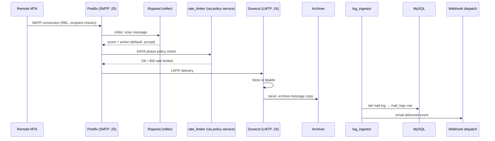
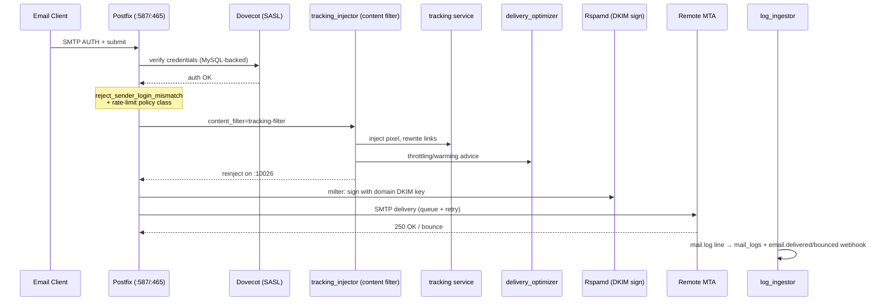

# Data Flow

How an email actually travels through Mailyte — from the moment it hits the wire to the moment it lands in a mailbox (or leaves one). Verified against `mailer/postfix/config/main.cf`, `master.cf`, and the compose files, current as of 2026-08-30.

---

## Inbound Email (Receiving)

When someone on the internet sends an email to one of your hosted domains:

1. **DNS lookup**: The sender's mail server looks up your domain's MX record, which points to your Mailyte instance.
2. **SMTP connection**: The remote server connects to Postfix on port 25. Client restrictions run first — RBL checks (`zen.spamhaus.org`), pipelining rejection.
3. **Recipient validation**: Postfix queries MySQL live — is this domain in `domains`? Is the recipient a real mailbox or an alias? Then the per-org IP access policy (`ip_access_policy.py`, a Unix policy service inside the Postfix container) runs.
4. **Rspamd filtering**: The milter (`inet:rspamd:11332`) runs SPF, DKIM and DMARC verification, Bayesian scoring, and custom rules. `milter_default_action = accept` — if Rspamd is down, mail flows unscanned rather than deferring. (ClamAV antivirus is present in the Rspamd config but disabled — no ClamAV container is deployed.)
5. **Rate limiting at DATA**: The rate-limit policy service (`rate_limit_policy.py`, which calls the `rate_limiter` service over HTTP) runs at the SMTP **DATA phase and nowhere else** on the inbound path — it once ran in three restriction lists at once, triple-counted every message, and deferred essentially all inbound mail. Over-limit senders get a `450`.
6. **Local delivery over LMTP**: Postfix hands the message to Dovecot via LMTP (`virtual_transport = lmtp:inet:dovecot:24`), which stores it in the recipient's Maildir under `/var/mail/vhosts`.
7. **Archive on delivery**: Dovecot's global Sieve pipes every delivered message to `archive-message`, which POSTs it to the `archiver` service (age-encrypted, written to S3, spooled locally if S3 is unreachable).
8. **Logging & webhooks, after the fact**: `log_ingestor` tails Postfix's log and writes per-message rows to `mail_logs`, dispatching `email.delivered` / `email.bounced` / `email.deferred` / `email.rejected` webhooks as delivery lines appear.

!!! warning "No sender-login check on port 25 — on purpose"
    `reject_sender_login_mismatch` is enforced only on the authenticated submission ports (587/465). Adding it to the global sender restrictions once rejected **all** inbound mail from any sender who owned a local mailbox (production outage, fixed 2026-08-22). Port 25 carries unauthenticated mail by definition.

## Outbound Email (Sending)

When a user's email client sends through Mailyte:

1. **Authentication**: The client connects to Postfix on 587 (STARTTLS) or 465 (implicit TLS). Postfix delegates SASL auth to Dovecot (`smtpd_sasl_type = dovecot`), which checks MySQL — mailbox passwords or per-key SMTP credentials.
2. **Sender ownership**: `reject_sender_login_mismatch` runs **before** `permit_sasl_authenticated` on 587/465 — you cannot authenticate as one account and send as an address you don't own.
3. **Rate limiting**: The submission service applies the same rate-limit policy check via a named restriction class.
4. **Tracking content filter**: Submission ports carry `content_filter=tracking-filter:` — `tracking_injector.py` (inside the Postfix container) calls the `tracking` service to inject the open pixel and rewrite links, consults `delivery_optimizer`, hands the archiver an outbound copy, then reinjects the message on the loopback listener (10026).
5. **DKIM signing**: **Rspamd** (not Postfix) signs the message with the sending domain's private key via the milter.
6. **Queue & delivery**: The message enters Postfix's spool (a named volume — queued mail survives container recreation), the MX is resolved, and delivery is attempted with normal Postfix retry/backoff.
7. **Logging & webhooks**: `log_ingestor` turns the delivery/bounce/deferral log lines into `mail_logs` rows and webhook events.

## API / Webmail-Initiated Email

When the webmail or an API client sends through the gateway:

1. **API request**: `POST` to the FastAPI gateway (bind port 8080; `api.${DOMAIN}` behind Traefik in production) with the caller's credential (API key or webmail session).
2. **Validation**: The gateway validates the credential and that the sending mailbox belongs to the authenticated context.
3. **SMTP submission to the internal listener**: The gateway submits the message over SMTP to **`postfix:10587`** — Postfix's internal submission listener, which carries the tracking content filter. It deliberately does *not* use port 25, because 25 has no tracking filter (it must never touch inbound mail); sending on 25 was why no webmail message was ever tracked before this was fixed.
4. **From there, the normal outbound flow applies** — tracking injection, DKIM signing by Rspamd, Postfix queue, delivery, log ingestion, webhooks.

!!! info "There is no separate application mail queue"
    The outbound queue **is Postfix's spool**. The `queue_manager` service does not dequeue messages from MySQL and feed them to Postfix — it manages Postfix's own queue (`postqueue -p`, flush, hold, release, delete) over the shared spool volume. The `mail_queue` table exists in the schema but is not a send path.

## Tracking Events

After an email is delivered, two things generate tracking events:

- **Open tracking**: The injected pixel points at `https://api.${DOMAIN}/api/v1/tracking/pixel/{id}`. The gateway proxies the request to the `tracking` service, which records the open.
- **Click tracking**: Rewritten links pass through the gateway's tracking redirect endpoint; the tracking service records the click and 302-redirects to the original URL.

Both are stored in MySQL (`email_tracking`, `tracking_statistics`) and can fire `tracking.open` / `tracking.click` webhooks. The tracking base URL must be a hostname that actually resolves and routes to the gateway — it is configured via `TRACKING_BASE_URL`.

## RAG Pipeline (AI Search)

For organizations with RAG enabled:

1. Email content is embedded by the `rag` worker and stored in Qdrant.
2. Search queries arrive via the gateway's `/api/v1/rag` module, get embedded, and are matched against stored vectors.

This runs asynchronously and doesn't affect mail delivery.

## What Gets Logged

| What | Where | Producer |
|------|-------|----------|
| Per-message delivery records | MySQL `mail_logs` | **log_ingestor** (tails Postfix's log; added 2026-08-22 — before that the table had no producer) |
| Raw SMTP transactions | `logs/mailer/postfix/mail.log` | Postfix |
| Spam scores and actions | Rspamd logs; score also lands on the `mail_logs` row | Rspamd / log_ingestor |
| Open/click events | MySQL `email_tracking`, `tracking_statistics` | tracking service |
| Webhook deliveries & failures | MySQL `webhook_delivery_logs`, `webhook_dead_letters` | shared webhook dispatcher |
| API requests / mutations | Gateway logs (with per-request correlation IDs), MySQL `audit_logs` | api |
| Auth failures | MySQL `failed_auth_attempts` | api |
