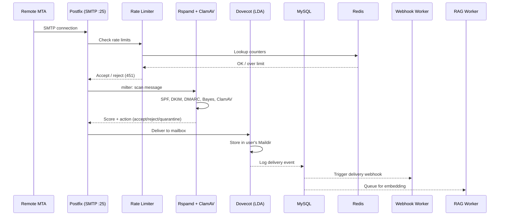
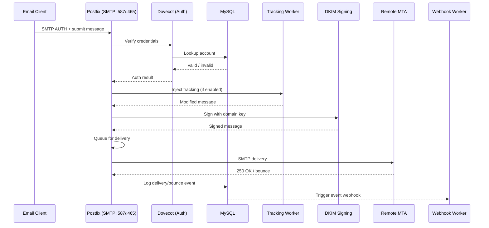
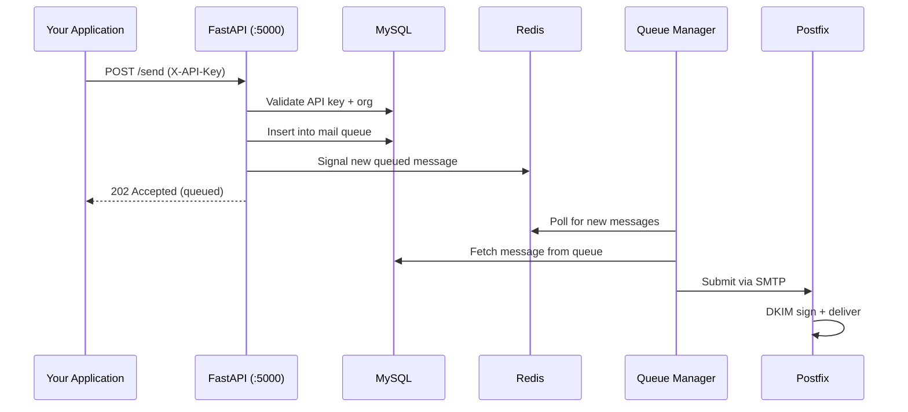

# Data Flow

How an email actually travels through Mailyte — from the moment it hits the wire to the moment it lands in a mailbox (or leaves one).

---

## Inbound Email (Receiving)

When someone on the internet sends an email to one of your hosted domains, here's what happens step by step:

1. **DNS lookup**: The sender's mail server looks up your domain's MX record, which points to your Mailyte instance.
2. **SMTP connection**: The remote server connects to Postfix on port 25.
3. **Rate limiting**: Before accepting the message, the rate limiter checks whether this sender IP or domain has exceeded its limits. If yes, the connection is temporarily rejected (451).
4. **Rspamd filtering**: Postfix passes the message to Rspamd via the milter protocol. Rspamd runs it through multiple checks — SPF, DKIM verification, DMARC, Bayesian spam scoring, and ClamAV virus scanning.
5. **Accept or reject**: If the message scores above the spam threshold, it's rejected or quarantined. Otherwise, Postfix accepts it.
6. **Local delivery**: Postfix hands the message to Dovecot's Local Delivery Agent (LDA), which drops it into the correct mailbox on disk.
7. **Post-delivery hooks**: The system logs the delivery event to MySQL, fires any configured webhooks, and (if RAG is enabled for the org) queues the message for vector embedding.

!!! info "What happens during a spam storm"
    If a sender trips the rate limiter, Postfix returns a 451 (temporary failure). Legitimate senders will retry later. Spammers usually won't. This is the first line of defense, before Rspamd even sees the message.

## Outbound Email (Sending)

When a user (or your application via the API) sends an email through Mailyte:

1. **Authentication**: The email client connects to Postfix on port 587 (STARTTLS) or 465 (implicit TLS). Postfix delegates authentication to Dovecot, which checks credentials against MySQL.
2. **Message submission**: Once authenticated, the client submits the message.
3. **Tracking injection**: If tracking is enabled for this org/domain, the tracking worker injects open-tracking pixels and rewrites links for click tracking.
4. **DKIM signing**: Postfix signs the outgoing message with the domain's DKIM private key.
5. **Queue**: The message enters Postfix's outbound queue.
6. **Delivery**: Postfix resolves the recipient's MX record and delivers via SMTP. If delivery fails, the message stays in the queue for retry (configurable backoff).
7. **Delivery tracking**: Once delivered (or bounced), the event is logged to MySQL, the queue record is updated, and webhooks fire.

## API-Initiated Email

When your application sends email via the REST API instead of SMTP:

1. **API request**: Your app sends a `POST` to the FastAPI server on port 5000 with an `X-API-Key` header.
2. **Validation**: The API validates the key, checks that the sending domain belongs to the authenticated org, and validates the message payload.
3. **Queue insertion**: The message is added to the mail queue (MySQL + Redis).
4. **Queue manager picks it up**: The queue manager worker dequeues the message and hands it to Postfix for delivery.
5. **From here, it follows the normal outbound flow** — DKIM signing, delivery, logging, webhooks.

!!! tip "Why a queue instead of sending directly?"
    The queue gives you retry logic, rate limiting, and backpressure for free. If the remote server is down, the message stays queued and retries automatically. It also means the API responds instantly (202) instead of blocking until delivery completes.

## Tracking Events

After an email is delivered, two things can generate tracking events:

- **Open tracking**: The email contains a tiny invisible image hosted by Mailyte. When the recipient's email client loads it, the tracking worker logs the open.
- **Click tracking**: Links in the email are rewritten to pass through Mailyte's redirect endpoint. When clicked, the tracking worker logs the click and redirects to the original URL.

Both events are stored in MySQL, update analytics counters in Redis, and can trigger webhooks.

## RAG Pipeline (AI Search)

For organizations with RAG enabled, emails flow through an additional pipeline:

1. New emails (inbound or outbound) are queued for processing.
2. The RAG worker reads the email content, generates vector embeddings, and stores them in Qdrant.
3. When a user searches via the API, the query is embedded and matched against stored vectors in Qdrant for semantically relevant results.

This runs asynchronously and doesn't affect mail delivery speed.

## What Gets Logged

Every email that passes through the system generates log entries in multiple places:

| What | Where | Why |
|------|-------|-----|
| SMTP transaction details | Postfix logs + MySQL (`MailLog`) | Debugging delivery issues |
| Spam scores and actions | Rspamd logs + MySQL | Tuning spam filters |
| Delivery/bounce events | MySQL (`MailQueue`) | Tracking message status |
| Open/click events | MySQL (tracking tables) | Analytics |
| API requests | FastAPI logs + MySQL | Audit trail |
| Auth failures | fail2ban logs + MySQL | Security monitoring |
