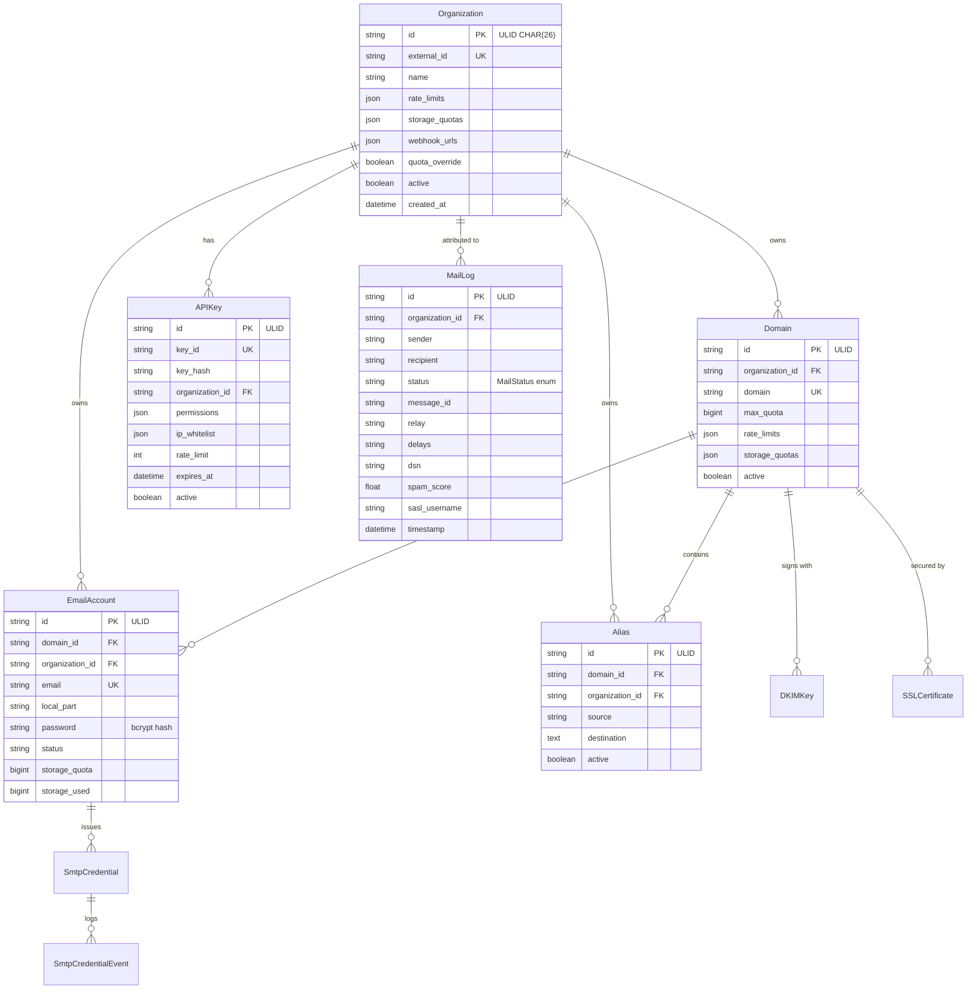

# Database Design

The database schema, how the models relate to each other, and why things are structured this way. Verified against `database/models/` as of 2026-08-30.

---

## Overview

Mailyte uses SQLAlchemy ORM models organized into logical groups. Each group lives in its own file under `database/models/`. MySQL (8.0.35) is the primary database, with Redis for caching and Qdrant for vector storage.

Two structural facts shape everything:

- **ULID primary keys.** Every core table uses a 26-character ULID (`CHAR(26)`) primary key generated by `shared/ulid_utils.py`, not an auto-increment integer. IDs are globally unique, time-sortable, and safe to expose in URLs. (See [ULID Migration](ulid-migration.md).)
- **Alembic owns the schema.** Migrations live in `alembic/versions/` (baseline `0001` through, currently, `0010_alert_rules_channels_events`) and run in the dedicated `migrate` container before any schema-touching service starts. A failed migration stops the deploy. The frozen SQL files under `database/migrations/sql/` are the historical source the baseline was generated from — nothing executes them in this edition anymore.

The schema follows a strict multi-tenant hierarchy: **Organization → Domain → EmailAccount**. Almost every table carries an `organization_id` foreign key, which is what makes tenant isolation a simple `WHERE` clause.

## Model Files at a Glance

| File | What it covers | Key models |
|------|---------------|------------|
| `core.py` | The multi-tenant hierarchy + SMTP API keys | Organization, Domain, EmailAccount, Alias, SmtpCredential, SmtpCredentialEvent |
| `mail.py` | Email processing | MailQueue, MailLog |
| `authentication.py` | Auth and API access | APIKey, User, UserSession, WebSession, MailboxSession |
| `security.py` | Threat tracking & policy | IPAccessRule, AuditLog, FailedAuthAttempt, IPReputation, DLPPolicy, DLPViolation, TOTPSecret, GeoPolicy |
| `tracking.py` | Email engagement | EmailTracking, TrackingStatistics |
| `webhooks.py` | Event callbacks | WebhookURL, WebhookDeliveryLog |
| `analytics.py` | Aggregated metrics | AnalyticsData |
| `ai.py` | AI usage | AITransaction |
| `reputation.py` | Sender reputation & suppression | EmailSuppression, DomainReputation, FeedbackLoop |
| `certificates.py` | TLS & DKIM key material | SSLCertificate, DKIMKey |
| `collaboration.py` | Shared mailboxes, groups, rules | SharedMailboxMember, DistributionGroup, DistributionGroupMember, TransportRule, Quarantine |
| `alerts.py` | Operator alerting & usage | Alert, UsageHistory |
| `infrastructure.py` | Protocol/ops state | JMAPState, MigrationJob, MigrationError, KafkaDeadLetter, ConsentRecord, DataExportRequest, DataErasureRequest, OAuthClient, OAuthGrant |
| `system.py` | Server-level state | SystemConfig, HealthCheck, ServiceMetrics |
| `enums.py` | Shared enums | MailStatus, EventType, … |

## Entity Relationship Diagram

The core of the schema (fields abbreviated; all `id` columns are `CHAR(26)` ULIDs):

## Core Models (`core.py`)

### Organization

The top-level tenant.

- `external_id` — A unique identifier that maps to the upstream system (mailyte-api's customer ID). This is how the two systems stay loosely coupled.
- `rate_limits` / `storage_quotas` — JSON blobs holding the org's default limits (there is no flat `sending_rate_limit` column; limits are structured).
- `webhook_urls` / `webhook_secret` — the org's callback configuration.
- `quota_override` (+ `_at`, `_by`) — set when a human operator edits quotas through the console; the upstream plan sync then refuses to overwrite them without `force=true`.

### Domain

A mail domain owned by an organization. Carries `verified`/`verification` state, `max_quota`, and its own `rate_limits`/`storage_quotas` JSON that can override the org defaults.

### EmailAccount

A mailbox under a domain. Notable columns:

- `password` — bcrypt hash, checked by Dovecot for IMAP/POP3/SMTP auth.
- `status` — active/suspended/… (Dovecot's SQL queries filter on it).
- `storage_quota` / `storage_used` (+ attachment/email breakdowns) — quota accounting; usage is measured by the `storage_usage` worker over IMAP QUOTA.

### Alias

`source` → `destination` forwarding, no mailbox of its own. `destination` is `Text` — one-to-many forwarding is expressed as multiple destinations.

### SmtpCredential / SmtpCredentialEvent

Per-mailbox SMTP API keys (live since 2026-08-27): scoped credentials that authenticate on the submission ports through a dedicated Dovecot SQL passdb. Lifecycle operations (rotate, revoke, suspend) flush Dovecot's auth cache via the doveadm HTTP API so they take effect immediately, and `SmtpCredentialEvent` is the audit/usage trail behind the credential reports endpoints.

## Mail Models (`mail.py`)

### MailLog

A per-message record of every delivery attempt, inbound or outbound. Its columns — `relay`, `delays`, `dsn`, `status`, `sasl_username`, `spam_score` — map one-for-one onto a Postfix delivery log line, which is what the schema was designed around.

**Producer**: `mailer/log_ingestor` (added 2026-08-22), which tails Postfix's log. Before it existed, nothing wrote this table at all.

### MailQueue

A queue-shaped table (`status` = `queued`/`sending`/`sent`/`bounced`/…, `attempts`, `scheduled_at`, `worker_id`).

!!! warning "MailQueue is not the send path"
    The live outbound queue is **Postfix's own spool** (a named Docker volume), managed by the `queue_manager` service via `postqueue`. API- and webmail-originated mail is submitted straight to Postfix's internal submission listener. Don't build features that assume rows flow through `mail_queue`.

## Authentication Models (`authentication.py`)

- **APIKey** — programmatic keys, sent as `X-API-Key`. Stored hash-only: `key_hash` (SHA-256) is the verification value and `key_id` a non-secret display id (raw keys redacted by migration `0019`, 2026-08-30), with JSON `permissions`, optional `ip_whitelist` (not yet enforced), per-key `rate_limit` (not yet enforced), and `expires_at` (enforced at auth). Platform-scoped keys (`scope='platform'`, added in migration `0005`) are required for cross-tenant operations.
- **User / UserSession / WebSession** — browser-session auth for deployments where a browser talks to this API directly: credentials in, short-lived HttpOnly cookie out.
- **MailboxSession** — the webmail's mailbox-holder sessions. Login is verified against Dovecot over IMAP (not against a copied password hash — a stale-copy bug fixed 2026-08-21), and the session holds the SMTP credential used for sends.

## Security Models (`security.py`)

- **IPAccessRule** — per-org IP allow/deny, enforced by Postfix's `ip_access_policy` service.
- **AuditLog** — who did what, when, from where. API mutations land here.
- **FailedAuthAttempt** — failed logins, backing lockout/throttling logic in the gateway.
- **IPReputation** — per-IP reputation tracking.
- **DLPPolicy / DLPViolation** — the DLP service's per-org policies and recorded violations.
- **TOTPSecret** — TOTP enrollment for operator MFA (the `totp` service).
- **GeoPolicy** — geo-blocking rules for the `geo_blocking` service.

## Tracking Models (`tracking.py`)

- **EmailTracking** — one row per tracked message: pixel ID, rewritten links, open/click state, recipient metadata.
- **TrackingStatistics** — per-domain/per-period rollups.

## Webhook Models (`webhooks.py`)

- **WebhookURL** — registered callback endpoints.
- **WebhookDeliveryLog** — the record of each attempted delivery. Permanently failed events additionally land in the `webhook_dead_letters` table written by `shared/webhook_dispatcher.py`.

## Analytics (`analytics.py`), AI (`ai.py`), Reputation (`reputation.py`)

- **AnalyticsData** — pre-aggregated, time-bucketed metrics per org/domain (the `analytics` worker writes these; dashboards read them instead of scanning raw events).
- **AITransaction** — usage records for AI-backed features.
- **EmailSuppression** — suppression list (bounces, complaints, unsubscribes) consulted on the send path.
- **DomainReputation / FeedbackLoop** — deliverability reputation per domain and inbound FBL processing.

## Certificates (`certificates.py`)

- **SSLCertificate** — per-hostname TLS certificates managed by `cert_manager`, with expiry tracking; backs the SNI maps Postfix/Dovecot/Traefik read.
- **DKIMKey** — per-domain DKIM key pairs. Private keys are **envelope-encrypted**: wrapped with the KEK mounted at `/run/secrets/encryption_kek` (migration `0003_encrypt_private_keys`), so a database dump alone does not expose signing keys.

## Collaboration (`collaboration.py`), Alerts (`alerts.py`), Infrastructure (`infrastructure.py`), System (`system.py`)

- Shared mailbox membership, distribution groups, **TransportRule** (mail-routing rules — enforcement is gated behind `TRANSPORT_RULES_ENABLED`, off by default), and **Quarantine**.
- **Alert** rules/channels/events (migration `0010`) evaluated by the gateway on an interval, plus **UsageHistory** rollups.
- **JMAPState** (JMAP sync state), **MigrationJob/MigrationError** (mailbox migration), **OAuthClient/OAuthGrant** (XOAUTH2), GDPR-shaped **ConsentRecord / DataExportRequest / DataErasureRequest**, and **KafkaDeadLetter** (schema support for the provisioned-but-unused Kafka broker).
- **SystemConfig**, **HealthCheck**, **ServiceMetrics** — server-level state.

## Design Decisions

**Why `organization_id` on almost everything?** Tenant isolation. Every query can be scoped to an org with a simple `WHERE organization_id = ?`.

**Why ULID primary keys?** Globally unique and time-sortable without coordination, safe to expose in URLs and to sync to the upstream Laravel system, and index-friendly (unlike random UUIDv4).

**Why `external_id` on Organization?** So the upstream system doesn't have to store Mailyte's IDs — each side keeps its own ULIDs and maps through `external_id`.

**Why separate MailQueue and MailLog?** Different lifecycles — queue records are transient, log records are the permanent audit trail. (And in the deployed system, MailLog is the one that actually gets written — by `log_ingestor`.)

**Why store DKIM keys in the database?** So the API can provision new domains without touching config files — Rspamd's signing path resolves keys per domain. Keys are envelope-encrypted with a KEK that never lives in the database.
