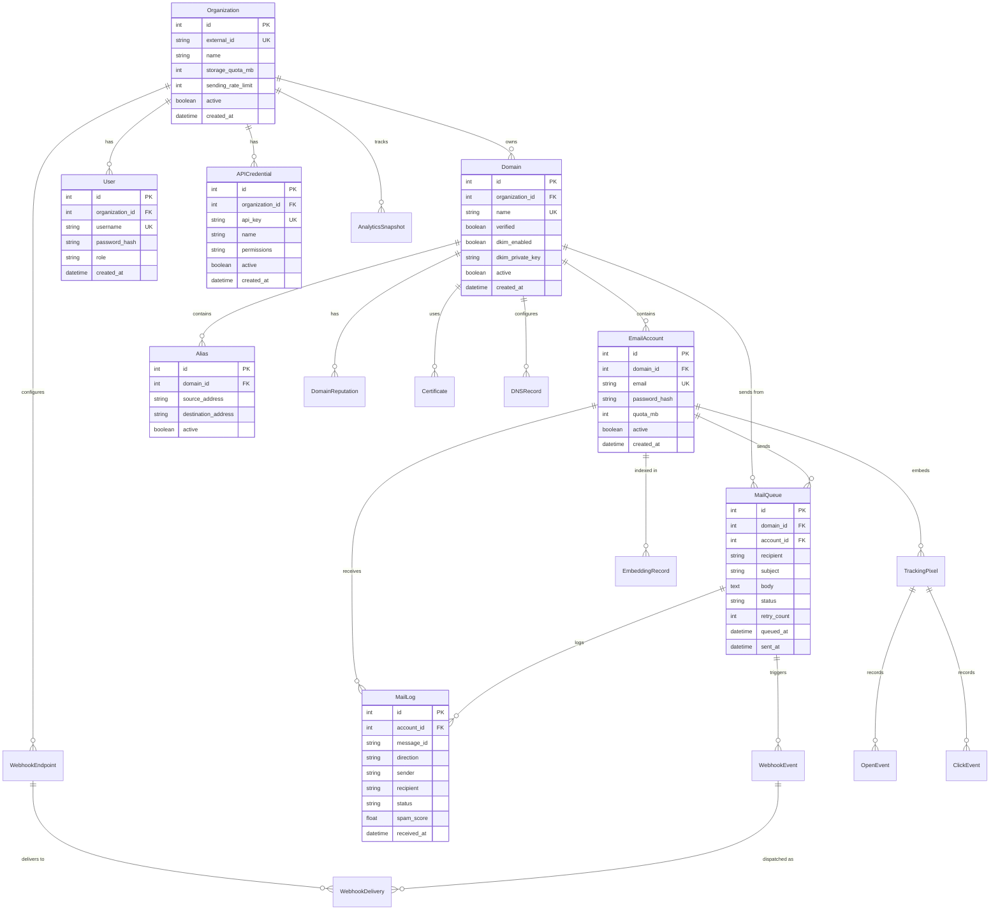

# Database Design

The database schema, how the models relate to each other, and why things are structured this way.

---

## Overview

Mailyte uses SQLAlchemy ORM models organized into logical groups. Each group lives in its own file under the `models/` directory. MySQL is the primary database, with Redis for caching and Qdrant for vector storage.

The schema follows a strict multi-tenant hierarchy: **Organization > Domain > Email Account**. Almost every table has an `organization_id` foreign key, which makes tenant isolation straightforward — you just filter by org.

## Model Files at a Glance

| File | What it covers | Key models |
|------|---------------|------------|
| `core.py` | The multi-tenant hierarchy | Organization, Domain, EmailAccount, Alias |
| `mail.py` | Email processing | MailQueue, MailLog |
| `authentication.py` | Auth and API access | User, APICredential |
| `security.py` | Threat tracking | SecurityEvent, BanRecord, AuditLog |
| `tracking.py` | Email engagement | TrackingPixel, ClickEvent, OpenEvent |
| `webhooks.py` | Event callbacks | WebhookEndpoint, WebhookEvent, WebhookDelivery |
| `analytics.py` | Aggregated metrics | AnalyticsSnapshot, DomainStats |
| `ai.py` | RAG / vector search | EmbeddingRecord, RAGQuery |
| `reputation.py` | Sender reputation | DomainReputation, IPReputation |
| `infrastructure.py` | Server management | Server, Certificate, DNSRecord |

## Entity Relationship Diagram

## Core Models (`core.py`)

These are the foundation of the multi-tenant hierarchy.

### Organization

The top-level tenant. Everything rolls up to an org.

- `external_id` — A unique identifier that maps to your upstream system (e.g., your app's customer ID). This is how you link Mailyte orgs to your own user accounts.
- `storage_quota_mb` — Total storage allowed across all mailboxes in the org.
- `sending_rate_limit` — Maximum emails per hour for the entire org.

### Domain

A mail domain (like `acme.com`) owned by an organization. One org can have many domains.

- `verified` — Whether DNS records (MX, SPF, DKIM) have been validated.
- `dkim_private_key` — The private key used to sign outgoing mail. Stored encrypted.

### EmailAccount

A mailbox (like `alice@acme.com`) under a domain.

- `quota_mb` — Per-mailbox storage limit, which counts against the org's total.
- `password_hash` — Used for SMTP/IMAP auth. Hashed with a strong algorithm (bcrypt or argon2).

### Alias

An address that forwards to another address. For example, `support@acme.com` -> `alice@acme.com`.

!!! info "Aliases don't have mailboxes"
    An alias just redirects. It doesn't store mail. If you need a shared mailbox, create an EmailAccount and set up aliases that forward to it.

## Mail Models (`mail.py`)

### MailQueue

Outbound messages waiting to be sent. The queue manager worker processes this table.

- `status` — One of: `queued`, `sending`, `sent`, `failed`, `deferred`.
- `retry_count` — How many delivery attempts have been made. Used for backoff logic.

### MailLog

A record of every email that passes through the system, inbound or outbound. This is your audit trail.

- `direction` — `inbound` or `outbound`.
- `spam_score` — Rspamd's spam score for the message. Useful for tuning filters.

## Authentication Models (`authentication.py`)

### User

Admin or management users who can access the API. Each user belongs to one organization.

- `role` — Controls what the user can do. Roles are enforced at the API level.

### APICredential

Programmatic API keys. Your application uses these instead of username/password.

- `api_key` — Sent in the `X-API-Key` header. Stored hashed in the database.
- `permissions` — Scoped access (e.g., `send_only`, `read_only`, `admin`).

## Security Models (`security.py`)

Tracks threats and provides an audit trail.

- **SecurityEvent** — Records suspicious activity (failed auth, unusual patterns).
- **BanRecord** — IPs banned by fail2ban, with expiry times.
- **AuditLog** — Who did what, when. Every API mutation gets logged here.

## Tracking Models (`tracking.py`)

Engagement tracking for sent emails.

- **TrackingPixel** — A unique invisible image URL embedded in an email. One per message.
- **OpenEvent** — Logged when the pixel is loaded (recipient opened the email).
- **ClickEvent** — Logged when a tracked link is clicked.

Each event includes timestamps, IP addresses, and user-agent strings for analytics.

## Webhook Models (`webhooks.py`)

Event notification system for external integrations.

- **WebhookEndpoint** — A URL configured by an org to receive event callbacks. Includes a secret for signature verification.
- **WebhookEvent** — A specific event (delivery, bounce, open, etc.) that needs to be sent.
- **WebhookDelivery** — The record of actually sending the webhook — HTTP status, response body, retry count.

## Analytics Models (`analytics.py`)

Pre-aggregated metrics so you don't have to count raw events every time.

- **AnalyticsSnapshot** — Time-bucketed counters (hourly/daily) per org: sends, deliveries, bounces, opens, clicks.
- **DomainStats** — Per-domain roll-ups of the same metrics.

!!! tip "Why pre-aggregate?"
    Counting millions of raw events on every dashboard load is slow. The analytics worker periodically crunches the numbers and stores the results. Dashboard queries hit the aggregates instead of scanning event tables.

## AI Models (`ai.py`)

Support for RAG (Retrieval-Augmented Generation) email search.

- **EmbeddingRecord** — Links an email to its vector embedding in Qdrant. Stores the Qdrant point ID and metadata.
- **RAGQuery** — Logs search queries and their results for analytics and quality tuning.

## Reputation Models (`reputation.py`)

Tracks sending reputation to protect deliverability.

- **DomainReputation** — Aggregate reputation score per domain, based on bounce rates, spam complaints, and engagement.
- **IPReputation** — Same, but per sending IP. Useful if you're sending from multiple IPs.

## Infrastructure Models (`infrastructure.py`)

Manages the server infrastructure itself.

- **Server** — Registered server instances with health status.
- **Certificate** — TLS certificate records with expiry tracking.
- **DNSRecord** — Expected DNS records per domain (MX, SPF, DKIM, DMARC) and their verification status.

## Design Decisions

**Why `organization_id` on almost everything?** Tenant isolation. Every query can be scoped to an org with a simple `WHERE organization_id = ?`. No risk of data leaking between tenants.

**Why `external_id` on Organization?** So you don't have to sync Mailyte's auto-increment IDs with your own system. Use your own customer IDs and look up orgs by `external_id`.

**Why separate MailQueue and MailLog?** Different lifecycles. Queue records are transient — they exist while a message is being processed and can be cleaned up after delivery. Log records are permanent audit trails.

**Why store DKIM keys in the database?** So the API can provision new domains without touching config files. Postfix reads the key from the database (via a lookup query) when signing outbound mail.
