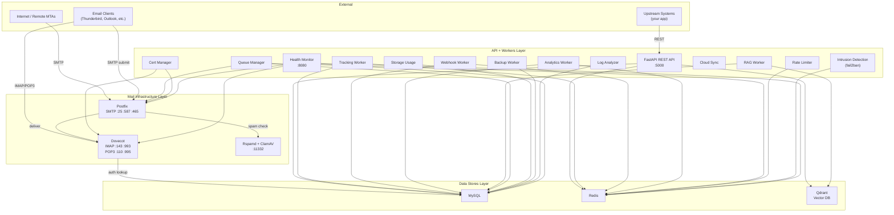
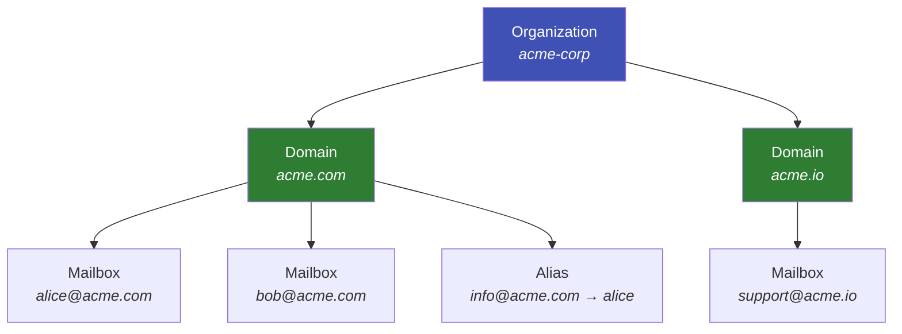

# Architecture Overview

A bird's-eye view of how Mailyte's email server is put together and why each piece exists. If you want to understand the system before you start building on it, this is the place.

---

## In this section

-   :material-transit-connection-variant:{ .lg .middle } **Data Flow**

    ---

    Follow an email from arrival to delivery — every hop, every check, every store.

    [:octicons-arrow-right-24: Data flow](data-flow.md)

-   :material-server-network:{ .lg .middle } **Service Architecture**

    ---

    Every service, its port, its dependencies, and what happens when it goes down.

    [:octicons-arrow-right-24: Service architecture](service-architecture.md)

-   :material-database:{ .lg .middle } **Database Design**

    ---

    Tables, relationships, indexes, and the schema that holds it all together.

    [:octicons-arrow-right-24: Database design](database-design.md)

-   :material-shield-lock:{ .lg .middle } **Security Model**

    ---

    Authentication, TLS, and threat protection from the architecture perspective.

    [:octicons-arrow-right-24: Security model](security-model.md)

-   :material-arrow-expand-all:{ .lg .middle } **Scaling Strategy**

    ---

    How to grow Mailyte as load increases — horizontal scaling, resource limits, bottlenecks.

    [:octicons-arrow-right-24: Scaling strategy](scaling-strategy.md)

-   :material-office-building:{ .lg .middle } **Organization Model**

    ---

    The org/domain/mailbox hierarchy and how multi-tenancy is structured.

    [:octicons-arrow-right-24: Organization model](organization-model.md)

-   :material-shield-half-full:{ .lg .middle } **Multi-Tenant Isolation**

    ---

    How tenant data, quotas, and configuration stay completely separated.

    [:octicons-arrow-right-24: Multi-tenant isolation](multi-tenant.md)

---

## The Big Picture

Mailyte is a multi-tenant email server that sends, receives, filters, and stores email for multiple organizations — all from a single deployment. Think of it as running a small email hosting company inside a Docker Compose stack.

The system breaks down into three layers, each with a clear job:

| Layer | What it does | Key services |
|-------|-------------|--------------|
| **Mail Infrastructure** | Handles the actual email traffic — SMTP in/out, spam filtering, mailbox storage | Postfix, Dovecot, Rspamd + ClamAV |
| **API + Workers** | Manages everything programmatically and runs background jobs | FastAPI, tracking, webhooks, analytics, queue manager, and more |
| **Data Stores** | Persists state — accounts, queues, caches, vector embeddings | MySQL, Redis, Qdrant |

Each layer only talks to the layers it needs to. Workers never handle raw SMTP. Postfix never queries Qdrant. This keeps the system modular — you can swap out Redis for another cache, or scale the workers independently of the mail servers.

---

## System Diagram

---

## Service inventory

Every service in the stack at a glance:

| Service | Port(s) | Layer | Role |
|---------|---------|-------|------|
| **Postfix** | 25, 587, 465 | Mail | SMTP relay and submission |
| **Dovecot** | 143, 993, 110, 995 | Mail | IMAP/POP3 mailbox access |
| **Rspamd** | 11332 | Mail | Spam filtering, DKIM signing |
| **ClamAV** | -- | Mail | Antivirus scanning |
| **FastAPI** | 5000 | API | REST API control plane |
| **Health Monitor** | 8080 | API | Health checks, auto-healing |
| **Tracking Worker** | 8083 | API | Open/click tracking, analytics |
| **Webhook Worker** | 8081 | API | Event delivery to your app |
| **Rate Limiter** | 8082 | API | Sliding window rate limits |
| **Queue Manager** | -- | API | Mail queue management |
| **RAG Worker** | 8090 | API | AI-powered email search |
| **Storage Usage** | 8084 | API | Quota tracking |
| **Backup Worker** | -- | API | Automated backups |
| **Cloud Sync** | -- | API | S3/Azure backup sync |
| **Log Analyzer** | -- | API | Log parsing and alerting |
| **Cert Manager** | -- | API | TLS certificate rotation |
| **Intrusion Detection** | -- | API | fail2ban integration |
| **MySQL** | 3306 | Data | Primary database |
| **Redis** | 6379 | Data | Cache, queues, pub/sub |
| **Qdrant** | 6333 | Data | Vector embeddings |

!!! info "Internal vs. external ports"
    Only mail ports (25, 587, 465, 143, 993, 110, 995), the API (5000), and the health endpoint (8080) need to be reachable from outside. Everything else stays on the Docker network.

---

## How the Layers Talk to Each Other

=== "Mail Infrastructure"

    The front door. Postfix accepts email from the internet (or from clients submitting outbound mail), runs it through Rspamd for spam checks, and hands it to Dovecot for storage. This layer speaks native email protocols — SMTP, IMAP, POP3 — and doesn't know anything about your API keys or webhook URLs.

=== "API + Workers"

    The control plane. The FastAPI server exposes a REST API that lets your application create organizations, add domains, provision mailboxes, and query analytics. The workers run in the background: tracking pixel hits, firing webhooks on delivery events, computing analytics, managing the mail queue, rotating TLS certificates, and watching for intrusions.

=== "Data Stores"

    Holds everything. MySQL is the source of truth for accounts, domains, logs, and configuration. Redis handles the fast stuff — caching, rate limit counters, job queues. Qdrant stores vector embeddings for AI-powered email search (RAG), so you can ask questions like "find emails about the Q3 budget" and get semantically relevant results.

---

## Multi-Tenancy at a Glance

Every piece of data belongs to an Organization. Organizations own Domains. Domains own Email Accounts and Aliases. This hierarchy means you can host `acme.com` and `widgets.io` under different organizations with fully isolated data, quotas, and rate limits — all in the same deployment.

!!! tip "Isolation is the default"
    You don't have to do anything special to get tenant isolation. Every API call is scoped to the organization that owns the API key. There is no way to accidentally access another organization's data.

For the full breakdown, see [Organization Model](organization-model.md) and [Multi-Tenant Isolation](multi-tenant.md).

---

## Key design decisions

| Decision | Rationale |
|----------|-----------|
| **Docker Compose, not Kubernetes** | Keeps the barrier to entry low. A single `docker compose up` gets everything running. Kubernetes deployment configs are available for production scale. |
| **Workers are separate containers** | Each worker can be scaled, restarted, or disabled independently without affecting mail delivery. |
| **Redis for queues, not a dedicated broker** | Avoids adding another dependency (RabbitMQ/Kafka). Redis is already needed for caching, so it pulls double duty. |
| **Qdrant for vector search** | Purpose-built vector DB gives better performance and relevance than bolting vector search onto MySQL. |
| **Rspamd over SpamAssassin** | Modern, high-performance, built-in web UI, native milter support, and active development. |

---

## What to Read Next

| Topic | Page |
|-------|------|
| How email flows through the system | [Data Flow](data-flow.md) |
| Every service, its port, and its dependencies | [Service Architecture](service-architecture.md) |
| Database tables and relationships | [Database Design](database-design.md) |
| Authentication, TLS, and threat protection | [Security Model](security-model.md) |
| Growing the system as load increases | [Scaling Strategy](scaling-strategy.md) |
| The org/domain/mailbox hierarchy | [Organization Model](organization-model.md) |
| How tenant isolation works in practice | [Multi-Tenant Isolation](multi-tenant.md) |

**Related sections:**

- [Getting Started](../getting-started/index.md) -- install and run the stack
- [API Reference](../api/index.md) -- interact with the control plane
- [Security](../security/index.md) -- deep dive into every defense layer
