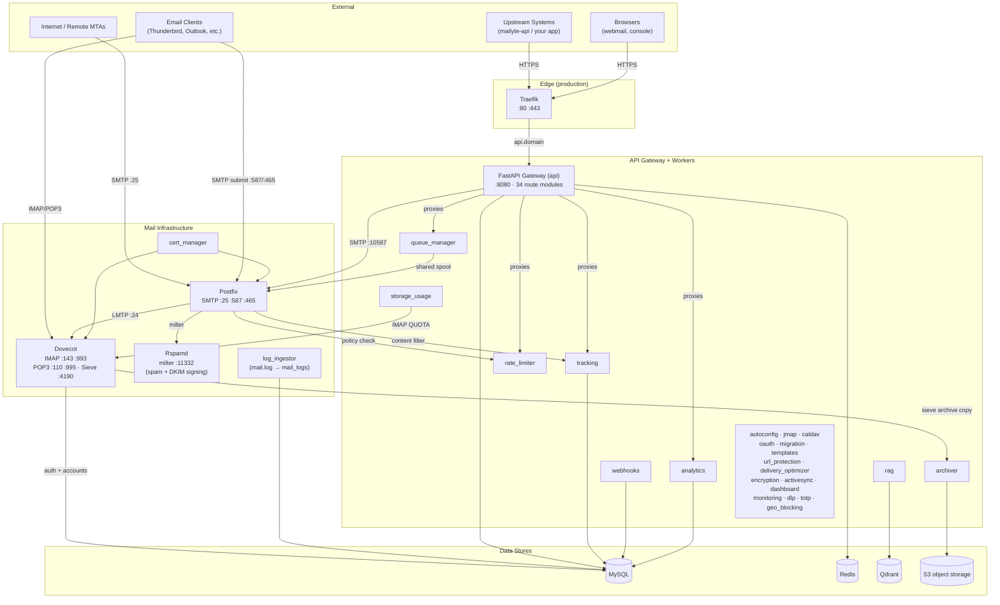
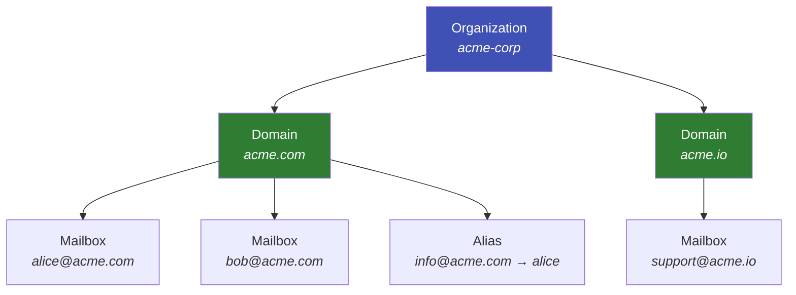

# Architecture Overview

A bird's-eye view of how Mailyte's email server is put together and why each piece exists. If you want to understand the system before you start building on it, this is the place.

---

## In this section

-   :material-transit-connection-variant:{ .lg .middle } **Data Flow**

    ---

    Follow an email from arrival to delivery — every hop, every check, every store.

    [:octicons-arrow-right-24: Data flow](data-flow.md)

-   :material-server-network:{ .lg .middle } **Service Architecture**

    ---

    Every service, its port, its dependencies, and what happens when it goes down.

    [:octicons-arrow-right-24: Service architecture](service-architecture.md)

-   :material-database:{ .lg .middle } **Database Design**

    ---

    Tables, relationships, indexes, and the schema that holds it all together.

    [:octicons-arrow-right-24: Database design](database-design.md)

-   :material-shield-lock:{ .lg .middle } **Security Model**

    ---

    Authentication, TLS, and threat protection from the architecture perspective.

    [:octicons-arrow-right-24: Security model](security-model.md)

-   :material-arrow-expand-all:{ .lg .middle } **Scaling Strategy**

    ---

    How to grow Mailyte as load increases — horizontal scaling, resource limits, bottlenecks.

    [:octicons-arrow-right-24: Scaling strategy](scaling-strategy.md)

-   :material-office-building:{ .lg .middle } **Organization Model**

    ---

    The org/domain/mailbox hierarchy and how multi-tenancy is structured.

    [:octicons-arrow-right-24: Organization model](organization-model.md)

-   :material-shield-half-full:{ .lg .middle } **Multi-Tenant Isolation**

    ---

    How tenant data, quotas, and configuration stay completely separated.

    [:octicons-arrow-right-24: Multi-tenant isolation](multi-tenant.md)

---

## The Big Picture

Mailyte is a multi-tenant email server that sends, receives, filters, and stores email for multiple organizations — all from a single deployment. Think of it as running a small email hosting company inside a Docker Compose stack: roughly 45 containers in the full production stack, but organized into a handful of clear layers.

| Layer | What it does | Key services |
|-------|-------------|--------------|
| **Edge** | TLS termination and per-hostname routing for all HTTP traffic (production) | Traefik, acme_webroot |
| **Mail Infrastructure** | The actual email traffic — SMTP in/out, spam filtering + DKIM signing, mailbox storage, certificates, log ingestion | Postfix, Dovecot, Rspamd, cert_manager, log_ingestor |
| **API Gateway + Workers** | The management plane (one FastAPI gateway, 34 route modules) and ~20 single-purpose worker services | api, webhooks, tracking, rate_limiter, analytics, queue_manager, archiver, autoconfig, jmap, caldav, oauth, migration, and more |
| **Security Services** | DLP scanning, TOTP for operator MFA, geo-blocking | dlp, totp, geo_blocking |
| **Data Stores** | Persistent state | MySQL, Redis, Qdrant, S3 object storage (+ Kafka provisioned, unused — see below) |
| **Observability** | Metrics, dashboards, alerting | Prometheus, Grafana, Alertmanager, exporters |
| **Frontends** | Human surfaces | webmail, console (staff), Roundcube/SOGo (optional profiles), docs |

Each layer only talks to the layers it needs to. Workers never handle raw SMTP. Postfix never queries Qdrant. This keeps the system modular — services can be scaled or restarted independently of mail delivery.

---

## System Diagram

---

## Service inventory

The full roster lives in [Service Architecture](service-architecture.md), with per-service detail. The short version, straight from `docker-compose.yml`:

| Group | Services |
|-------|----------|
| **Lifecycle** | secrets-check, migrate (Alembic), docker-proxy |
| **Mail** | postfix, dovecot, rspamd, cert_manager, acme_webroot, log_ingestor |
| **Gateway** | api (FastAPI, :8080, ×2 replicas in production) |
| **Workers** | webhooks (×2), tracking (×2), rate_limiter, monitoring, analytics, archiver, dashboard, encryption, queue_manager, rag, storage_usage, delivery_optimizer, templates, url_protection, oauth, caldav, radicale, jmap, migration, autoconfig, activesync |
| **Security** | dlp, totp, geo_blocking |
| **Data** | mysql (8.0.35), redis, qdrant, kafka + zookeeper |
| **Observability** | prometheus, grafana, alertmanager, mysql-exporter, redis-exporter |
| **Frontends** | docs, console (profile), webmail (profile), roundcube (profile), sogo (profile) |
| **Edge (prod)** | traefik |

!!! info "Internal vs. external ports"
    In production only the mail protocol ports (25, 587, 465, 143, 993, 110, 995, 4190) and Traefik's 80/443 listen on `0.0.0.0`. Every other service was re-bound to `127.0.0.1` on 2026-08-22 — before that, ~30 internal services (including unauthenticated Prometheus and Qdrant) were reachable from the public internet. HTTP services are reached externally only through Traefik: `api.${DOMAIN}`, `jmap.${DOMAIN}`, `caldav.${DOMAIN}`, `docs.${DOMAIN}`, `grafana.${DOMAIN}`, the wildcard `autoconfig.*`/`autodiscover.*`/`mta-sts.*` rule, the webmail hostname, and the (IP-allowlisted) console hostname.

---

## How the Layers Talk to Each Other

=== "Mail Infrastructure"

    The front door. Postfix accepts email from the internet (or from clients submitting outbound mail), runs it through Rspamd for spam checks (inbound) and DKIM signing (outbound), and hands it to Dovecot over LMTP for storage. This layer speaks native email protocols — SMTP, IMAP, POP3, ManageSieve. Its integration points with the platform are precise and few: SQL lookups against MySQL, a rate-limit policy call at the SMTP DATA phase, and the tracking content filter on the submission ports.

=== "API Gateway + Workers"

    The control plane. One FastAPI gateway (`api`) exposes the whole REST surface — organizations, domains, mailboxes, SMTP credentials, filters, analytics, and the webmail backend — and proxies to the single-purpose worker containers behind it (analytics, tracking, rate_limiter, queue_manager, storage_usage, monitoring). Workers run in the background: firing webhooks, recording opens and clicks, archiving mail to S3, measuring quotas over IMAP, rotating TLS certificates, running migration jobs.

=== "Data Stores"

    MySQL is the source of truth for accounts, domains, credentials, logs, and configuration. Redis handles the fast stuff — caching, rate-limit counters, Rspamd's Bayes data. Qdrant stores vector embeddings for AI-powered search. S3 holds the encrypted mail archive and backups.

---

## Multi-Tenancy at a Glance

Every piece of data belongs to an Organization. Organizations own Domains. Domains own Email Accounts and Aliases. This hierarchy means you can host `acme.com` and `widgets.io` under different organizations with fully isolated data, quotas, and rate limits — all in the same deployment.

!!! tip "Isolation is the default"
    Every API call is scoped to the organization that owns the credential. Cross-tenant operations require a platform-scoped credential (an operator session or an API key issued with `scope='platform'`) — a tenant credential can never reach them, regardless of its own permission flags.

For the full breakdown, see [Organization Model](organization-model.md) and [Multi-Tenant Isolation](multi-tenant.md).

---

## Key design decisions

| Decision | Rationale |
|----------|-----------|
| **Docker Compose, not Kubernetes** | Keeps the barrier to entry low. A single `./start.sh` gets everything running; `docker-compose.prod.yml` layers on Traefik, replicas, resource limits, and loopback port binding. |
| **One gateway, many workers** | The `api` container owns the entire public REST surface and proxies to single-purpose workers. Workers can be scaled, restarted, or disabled independently without affecting mail delivery. |
| **HTTP + Redis for inter-service communication** | Kafka and Zookeeper are provisioned in the stack and a client library exists (`shared/kafka_client.py`), but as of 2026-08-30 no service produces or consumes — the working paths are HTTP calls over the Docker network and Redis. |
| **Postfix's spool is the outbound queue** | No parallel application-level mail queue to drift out of sync; `queue_manager` manages Postfix's own queue via `postqueue` over a shared volume. |
| **Rspamd over SpamAssassin** | Modern, high-performance, native milter support — and it's also the DKIM signer. |
| **Qdrant for vector search** | Purpose-built vector DB rather than bolting vector search onto MySQL. |
| **Fail-closed startup** | `secrets-check` gates the entire stack on strong secrets; `migrate` gates schema-touching services on successful Alembic migration. |
| **ULID primary keys** | All core tables use 26-char ULIDs (`CHAR(26)`), not auto-increment INTs — globally unique, time-sortable, safe to expose. |

---

## What to Read Next

| Topic | Page |
|-------|------|
| How email flows through the system | [Data Flow](data-flow.md) |
| Every service, its port, and its dependencies | [Service Architecture](service-architecture.md) |
| Database tables and relationships | [Database Design](database-design.md) |
| Authentication, TLS, and threat protection | [Security Model](security-model.md) |
| Growing the system as load increases | [Scaling Strategy](scaling-strategy.md) |
| The org/domain/mailbox hierarchy | [Organization Model](organization-model.md) |
| How tenant isolation works in practice | [Multi-Tenant Isolation](multi-tenant.md) |

**Related sections:**

- [Getting Started](../getting-started/index.md) -- install and run the stack
- [API Reference](../api/index.md) -- interact with the control plane
- [Security](../security/index.md) -- deep dive into every defense layer
