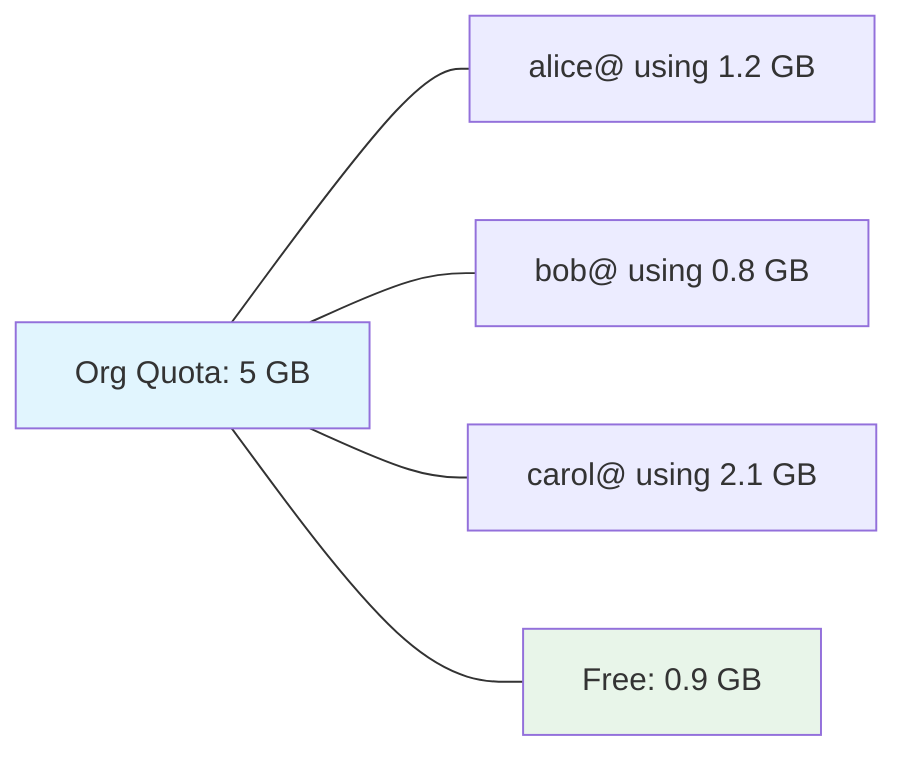
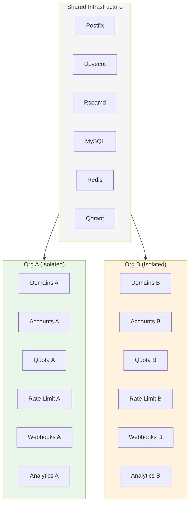

# Multi-Tenant Isolation

How Mailyte keeps tenant data separate — what's shared, what's isolated, and how each boundary is enforced.

---

## The Core Principle

Every piece of tenant data belongs to exactly one Organization. There is no cross-tenant data access in normal operation. The only paths that can see across org boundaries are **platform-scoped credentials** — an operator session (console login + TOTP MFA) or an API key issued with `scope='platform'` — and that's by design: they're for platform operators, not tenants. A tenant-scoped credential can never reach a platform endpoint, regardless of its own permission flags.

## What's Isolated vs What's Shared

| Resource | Isolated per org? | Details |
|----------|:-:|--------|
| Domains | Yes | Each domain belongs to one org |
| Email accounts | Yes | Each account belongs to one domain, which belongs to one org |
| Mailbox storage | Yes | Each account has its own Maildir on disk |
| API keys | Yes | Keys are scoped to a single org |
| Webhook endpoints | Yes | Each org configures its own callback URLs |
| Rate limits | Yes | Per-org sending limits, independently tracked |
| Storage quotas | Yes | Per-org total, per-account breakdown |
| Analytics | Yes | Pre-aggregated per org and per domain |
| Tracking events | Yes | Open/click events tied to the sending account's org |
| Audit logs | Yes | Actions are logged with the acting org's ID |
| Postfix/Dovecot | **Shared** | Single instances serve all tenants |
| Rspamd | **Shared** | Single spam filter for all tenants |
| MySQL | **Shared** | Single database, isolation via `organization_id` |
| Redis | **Shared** | Single instance, key prefixing per org where needed |
| Qdrant | **Shared** | Single instance, metadata filtering per org |
| TLS certificates | **Mostly shared** | Managed globally by cert_manager; per-domain SNI certs are issued for customer mail hostnames |
| IP addresses | **Shared** | All orgs send from the same IPs (unless you configure dedicated IPs) |

## How Isolation is Enforced

### Database-Level Filtering

Almost every table has an `organization_id` column. The API layer adds a `WHERE organization_id = ?` clause to every query automatically. This is handled in the data access layer, not sprinkled through individual endpoints — so forgetting to filter in one endpoint doesn't leak data.

```python
# Simplified example of how queries are scoped.
# Org IDs are 26-char ULID strings, not integers.
def get_domains(db: Session, org_id: str):
    return db.query(Domain).filter(Domain.organization_id == org_id).all()
```

The org ID comes from the authenticated API key, not from the request body. A tenant can't forge another org's ID because the API key determines which org they are.

!!! warning "The platform bypass"
    Platform-scoped credentials (operator sessions, `scope='platform'` API keys) bypass per-org filtering. This is intentional — platform operators need to manage all orgs. It also means those credentials are root-equivalent for tenant data: never issue platform scope to a tenant, and keep the console behind its IP allowlist.

### Per-Org Rate Limits

Each organization has its own rate limits (the `rate_limits` JSON on the org, overridable per domain), tracked as independent per-org counters with TTLs in Redis by the `rate_limiter` service.

One org hitting its limit has zero effect on other orgs. Enforcement happens where mail actually enters the system: Postfix's policy service consults the rate limiter per sender at the SMTP DATA phase (inbound) and on the submission path (outbound).

### Per-Org Webhooks

Webhook endpoints are registered per org. When an event fires (delivery, bounce, open, click), the webhook worker looks up endpoints for that event's org and only delivers to those URLs.

There's no way for org A to register a webhook that receives org B's events. The lookup is always scoped by `organization_id`.

### Per-Org Storage Quotas

Each org has a storage budget (the `storage_quotas` JSON on the organization, overridable per domain), divided among its accounts (`storage_quota` on each account). The `storage_usage` worker measures actual usage per mailbox — over Dovecot's IMAP QUOTA, the same figure Dovecot maintains for enforcement — and compares it to quotas, firing `storage.quota.warning` / `storage.quota.exceeded` webhooks.



When an account exceeds its individual quota, Dovecot rejects new deliveries for that account. When the org exceeds its total quota, no accounts in the org can receive new mail until storage is freed.

### Per-Org Analytics

Analytics are pre-aggregated per org. The `AnalyticsData` rollups carry the org/domain context, and the gateway's analytics endpoints (which proxy to the `analytics` service) filter by the authenticated org.

This means analytics queries are fast (they hit pre-aggregated tables) and isolated (no risk of seeing another org's numbers).

### Mail-Level Isolation

At the Postfix/Dovecot level, isolation works differently than in the API. Mail servers don't have a concept of "organizations" — they deal with domains and accounts.

- **Dovecot** isolates mailboxes by filesystem path. Each account gets its own Maildir directory. Account `alice@acme.com` physically cannot read `bob@widgets.io`'s mail because they're in different directories, and Dovecot's auth ensures each login only accesses its own mailbox.
- **Postfix** enforces sender restrictions. An authenticated user can only send from their own address (or aliases configured for their account). You can't authenticate as `alice@acme.com` and send from `admin@widgets.io`.

### Redis Key Isolation

Redis is a flat key-value store with no built-in multi-tenancy. Mailyte keeps tenant data separate by including the tenant identifier (org ULID, sender address, or API key ID, depending on the counter) in every key a worker writes. There's no global key that mixes data from multiple orgs.

### Qdrant Isolation

Vector embeddings in Qdrant are tagged with the organization ID as metadata. Search queries include a metadata filter:

```json
{
  "filter": {
    "must": [
      { "key": "organization_id", "match": { "value": "01J5YGKB3ZJR4DPNZN9SMTHF4R" } }
    ]
  }
}
```

This ensures RAG search results only include emails from the requesting org.

## What Happens When You Delete an Org

Deletion is deliberately **bottom-up, not cascading**. `DELETE /api/v1/organizations/{id}` (a platform-level action) refuses with a `400` while the org still has domains or email accounts — you delete accounts, then domains, then the org. That ordering is the safety mechanism: there is no single call that silently takes a tenant's mailboxes with it.

If the goal is to stop mail flow rather than remove data, **deactivate** instead: setting `active = false` on the org (or a single domain, or a single account) stops Postfix accepting mail for it and Dovecot serving it, and is reversible.

!!! warning "Dovecot's auth cache outlives the change"
    Deactivating or deleting a mailbox does not end its cached credentials — Dovecot's auth cache keeps them working for up to 1 hour (`auth_cache_ttl`) unless it is flushed. The SMTP-credential lifecycle endpoints flush it automatically via the doveadm API; direct database changes do not.

## Isolation Boundaries Summary



The infrastructure is shared, but the data layer creates hard boundaries between tenants. As long as queries are scoped by `organization_id` (and they always are — it's enforced at the data access layer), tenants can't see each other's data.
