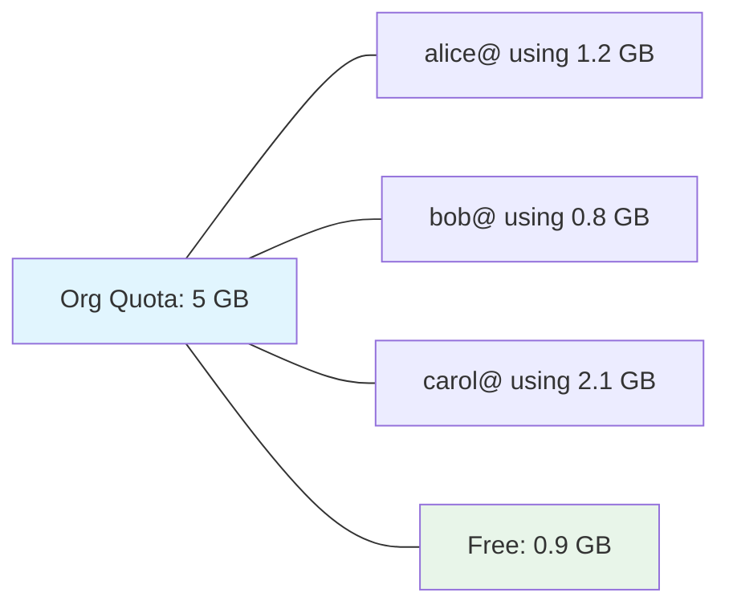
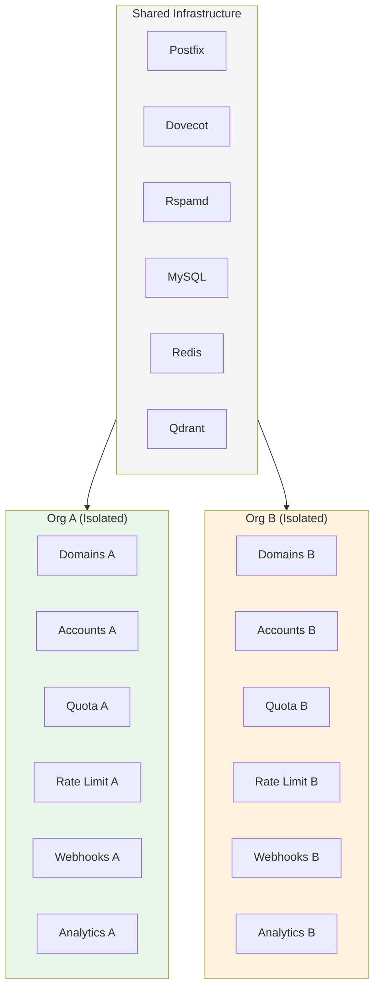

# Multi-Tenant Isolation

> **Enterprise Edition** — This feature is available in [Mailyte Enterprise](https://mailyte.com). The Community Edition does not include this functionality.


How Mailyte keeps tenant data separate — what's shared, what's isolated, and how each boundary is enforced.

---

## The Core Principle

Every piece of tenant data belongs to exactly one Organization. There is no cross-tenant data access in normal operation. The admin API (authenticated with `X-Admin-Password`) is the only path that can see across org boundaries, and that's by design — it's for platform operators, not tenants.

## What's Isolated vs What's Shared

| Resource | Isolated per org? | Details |
|----------|:-:|--------|
| Domains | Yes | Each domain belongs to one org |
| Email accounts | Yes | Each account belongs to one domain, which belongs to one org |
| Mailbox storage | Yes | Each account has its own Maildir on disk |
| API keys | Yes | Keys are scoped to a single org |
| Webhook endpoints | Yes | Each org configures its own callback URLs |
| Rate limits | Yes | Per-org sending limits, independently tracked |
| Storage quotas | Yes | Per-org total, per-account breakdown |
| Analytics | Yes | Pre-aggregated per org and per domain |
| Tracking events | Yes | Open/click events tied to the sending account's org |
| Audit logs | Yes | Actions are logged with the acting org's ID |
| Postfix/Dovecot | **Shared** | Single instances serve all tenants |
| Rspamd | **Shared** | Single spam filter for all tenants |
| MySQL | **Shared** | Single database, isolation via `organization_id` |
| Redis | **Shared** | Single instance, key prefixing per org where needed |
| Qdrant | **Shared** | Single instance, metadata filtering per org |
| TLS certificates | **Shared** | Managed globally by the cert manager |
| IP addresses | **Shared** | All orgs send from the same IPs (unless you configure dedicated IPs) |

## How Isolation is Enforced

### Database-Level Filtering

Almost every table has an `organization_id` column. The API layer adds a `WHERE organization_id = ?` clause to every query automatically. This is handled in the data access layer, not sprinkled through individual endpoints — so forgetting to filter in one endpoint doesn't leak data.

```python
# Simplified example of how queries are scoped
def get_domains(db: Session, org_id: int):
    return db.query(Domain).filter(Domain.organization_id == org_id).all()
```

The org ID comes from the authenticated API key, not from the request body. A tenant can't forge another org's ID because the API key determines which org they are.

!!! warning "The admin bypass"
    The `X-Admin-Password` path bypasses per-org filtering. This is intentional — platform operators need to manage all orgs. But it means the admin password must be treated as a root credential. Never give it to tenants.

### Per-Org Rate Limits

Each organization has its own sending rate limit, tracked independently in Redis:

```
rate_limit:org:{org_id}:hourly -> counter with TTL
```

One org hitting its limit has zero effect on other orgs. The rate limiter checks the calling org's counter and only throttles that org.

### Per-Org Webhooks

Webhook endpoints are registered per org. When an event fires (delivery, bounce, open, click), the webhook worker looks up endpoints for that event's org and only delivers to those URLs.

There's no way for org A to register a webhook that receives org B's events. The lookup is always scoped by `organization_id`.

### Per-Org Storage Quotas

Each org has a total storage budget (`storage_quota_mb`), divided among its accounts. The storage usage worker calculates actual disk usage per account and compares it to quotas.



When an account exceeds its individual quota, Dovecot rejects new deliveries for that account. When the org exceeds its total quota, no accounts in the org can receive new mail until storage is freed.

### Per-Org Analytics

Analytics are pre-aggregated per org. The `AnalyticsSnapshot` and `DomainStats` tables both include `organization_id`. When the API serves analytics data, it filters by the authenticated org.

This means analytics queries are fast (they hit pre-aggregated tables) and isolated (no risk of seeing another org's numbers).

### Mail-Level Isolation

At the Postfix/Dovecot level, isolation works differently than in the API. Mail servers don't have a concept of "organizations" — they deal with domains and accounts.

- **Dovecot** isolates mailboxes by filesystem path. Each account gets its own Maildir directory. Account `alice@acme.com` physically cannot read `bob@widgets.io`'s mail because they're in different directories, and Dovecot's auth ensures each login only accesses its own mailbox.
- **Postfix** enforces sender restrictions. An authenticated user can only send from their own address (or aliases configured for their account). You can't authenticate as `alice@acme.com` and send from `admin@widgets.io`.

### Redis Key Isolation

Redis is a flat key-value store with no built-in multi-tenancy. Mailyte uses key prefixing to keep tenant data separate:

```
rate_limit:org:42:hourly
cache:org:42:domain_list
webhook_queue:org:42
```

Workers always include the org ID in Redis key operations. There's no global key that mixes data from multiple orgs.

### Qdrant Isolation

Vector embeddings in Qdrant are tagged with the organization ID as metadata. Search queries include a metadata filter:

```json
{
  "filter": {
    "must": [
      { "key": "organization_id", "match": { "value": 42 } }
    ]
  }
}
```

This ensures RAG search results only include emails from the requesting org.

## What Happens When You Delete an Org

Deleting an organization cascades through the hierarchy:

1. All API keys for the org are revoked.
2. All webhook endpoints are removed.
3. All email accounts are deactivated (Dovecot stops serving them).
4. All domains are deactivated (Postfix stops accepting mail for them).
5. Mailbox files are marked for deletion (handled by a cleanup job).
6. Database records are soft-deleted (retained for audit purposes, with a configurable hard-delete schedule).
7. Qdrant embeddings for the org are deleted.
8. Redis keys for the org expire naturally via TTLs.

!!! info "Soft delete by default"
    Org deletion is a soft delete. Records stay in the database with a `deleted_at` timestamp. This is for safety — if someone accidentally deletes an org, you can restore it. Hard deletion happens on a schedule (configurable, default 30 days).

## Isolation Boundaries Summary



The infrastructure is shared, but the data layer creates hard boundaries between tenants. As long as queries are scoped by `organization_id` (and they always are — it's enforced at the data access layer), tenants can't see each other's data.
