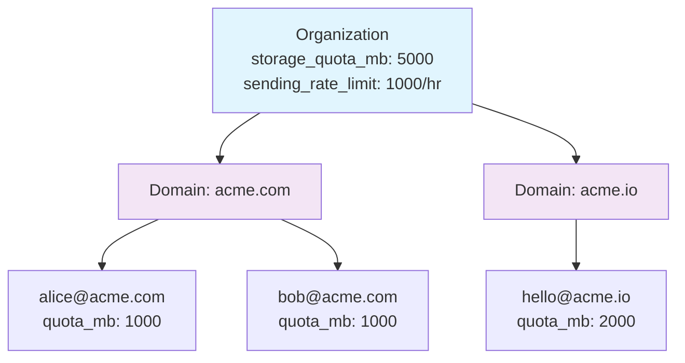

# Organization Model

The multi-tenant hierarchy that keeps everything organized: who owns what, how quotas work, and how Mailyte maps to your upstream system.

---

## The Hierarchy

Mailyte uses a three-level hierarchy to organize tenants:

```
Organization
├── Domain (acme.com)
│   ├── Email Account (alice@acme.com)
│   ├── Email Account (bob@acme.com)
│   └── Alias (support@acme.com → alice@acme.com)
└── Domain (acme.io)
    ├── Email Account (hello@acme.io)
    └── Alias (info@acme.io → hello@acme.io)
```

Think of it like a company structure: the Organization is the company, Domains are departments, and Email Accounts are employees. Aliases are name badges — they point to a real person but aren't a person themselves.

## Organization

The top-level tenant. This is typically one of your customers.

| Field | What it is |
|-------|-----------|
| `id` | Mailyte's internal auto-increment ID |
| `external_id` | Your system's identifier for this customer |
| `name` | Human-readable name ("Acme Corp") |
| `storage_quota_mb` | Total storage allowed across all mailboxes |
| `sending_rate_limit` | Max emails per hour for the whole org |
| `active` | Kill switch — deactivating an org stops all mail flow |

### The `external_id` Field

This is how you connect Mailyte to your own system. When your app creates an organization via the API, you pass your own customer ID as `external_id`:

```http
POST /api/v1/organizations
X-Admin-Password: your-admin-password
Content-Type: application/json

{
  "name": "Acme Corp",
  "external_id": "cust_abc123",
  "storage_quota_mb": 5000,
  "sending_rate_limit": 1000
}
```

Later, you can look up the org by `external_id` instead of having to store Mailyte's internal ID:

```http
GET /api/v1/organizations?external_id=cust_abc123
X-Admin-Password: your-admin-password
```

!!! tip "Always use `external_id`"
    Storing Mailyte's auto-increment IDs in your database creates a tight coupling. Use `external_id` to keep the two systems loosely connected. If you ever need to migrate or rebuild Mailyte, the IDs won't change.

## Domain

A mail domain under an organization. One org can own many domains.

| Field | What it is |
|-------|-----------|
| `name` | The domain name (`acme.com`) |
| `verified` | Whether DNS records have been validated |
| `dkim_enabled` | Whether outgoing mail is DKIM-signed |
| `dkim_private_key` | The DKIM signing key (stored encrypted) |
| `active` | Per-domain kill switch |

Before a domain can send or receive email, it needs to be verified. Verification means your DNS has the correct MX, SPF, DKIM, and DMARC records pointing to your Mailyte instance. The API provides the exact records you need to add.

## Email Account

A mailbox under a domain. This is a real account with storage and authentication.

| Field | What it is |
|-------|-----------|
| `email` | The full email address (`alice@acme.com`) |
| `password_hash` | Hashed password for SMTP/IMAP auth |
| `quota_mb` | Per-mailbox storage limit |
| `active` | Per-account kill switch |

Email accounts can:

- Send email (via SMTP or the API)
- Receive email
- Be accessed via IMAP or POP3

## Alias

A forwarding address that doesn't have its own mailbox.

| Field | What it is |
|-------|-----------|
| `source_address` | The alias address (`support@acme.com`) |
| `destination_address` | Where mail gets forwarded (`alice@acme.com`) |
| `active` | On/off switch |

Aliases are lightweight. They don't consume storage quota because they don't store mail — they just redirect it.

You can set up many-to-one aliases (multiple addresses forwarding to one account) or one-to-many (one address forwarding to multiple accounts, if your Postfix config supports it).

## Quota Inheritance

Quotas flow down the hierarchy:



In this example:

- The org has 5,000 MB total.
- Alice has 1,000 MB, Bob has 1,000 MB, hello@ has 2,000 MB.
- That's 4,000 MB allocated, leaving 1,000 MB unallocated for future accounts.
- Even if you try to create a new account with a 2,000 MB quota, the API will reject it because it would exceed the org's total.

**Sending rate limits** work at the org level. All accounts under all domains share the org's sending rate limit. If the org allows 1,000 emails/hour and Alice sends 800, Bob can only send 200 more that hour.

The **Storage Usage** worker periodically recalculates actual usage per account and per org. If an account exceeds its quota, Dovecot will reject new incoming mail for that account until the user deletes some messages.

## Lifecycle

A typical lifecycle looks like:

1. **Create org** (via admin API)
2. **Add domain** (API returns required DNS records)
3. **Verify domain** (API checks DNS after you've added the records)
4. **Create accounts** under the domain
5. **Set up aliases** as needed
6. **Create API keys** scoped to the org for your app to use

To tear down, work in reverse — delete accounts, then domains, then the org. Or just deactivate the org to stop all mail flow without deleting data.

!!! warning "Deactivation cascades"
    Deactivating an org effectively deactivates all its domains and accounts. Reactivating the org restores everything. But deactivating a single domain only affects that domain's accounts — other domains in the org keep working.
