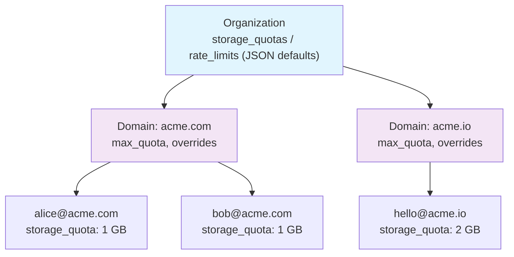

# Organization Model

The multi-tenant hierarchy that keeps everything organized: who owns what, how quotas work, and how Mailyte maps to your upstream system. Field lists below are verified against `database/models/core.py` as of 2026-08-30.

---

## The Hierarchy

Mailyte uses a three-level hierarchy to organize tenants:

```
Organization
├── Domain (acme.com)
│   ├── Email Account (alice@acme.com)
│   ├── Email Account (bob@acme.com)
│   └── Alias (support@acme.com → alice@acme.com)
└── Domain (acme.io)
    ├── Email Account (hello@acme.io)
    └── Alias (info@acme.io → hello@acme.io)
```

Think of it like a company structure: the Organization is the company, Domains are departments, and Email Accounts are employees. Aliases are name badges — they point to a real person but aren't a person themselves.

All three levels use **ULID primary keys** — 26-character, time-sortable strings like `01J5YGKB3ZJR4DPNZN9SMTHF4R` — and all three carry their own `external_id` for mapping to an upstream system.

## Organization

The top-level tenant. This is typically one of your customers.

| Field | What it is |
|-------|-----------|
| `id` | ULID primary key (`CHAR(26)`) |
| `external_id` | Your system's identifier for this customer |
| `name` | Human-readable name ("Acme Corp") |
| `rate_limits` | JSON — default rate limits for the org |
| `storage_quotas` | JSON — default storage quotas for the org |
| `webhook_urls` / `webhook_secret` | The org's event callback configuration |
| `quota_override` (+ `_at`, `_by`) | Set when an operator hand-edits quotas via the console; upstream plan sync then won't overwrite them without `force=true` |
| `active` | Kill switch — deactivating an org stops all mail flow |

### The `external_id` Field

This is how you connect Mailyte to your own system. When your app creates an organization via the API, you pass your own customer ID as `external_id`:

```http
POST /api/v1/organizations/
X-API-Key: <platform-scoped API key>
Content-Type: application/json

{
  "name": "Acme Corp",
  "external_id": "cust_abc123"
}
```

Creating organizations is a **platform-level action** — it requires an admin-scoped API key with platform scope, not a tenant credential.

!!! tip "Always use `external_id`"
    Storing Mailyte's IDs in your database creates a tight coupling. Use `external_id` to keep the two systems loosely connected — each side generates its own ULIDs and maps through `external_id`.

## Domain

A mail domain under an organization. One org can own many domains.

| Field | What it is |
|-------|-----------|
| `domain` | The domain name (`acme.com`), globally unique |
| `max_quota` / `max_users` | Domain-level caps (default 10 GB / 1000 accounts) |
| `dkim_enabled` / `dkim_selector` | DKIM signing configuration (keys live in the `dkim_keys` table, envelope-encrypted) |
| `rate_limits` / `storage_quotas` | JSON overrides of the org defaults |
| `total_storage_used`, `total_email_accounts`, … | Denormalised usage counters maintained by the workers |
| `active` | Per-domain kill switch |

Before a domain can send or receive email reliably, its DNS must be set up. Creating a domain returns the exact records to add (MX, SPF, DKIM, DMARC), and the API's verification endpoint checks live DNS against them.

## Email Account

A mailbox under a domain. This is a real account with storage and authentication.

| Field | What it is |
|-------|-----------|
| `email` | The full address (`alice@acme.com`), unique |
| `local_part` | The part before `@` |
| `password` | bcrypt hash used by Dovecot for SMTP/IMAP/POP3 auth |
| `status` | Lifecycle state — Dovecot's auth queries filter on it |
| `storage_quota` | Per-mailbox byte limit (default 1 GB) |
| `storage_used` (+ email/attachment breakdowns) | Usage, measured by the `storage_usage` worker over IMAP QUOTA |

Email accounts can send (SMTP, webmail, or API), receive, and be accessed via IMAP/POP3/JMAP. An account can also hold **SMTP credentials** — per-application API keys for sending that don't expose the mailbox password and can be rotated or revoked independently (with immediate effect, via a Dovecot auth-cache flush).

## Alias

A forwarding address that doesn't have its own mailbox.

| Field | What it is |
|-------|-----------|
| `source` | The alias address (`support@acme.com`) |
| `destination` | Where mail gets forwarded — a text field, so multiple destinations are supported |
| `active` | On/off switch |

Aliases are lightweight. They don't consume storage quota because they don't store mail — they just redirect it.

## Quotas and Limits

Quotas flow down the hierarchy, with each level able to override the one above:



- **Storage**: each account has a byte quota; each domain a `max_quota` and `max_users` cap; the org sets the defaults. The `storage_usage` worker keeps `storage_used` current from Dovecot's own QUOTA figures and fires warning/exceeded webhooks.
- **Rate limits**: the `rate_limits` JSON at org level (overridable per domain) feeds the `rate_limiter` service, which Postfix consults per message.
- **Operator overrides**: quotas edited by hand through the console set `quota_override`, which stops the upstream plan sync from silently reverting them.

## Lifecycle

A typical lifecycle looks like:

1. **Create org** (platform-scoped API key)
2. **Add domain** (API returns required DNS records)
3. **Verify domain** (API checks live DNS after you've added the records)
4. **Create accounts** under the domain
5. **Set up aliases** as needed
6. **Issue SMTP credentials** for applications that send

To tear down, work in reverse — the API enforces it: deleting an organization returns `400` while it still has domains or accounts. Delete accounts, then domains, then the org. Or just deactivate the org to stop all mail flow without deleting data.

!!! warning "Deactivation cascades — with one caveat"
    Deactivating an org effectively deactivates all its domains and accounts; reactivating restores everything. Deactivating a single domain only affects that domain. The caveat: Dovecot's auth cache keeps already-cached credentials working for up to 1 hour unless flushed — the SMTP-credential endpoints flush it automatically, direct database edits don't.
