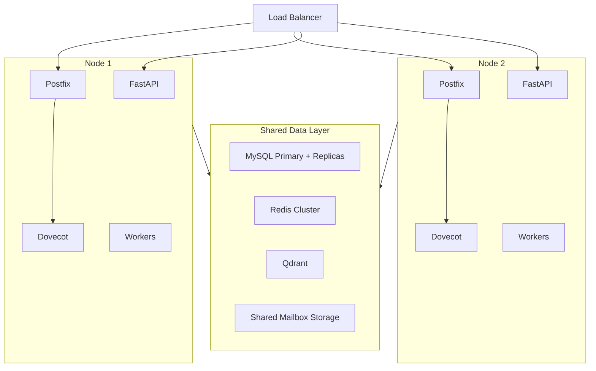

# Scaling Strategy

> **Enterprise Edition** — This feature is available in [Mailyte Enterprise](https://mailyte.com). The Community Edition does not include this functionality.


How to grow Mailyte from handling a few thousand emails a day to millions — and what to scale first when you hit limits.

---

## The Three Scaling Axes

You can scale Mailyte in three ways, and they're not mutually exclusive:

1. **Vertical** — Give individual containers more CPU and RAM.
2. **Horizontal** — Run multiple instances of a service behind a load balancer.
3. **Offloading** — Move data stores to managed services (e.g., RDS for MySQL, ElastiCache for Redis).

Most deployments start vertical, go horizontal for workers, and offload data stores last.

## What to Scale First

When your system starts struggling, here's the priority order. Fix the bottleneck you're actually hitting, not the theoretical one.

### 1. Workers (easiest win)

Workers are stateless processes. You can run 2, 5, or 20 instances of any worker without changing anything else. They pull jobs from Redis/MySQL queues, so adding more instances just means jobs get processed faster.

Scale these first:

| Worker | Scale when... |
|--------|--------------|
| Queue Manager | Outbound queue depth keeps growing |
| Webhook Worker | Webhook delivery latency is high |
| Tracking Worker | Open/click event processing is delayed |
| Analytics Worker | Analytics snapshots are stale |
| RAG Worker | Embedding backlog is growing |

```yaml
# docker-compose.override.yml
services:
  queue-manager:
    deploy:
      replicas: 3
  webhook-worker:
    deploy:
      replicas: 2
```

!!! tip "Workers are the free lunch"
    Because workers are stateless, scaling them is the lowest-risk change you can make. No data migration, no config changes, no downtime.

### 2. Redis

Redis is the second bottleneck you'll hit, because rate limiting, caching, and job queues all share it.

**Vertical first**: Give Redis more RAM. Most Redis instances are underprovisioned. If your hit rate is dropping or evictions are climbing, more memory helps immediately.

**Then cluster**: Redis Cluster shards data across multiple nodes. This gives you both more memory and more throughput. Workers and the API need a Redis client that supports cluster mode (most do).

**Or offload**: Use a managed Redis service (AWS ElastiCache, GCP Memorystore). Let someone else handle failover and backups.

### 3. MySQL

MySQL becomes the bottleneck when you have millions of mail log entries and analytics queries start slowing down.

**Vertical first**: More RAM for InnoDB buffer pool. More CPU cores for query parallelism. This gets you surprisingly far.

**Read replicas**: Route read-heavy queries (analytics, search, reporting) to replicas. The API's write path stays on the primary. SQLAlchemy supports this with separate read/write engine bindings.

**Partitioning**: For tables that grow unboundedly (MailLog, tracking events, analytics), partition by date. Old partitions can be archived or dropped cleanly.

**Or offload**: Use a managed MySQL service (RDS, Cloud SQL). Automatic backups, failover, and scaling without your ops team losing sleep.

### 4. Postfix

Postfix is highly efficient — a single instance handles tens of thousands of messages per hour. But if you're sending millions:

**Multiple Postfix instances**: Run multiple Postfix containers behind a load balancer. Each needs access to the same DKIM keys and config (from MySQL or shared config).

**Dedicated inbound vs outbound**: Separate your receiving Postfix (port 25) from your sending Postfix (port 587/465). They have different scaling profiles — inbound is bursty (spam waves), outbound is steady (your sending rate).

### 5. Dovecot

Dovecot is rarely the bottleneck unless you have thousands of concurrent IMAP connections (heavy email client users).

**Shared storage**: If you scale Dovecot horizontally, all instances need access to the same mailbox storage (NFS, GlusterFS, or similar). This is the tricky part.

**Director mode**: Dovecot has a built-in director that routes users to specific backends, avoiding storage sharing issues. Each user always hits the same backend.

## Vertical Scaling (Resource Allocation)

When running in Docker Compose, you can set resource limits per container:

```yaml
services:
  mysql:
    deploy:
      resources:
        limits:
          cpus: '4'
          memory: 8G
        reservations:
          cpus: '2'
          memory: 4G

  redis:
    deploy:
      resources:
        limits:
          cpus: '2'
          memory: 4G

  postfix:
    deploy:
      resources:
        limits:
          cpus: '2'
          memory: 2G
```

**Recommended starting points for a production deployment:**

| Service | CPU | RAM | Notes |
|---------|-----|-----|-------|
| MySQL | 2-4 cores | 4-8 GB | Mostly InnoDB buffer pool |
| Redis | 1-2 cores | 2-4 GB | Depends on cache size |
| Postfix | 1-2 cores | 1-2 GB | Lightweight per connection |
| Dovecot | 1-2 cores | 1-2 GB | Scales with concurrent IMAP sessions |
| Rspamd | 2-4 cores | 2-4 GB | ML scoring is CPU-intensive |
| FastAPI | 1-2 cores | 1-2 GB | Stateless, scale with replicas |
| Qdrant | 2-4 cores | 4-8 GB | Depends on number of embeddings |
| Workers | 0.5-1 core each | 512 MB each | Lightweight |

## Horizontal Scaling Architecture

When you outgrow a single Docker Compose deployment:



The key requirement for horizontal scaling is **shared state**: all nodes must share the same MySQL, Redis, and mailbox storage. Workers are the easiest to distribute because they only need database and cache access.

## Monitoring What to Scale

Watch these metrics to know when it's time to scale:

| Metric | Threshold | Action |
|--------|-----------|--------|
| Outbound queue depth > 1000 | 5+ minutes | Scale queue manager workers |
| API response time p95 > 500ms | Sustained | Scale FastAPI replicas or MySQL |
| Redis memory usage > 80% | Sustained | Scale Redis vertically or cluster |
| MySQL slow queries > 10/min | Sustained | Optimize queries, add replicas |
| Postfix queue depth > 5000 | 5+ minutes | Scale Postfix or check downstream |
| Dovecot concurrent connections > 80% limit | Sustained | Scale Dovecot |
| Rspamd scan latency > 2s average | Sustained | Scale Rspamd or ClamAV |

!!! info "Scale the bottleneck, not everything"
    Resist the urge to scale all services equally. Profile first, find the bottleneck, scale that one thing. Repeat. Most systems have one bottleneck at a time.
