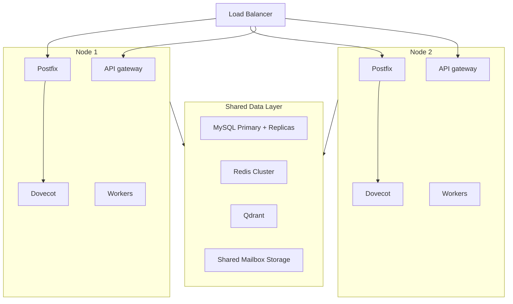

# Scaling Strategy

How to grow Mailyte from handling a few thousand emails a day to millions — and what to scale first when you hit limits.

---

## The Three Scaling Axes

You can scale Mailyte in three ways, and they're not mutually exclusive:

1. **Vertical** — Give individual containers more CPU and RAM.
2. **Horizontal** — Run multiple instances of a service behind a load balancer.
3. **Offloading** — Move data stores to managed services (e.g., RDS for MySQL, ElastiCache for Redis).

Most deployments start vertical, go horizontal for workers, and offload data stores last.

## What to Scale First

When your system starts struggling, here's the priority order. Fix the bottleneck you're actually hitting, not the theoretical one.

### 1. Stateless HTTP services (easiest win)

The gateway and most workers are stateless HTTP services. `docker-compose.prod.yml` already runs **api ×2, webhooks ×2, and tracking ×2**; raising those numbers (or replicating others) is a one-line change.

Scale these first:

| Service | Scale when... |
|---------|--------------|
| api (gateway) | API response times climb under load |
| webhooks | Webhook delivery latency is high |
| tracking | Open/click event processing is delayed |
| analytics | Rollups and reports are stale |
| rag | Embedding backlog is growing |

```yaml
# docker-compose.prod.yml (or an override file)
services:
  api:
    deploy:
      replicas: 3
  webhooks:
    deploy:
      replicas: 3
```

Two gotchas, both already handled for the replicated services in `docker-compose.prod.yml` and required for any service you add replicas to:

- `container_name` must be nulled out (`!reset null`) — a fixed name collides with replica naming.
- Fixed host-port publishes must be dropped (`ports: !reset []`) — every replica would fight for the same host port. Traefik reaches replicas over the internal network.

!!! warning "queue_manager is not a throughput knob"
    `queue_manager` manages **Postfix's own spool** via `postqueue` — it doesn't process a job queue, so running more replicas of it does not drain outbound mail faster. If the Postfix queue is growing, the bottleneck is delivery (remote acceptance, DNS, throttling), not queue management.

### 2. Redis

Redis is the second bottleneck you'll hit, because rate limiting, caching, and job queues all share it.

**Vertical first**: Give Redis more RAM. Most Redis instances are underprovisioned. If your hit rate is dropping or evictions are climbing, more memory helps immediately.

**Then cluster**: Redis Cluster shards data across multiple nodes. This gives you both more memory and more throughput. Workers and the API need a Redis client that supports cluster mode (most do).

**Or offload**: Use a managed Redis service (AWS ElastiCache, GCP Memorystore). Let someone else handle failover and backups.

### 3. MySQL

MySQL becomes the bottleneck when you have millions of mail log entries and analytics queries start slowing down.

**Vertical first**: More RAM for InnoDB buffer pool. More CPU cores for query parallelism. This gets you surprisingly far.

**Read replicas**: Route read-heavy queries (analytics, search, reporting) to replicas. The API's write path stays on the primary. SQLAlchemy supports this with separate read/write engine bindings.

**Partitioning**: For tables that grow unboundedly (MailLog, tracking events, analytics), partition by date. Old partitions can be archived or dropped cleanly.

**Or offload**: Use a managed MySQL service (RDS, Cloud SQL). Automatic backups, failover, and scaling without your ops team losing sleep.

### 4. Postfix

Postfix is highly efficient — a single instance handles tens of thousands of messages per hour. But if you're sending millions:

**Multiple Postfix instances**: Run multiple Postfix containers behind a load balancer. Each needs access to the same DKIM keys and config (from MySQL or shared config).

**Dedicated inbound vs outbound**: Separate your receiving Postfix (port 25) from your sending Postfix (port 587/465). They have different scaling profiles — inbound is bursty (spam waves), outbound is steady (your sending rate).

### 5. Dovecot

Dovecot is rarely the bottleneck unless you have thousands of concurrent IMAP connections (heavy email client users).

**Shared storage**: If you scale Dovecot horizontally, all instances need access to the same mailbox storage (NFS, GlusterFS, or similar). This is the tricky part.

**Director mode**: Dovecot has a built-in director that routes users to specific backends, avoiding storage sharing issues. Each user always hits the same backend.

## Vertical Scaling (Resource Allocation)

When running in Docker Compose, you can set resource limits per container:

```yaml
services:
  mysql:
    deploy:
      resources:
        limits:
          cpus: '4'
          memory: 8G
        reservations:
          cpus: '2'
          memory: 4G

  redis:
    deploy:
      resources:
        limits:
          cpus: '2'
          memory: 4G

  postfix:
    deploy:
      resources:
        limits:
          cpus: '2'
          memory: 2G
```

**What production ships with today** (`docker-compose.prod.yml` memory limits — raise these as volume grows):

| Service | Memory limit | Notes |
|---------|-------------|-------|
| MySQL | 2 GB | Mostly InnoDB buffer pool — first thing to raise |
| Redis | 512 MB | Base compose also caps `maxmemory` at 256 MB LRU |
| Postfix / Dovecot / Rspamd | 1 GB each | Rspamd's ML scoring is the CPU-heavy one |
| Qdrant | 1 GB | Grows with embedding count |
| api / webhooks / tracking | 512 MB each, ×2 replicas | Stateless, scale with replicas |
| Most other workers | 256–512 MB each | Lightweight |
| Prometheus / Kafka | 1 GB each | 30d metrics retention; Kafka idle until wired in |

## Horizontal Scaling Architecture

When you outgrow a single Docker Compose deployment:



The key requirement for horizontal scaling is **shared state**: all nodes must share the same MySQL, Redis, and mailbox storage. Workers are the easiest to distribute because they only need database and cache access.

## Monitoring What to Scale

Watch these metrics to know when it's time to scale:

| Metric | Threshold | Action |
|--------|-----------|--------|
| Postfix queue depth > 1000 | 5+ minutes | Investigate delivery (remote deferrals, DNS, throttling) — not queue_manager |
| API response time p95 > 500ms | Sustained | Add api replicas, or look at MySQL |
| Redis memory usage > 80% | Sustained | Raise `maxmemory`/container limit, then cluster or offload |
| MySQL slow queries > 10/min | Sustained | Optimize queries, add replicas |
| Dovecot concurrent connections > 80% limit | Sustained | Scale Dovecot |
| Rspamd scan latency > 2s average | Sustained | Give Rspamd more CPU, or scale it out |

!!! info "Scale the bottleneck, not everything"
    Resist the urge to scale all services equally. Profile first, find the bottleneck, scale that one thing. Repeat. Most systems have one bottleneck at a time.
