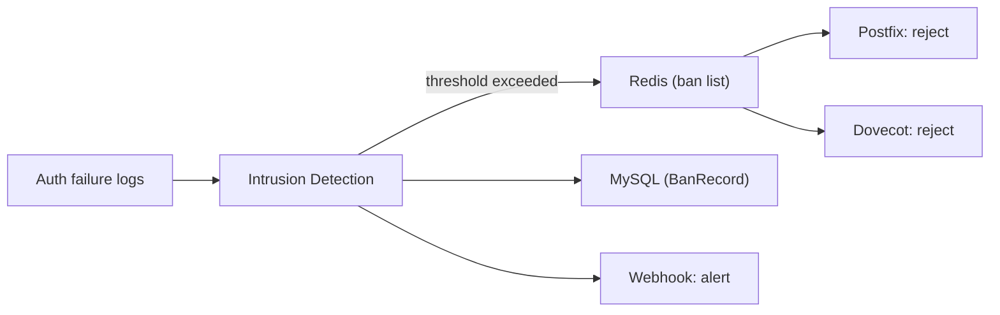

# Security Model

How Mailyte protects itself, its tenants, and the email it handles — from authentication to encryption to threat detection.

---

## Authentication

Mailyte has two authentication paths: one for the REST API and one for email protocols (SMTP/IMAP/POP3). They serve different purposes and work differently.

### API Authentication

The REST API uses two header-based mechanisms:

**API Keys (`X-API-Key` header)** — The primary method for programmatic access. Your application includes its API key in every request:

```http
GET /api/v1/domains
X-API-Key: mlt_a1b2c3d4e5f6...
```

API keys are:

- Scoped to a single organization (tenant isolation).
- Created with specific permissions (`send_only`, `read_only`, `admin`).
- Stored as hashed values in MySQL — if the database leaks, the raw keys aren't exposed.
- Revocable at any time via the API.

**Admin Password (`X-Admin-Password` header)** — Used for system-level operations that span across organizations, like creating new orgs or managing global settings:

```http
POST /api/v1/organizations
X-Admin-Password: your-admin-password
```

!!! warning "Keep the admin password safe"
    The admin password has full access to everything. Use it only for initial setup and infrastructure management. For day-to-day operations, use scoped API keys.

### Email Protocol Authentication

When email clients connect via SMTP (port 587/465) or IMAP/POP3, Postfix delegates authentication to Dovecot, which checks credentials against MySQL.

- Passwords are hashed with a strong algorithm (bcrypt or argon2).
- Only authenticated users can submit outbound email.
- Clients can only send from addresses that belong to their account.

## Encryption (TLS Everywhere)

Every external-facing connection uses TLS:

| Protocol | Port | TLS Mode |
|----------|------|----------|
| SMTP (server-to-server) | 25 | Opportunistic STARTTLS |
| SMTP (client submission) | 587 | Required STARTTLS |
| SMTP (client submission) | 465 | Implicit TLS |
| IMAP | 143 | STARTTLS |
| IMAPS | 993 | Implicit TLS |
| POP3 | 110 | STARTTLS |
| POP3S | 995 | Implicit TLS |
| REST API | 5000 | TLS (via reverse proxy) |

Internal service-to-service communication within the Docker network is unencrypted — it never leaves the host, so TLS overhead isn't needed there.

The **Cert Manager** worker handles automatic certificate renewal (Let's Encrypt or similar). When a cert is renewed, it reloads Postfix and Dovecot so they pick up the new cert without downtime.

!!! danger "Monitor cert expiry"
    An expired TLS cert breaks everything — clients refuse to connect, and other mail servers may reject your messages. The health monitor tracks cert expiry, but set up external alerts as a safety net.

## DKIM Signing

Every outgoing email is signed with a DKIM signature. This proves the message really came from your domain and hasn't been tampered with in transit.

How it works:

1. When you add a domain via the API, Mailyte generates a DKIM keypair.
2. The private key is stored in MySQL (encrypted at rest).
3. The public key is provided as a DNS TXT record you add to your domain.
4. When Postfix sends an email from that domain, it signs the message headers and body with the private key.
5. The receiving server looks up the public key in DNS and verifies the signature.

Combined with SPF and DMARC records (also managed via the API), DKIM gives your domain strong email authentication. This is critical for deliverability — without it, your email is much more likely to land in spam folders.

## Intrusion Detection (fail2ban)

The intrusion detection service monitors logs for suspicious patterns and automatically bans offending IPs.

What it watches:

- **SMTP auth failures** — Someone trying passwords against Postfix.
- **IMAP/POP3 auth failures** — Brute-force attacks on mailboxes.
- **API auth failures** — Repeated bad API keys or admin passwords.

How bans work:

1. The IDS watches Postfix, Dovecot, and API logs for auth failures.
2. When an IP exceeds the failure threshold (e.g., 5 failures in 10 minutes), it's added to the ban list in Redis.
3. Postfix and Dovecot reject connections from banned IPs.
4. Bans expire after a configurable duration (default: 1 hour, escalating for repeat offenders).
5. Ban events are logged to MySQL (`BanRecord`) and can trigger webhooks.



## Rate Limiting as Security

Rate limiting isn't just about fair usage — it's a security control. Here's what's limited:

| What | Scope | Default | Purpose |
|------|-------|---------|---------|
| Outbound emails | Per org, per hour | Configurable | Prevent compromised accounts from spamming |
| SMTP connections | Per IP | Configurable | Slow down brute-force attacks |
| API requests | Per API key | Configurable | Prevent abuse of the management API |
| Auth failures | Per IP | 5/10min | Trigger fail2ban before attackers get far |

Rate limits are enforced in Redis using atomic increment-and-check with TTLs. This means they're fast (sub-millisecond) and accurate even under high concurrency.

!!! tip "Fail closed, not open"
    If Redis is down and rate limits can't be checked, the safe default is to reject the request. Letting traffic through unmetered when your rate limiter is offline is how abuse happens.

## Data Isolation Per Organization

Every piece of tenant data is tagged with an `organization_id`. This isn't just a convention — it's enforced at multiple levels:

1. **API layer**: Every API request is scoped to the org that owns the API key. You physically cannot query another org's data through the API.
2. **Database layer**: Queries always include `WHERE organization_id = ?`. There's no "list all mailboxes across all orgs" endpoint (except for the admin password path).
3. **Worker layer**: Workers process jobs per-org and never mix data across tenants.
4. **Mail layer**: Dovecot's virtual mailbox configuration ensures each account only sees its own mail.

See [Multi-Tenant Isolation](multi-tenant.md) for the full breakdown.

## Audit Trail

Every significant action is logged to the `AuditLog` table:

- Who (user ID or API key)
- What (action type: create, update, delete)
- Which resource (org, domain, account, etc.)
- When (timestamp)
- From where (IP address)

This gives you a complete history of who changed what. Useful for compliance, debugging, and "who deleted that domain?" investigations.

## Security Checklist

When deploying Mailyte, make sure:

- [ ] Admin password is long, random, and stored in a secret manager (not in a config file).
- [ ] API keys use the minimum permissions needed.
- [ ] TLS certificates are valid and auto-renewing.
- [ ] DKIM, SPF, and DMARC records are configured for every domain.
- [ ] fail2ban is running and alerting on bans.
- [ ] Rate limits are set to sane defaults.
- [ ] MySQL is not exposed outside the Docker network.
- [ ] Redis is not exposed outside the Docker network.
- [ ] Backups are encrypted and stored off-site.
