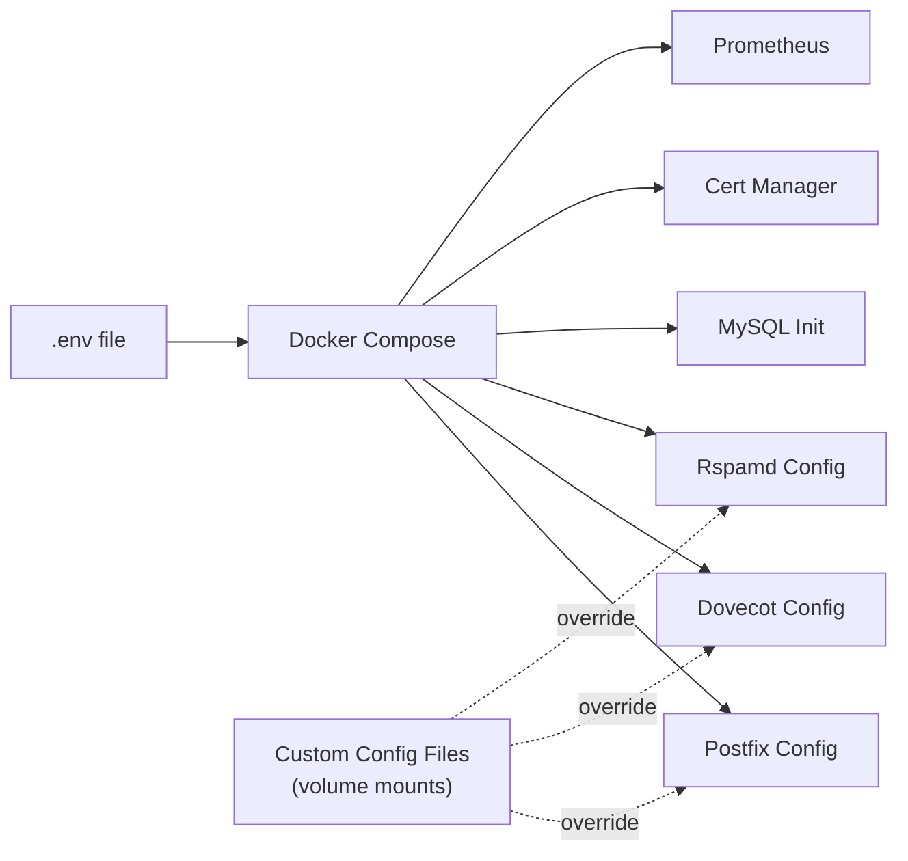

# Configuration

Everything you need to set up and customize Mailyte's email server components. Whether you're doing a first-time setup or fine-tuning a production deployment, this section has you covered.

---

## How Configuration Works

Mailyte runs as a set of Docker containers, each handling a specific part of the email pipeline. Most settings come from **environment variables** defined in your `.env` file or passed into Docker Compose. These variables get injected into service-specific config files at container startup.

For deeper customization, you can mount your own config files directly into the containers. The pages below explain both approaches.



## Components at a Glance

| Component | Role | Default Port(s) |
|-----------|------|-----------------|
| **Postfix** | SMTP — sends and receives email | 25, 465, 587 |
| **Dovecot** | IMAP/POP3 — lets users read their mail | 143, 993, 110, 995 |
| **Rspamd** | Anti-spam, DKIM signing, virus scanning | 11332, 11334 |
| **ClamAV** | Virus detection (integrated with Rspamd) | 3310 |
| **MySQL** | Stores domains, mailboxes, aliases, and metadata | 3306 |
| **Redis** | Caching, rate limiting, Rspamd backend | 6379 |
| **FastAPI** | Management API | 5000 |
| **Prometheus** | Metrics collection and alerting | 9090 |
| **cert-manager** | SSL certificate auto-renewal via Let's Encrypt | — |

## In This Section

<div class="grid cards" markdown>

-   :material-key-variant:{ .lg .middle } **Environment Variables**

    ---

    The complete reference for every env var, grouped by category. Start here if you're setting up for the first time.

    [:octicons-arrow-right-24: Environment Variables](environment-variables.md)

-   :material-email-fast:{ .lg .middle } **Postfix Configuration**

    ---

    SMTP settings, virtual domains, TLS, SASL authentication, relay hosts, and rate limiting.

    [:octicons-arrow-right-24: Postfix Configuration](postfix-configuration.md)

-   :material-email-open:{ .lg .middle } **Dovecot Configuration**

    ---

    IMAP/POP3 authentication, quotas, virtual users, namespaces, and Sieve filtering.

    [:octicons-arrow-right-24: Dovecot Configuration](dovecot-configuration.md)

-   :material-shield-check:{ .lg .middle } **Rspamd Configuration**

    ---

    Spam filtering thresholds, DKIM signing, ClamAV integration, greylisting, and Bayesian training.

    [:octicons-arrow-right-24: Rspamd Configuration](rspamd-configuration.md)

-   :material-lock:{ .lg .middle } **SSL Certificates**

    ---

    Let's Encrypt auto-renewal, manual certificate installation, and SNI for multiple domains.

    [:octicons-arrow-right-24: SSL Certificates](ssl-certificates.md)

-   :material-dns:{ .lg .middle } **DNS Setup**

    ---

    MX, SPF, DKIM, DMARC, MTA-STS, and SRV records — explained with copy-paste examples.

    [:octicons-arrow-right-24: DNS Setup](dns-setup.md)

-   :material-speedometer:{ .lg .middle } **Performance Tuning**

    ---

    Queue tuning, connection limits, memory settings, and worker counts for high-throughput setups.

    [:octicons-arrow-right-24: Performance Tuning](performance-tuning.md)

-   :material-domain:{ .lg .middle } **Multi-Tenant Configuration**

    ---

    Per-organization settings, quota defaults, rate limits, and webhook routing.

    [:octicons-arrow-right-24: Multi-Tenant Configuration](multi-tenant.md)

-   :material-chart-line:{ .lg .middle } **Monitoring Configuration**

    ---

    Prometheus scrape targets, metric endpoints, and alert rule definitions.

    [:octicons-arrow-right-24: Monitoring Configuration](monitoring-configuration.md)

-   :material-database-search:{ .lg .middle } **Prometheus Setup**

    ---

    Full `prometheus.yml` config, scrape intervals, retention policies, and storage sizing.

    [:octicons-arrow-right-24: Prometheus Setup](prometheus-setup.md)

</div>

## Quick Start

If you just want to get running, here's the minimum you need:

=== "Step 1: Environment"

    Set your environment variables — at minimum, your domain name and database passwords.

    ```bash
    cp .env.example .env
    # Edit .env with your values
    ```

    See [Environment Variables](environment-variables.md) for the full list.

=== "Step 2: DNS"

    Configure your DNS records before starting the server. You need at least an MX record and an A record.

    See [DNS Setup](dns-setup.md) for all required records.

=== "Step 3: Launch"

    ```bash
    docker compose up -d
    ```

    SSL certificates get provisioned automatically on first boot.

=== "Step 4: Verify"

    ```bash
    curl http://localhost:8080/health
    ```

!!! tip "Start with the defaults"
    Mailyte ships with sensible settings for most deployments. Only dive into per-service tuning once you have traffic flowing and can see what needs adjusting.

!!! note "File paths"
    All file paths in this documentation are relative to the container filesystem unless stated otherwise. When mounting custom configs, map your host paths accordingly in `docker-compose.yml`.

## Related Sections

- **[Deployment](../deployment/index.md)** — Production setup, Docker Compose, and Kubernetes guides
- **[Monitoring](../monitoring/index.md)** — Dashboards, alerts, and health checks
- **[Reference](../reference/index.md)** — CLI commands, database schema, and env var lookup
