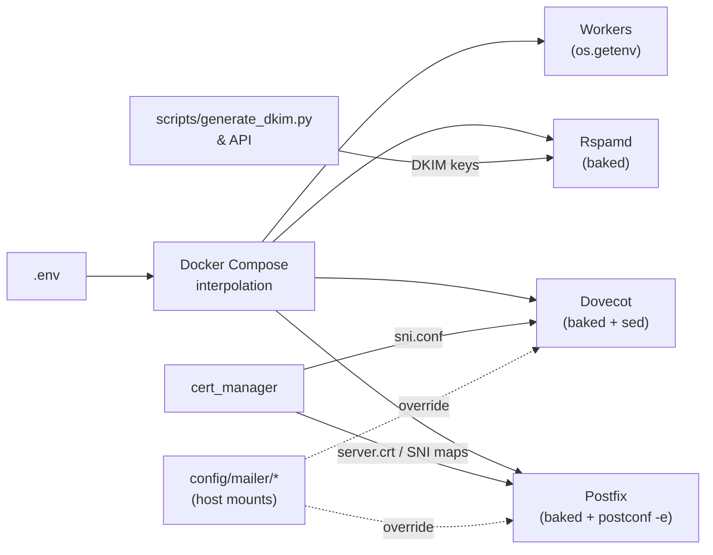

# Configuration

Everything you need to set up and customize Mailyte's email server components. Whether you're doing a first-time setup or fine-tuning a production deployment, this section has you covered.

---

## How Configuration Works

Mailyte runs as a set of Docker containers (~45 services). Configuration has three layers:

1. **Environment variables** — defined in `.env` and injected per-service by Docker Compose interpolation (a variable reaches a container only if that service's `environment:` block names it).
2. **Baked service configs** — Postfix/Dovecot/Rspamd configuration is built into the images from `mailer/*/config/`; entrypoints apply env-driven overrides at start (`postconf -e`, `sed` substitution).
3. **Host-mounted overrides and generated files** — a small set under `config/mailer/` (transport cutover map, Dovecot `local.conf`) and the generated artifacts under `storage/` (DKIM keys, deployed certificates, SNI maps).



## Components at a Glance

| Component | Role | Port(s) |
|-----------|------|---------|
| **Postfix** | SMTP — sends and receives email; postscreen on 25, tracking filter on submission | 25, 587, 465 (public); 10026, 10587 internal |
| **Dovecot** | IMAP/POP3/LMTP/Sieve; auth backend for Postfix and SMTP credentials | 143, 993, 110, 995, 4190 (public); 24, 24100, 24180 internal |
| **Rspamd** | Anti-spam, DKIM/ARC signing, greylisting, smart-folder classification | 11332 (milter), 11334 (controller) |
| **MySQL** | Domains, mailboxes, aliases, SMTP credentials, logs, all metadata | internal only |
| **Redis** | Rate limiting, Rspamd data, auth policy, caches | internal (6379) |
| **api** (FastAPI) | Management API gateway | container 8080 → host 8083 |
| **~20 worker services** | tracking, webhooks, rate_limiter, analytics, archiver, queue_manager, rag, storage_usage, monitoring, … | 8081–8104 |
| **log_ingestor** | Tails the Postfix log into `mail_logs` + delivery webhooks | — |
| **cert_manager** | Let's Encrypt issuance/renewal + SNI map generation | — |
| **Prometheus / Grafana / Alertmanager** | Metrics, dashboards, alerts | 9090 / 3000 / 9093 |
| **Traefik** (production) | HTTPS entry for API, webmail, console, autoconfig, docs, Grafana | 80, 443 |

Virus scanning (ClamAV) is **not deployed by default** — the Rspamd antivirus module ships disabled; see [Rspamd Configuration](rspamd-configuration.md).

## In This Section

<div class="grid cards" markdown>

-   :material-key-variant:{ .lg .middle } **Environment Variables**

    ---

    How config loading actually works, the minimum setup set, and the traps. Start here.

    [:octicons-arrow-right-24: Environment Variables](environment-variables.md)

-   :material-email-fast:{ .lg .middle } **Postfix Configuration**

    ---

    SMTP settings, virtual domains, TLS/SNI, sender-login enforcement, postscreen, the tracking filter, and the transport cutover map.

    [:octicons-arrow-right-24: Postfix Configuration](postfix-configuration.md)

-   :material-email-open:{ .lg .middle } **Dovecot Configuration**

    ---

    Authentication (mailboxes, SMTP credentials, master users), quotas, Sieve, mail_crypt, and the auth cache.

    [:octicons-arrow-right-24: Dovecot Configuration](dovecot-configuration.md)

-   :material-shield-check:{ .lg .middle } **Rspamd Configuration**

    ---

    Spam thresholds, DKIM/ARC signing, greylisting, Bayesian training, and per-organization policies.

    [:octicons-arrow-right-24: Rspamd Configuration](rspamd-configuration.md)

-   :material-lock:{ .lg .middle } **SSL Certificates**

    ---

    cert_manager's Let's Encrypt flow, SNI map generation, and manual certificate installation.

    [:octicons-arrow-right-24: SSL Certificates](ssl-certificates.md)

-   :material-dns:{ .lg .middle } **DNS Setup**

    ---

    MX, SPF, DKIM, DMARC, PTR, MTA-STS, autoconfig — the exact records Mailyte generates and verifies.

    [:octicons-arrow-right-24: DNS Setup](dns-setup.md)

-   :material-speedometer:{ .lg .middle } **Performance Tuning**

    ---

    The stack's real defaults and the knobs that matter at scale.

    [:octicons-arrow-right-24: Performance Tuning](performance-tuning.md)

-   :material-domain:{ .lg .middle } **Multi-Tenant Configuration**

    ---

    Organizations, quotas, rate limits, SMTP credentials, and per-tenant webhooks.

    [:octicons-arrow-right-24: Multi-Tenant Configuration](multi-tenant.md)

-   :material-chart-line:{ .lg .middle } **Monitoring Configuration**

    ---

    Metric endpoints, shipped alert rules, and Alertmanager routing.

    [:octicons-arrow-right-24: Monitoring Configuration](monitoring-configuration.md)

-   :material-database-search:{ .lg .middle } **Prometheus Setup**

    ---

    The shipped prometheus.yml, retention, exporters, and target corrections.

    [:octicons-arrow-right-24: Prometheus Setup](prometheus-setup.md)

</div>

## Quick Start

If you just want to get running, here's the minimum:

=== "Step 1: Secrets & identity"

    ```bash
    ./scripts/generate-secrets.sh    # writes .env with strong secrets
    # then edit .env: HOSTNAME, DOMAIN, ADMIN_EMAIL, ACME_EMAIL, ACME_STAGING
    ```

    See [Environment Variables](environment-variables.md).

=== "Step 2: DNS"

    Configure DNS before starting: A record for `HOSTNAME`, PTR on the server IP, then MX/SPF/DKIM/DMARC per hosted domain.

    See [DNS Setup](dns-setup.md).

=== "Step 3: Launch"

    ```bash
    docker compose up -d       # or: ./start.sh dev / ./scripts/staged-startup.sh
    ```

    The `secrets-check` gate validates your secrets, `migrate` applies the schema, and cert_manager provisions certificates as domains resolve.

=== "Step 4: Verify"

    ```bash
    curl http://localhost:8083/health   # API health (host port)
    ./start.sh health                   # per-service summary
    ./scripts/setup-first-user.sh       # bootstrap the first org/domain/mailbox/API key
    ```

!!! tip "Start with the defaults"
    Mailyte ships with sensible settings for most deployments. Only dive into per-service tuning once you have traffic flowing and can see what needs adjusting.

!!! note "File paths"
    All file paths in this documentation are container paths unless stated otherwise. Baked configs live in the repo under `mailer/<service>/config/` — edits there need an image rebuild.

## Related Sections

- **[Deployment](../deployment/index.md)** — Production setup, Docker Compose, and Kubernetes guides
- **[Monitoring](../monitoring/index.md)** — Dashboards, alerts, and health checks
- **[Reference](../reference/index.md)** — CLI commands, database schema, and env var lookup
