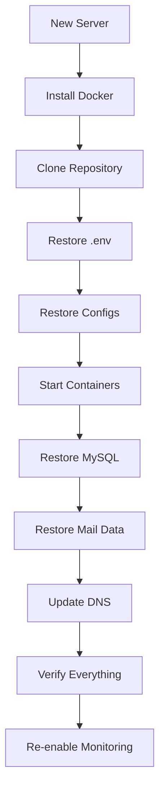

# Disaster Recovery

When things go really wrong — database corruption, server failure, or accidental deletion — here's how to get back up.

## Recovery Time Objectives

Know your targets before disaster strikes:

| Scenario | Target Recovery Time | Data Loss Tolerance |
|----------|---------------------|-------------------|
| Single service crash | < 5 minutes (auto-healing) | None |
| Database corruption | < 1 hour | Up to 24 hours |
| Full server failure | < 4 hours | Up to 24 hours |
| Data center outage | < 8 hours | Up to 24 hours |
| Accidental data deletion | < 2 hours | Depends on backup frequency |

## Quick Assessment

When something breaks, figure out what you're dealing with:

```bash
# What's running?
docker compose ps

# Can you reach the server?
ssh user@your-server

# Is Docker running?
systemctl status docker

# Check disk space
df -h

# Check system logs
journalctl --since "1 hour ago" | tail -50
```

## Scenario 1: Database Restore

MySQL database is corrupted or lost.

### From mysqldump

```bash
# 1. Stop services that depend on MySQL
docker compose stop api worker postfix dovecot

# 2. Find the latest backup
ls -lt /opt/mailyte/backups/mysql/ | head -5

# 3. Drop and recreate the database
docker compose exec mysql mysql -u root -p"${MYSQL_ROOT_PASSWORD}" -e "
  DROP DATABASE IF EXISTS mailyte;
  CREATE DATABASE mailyte;
"

# 4. Restore from backup
zcat /opt/mailyte/backups/mysql/mailyte_20260325_020000.sql.gz \
  | docker compose exec -T mysql mysql -u root -p"${MYSQL_ROOT_PASSWORD}" mailyte

# 5. Verify the restore
docker compose exec mysql mysql -u root -p"${MYSQL_ROOT_PASSWORD}" mailyte -e "
  SELECT COUNT(*) AS users FROM users;
  SELECT COUNT(*) AS domains FROM domains;
  SELECT COUNT(*) AS emails FROM emails;
"

# 6. Restart services
docker compose up -d
```

### From Remote Backup (S3)

```bash
# Download the backup
aws s3 cp s3://your-bucket/mailyte-backups/mysql/mailyte_20260325_020000.sql.gz \
  /tmp/restore.sql.gz

# Then follow steps 1-6 above using /tmp/restore.sql.gz
```

## Scenario 2: Mail Data Recovery

Mail storage volume is damaged or deleted.

```bash
# 1. Stop mail services
docker compose stop postfix dovecot

# 2. Check if the volume still exists
docker volume inspect mailyte_mail-data

# 3a. If volume exists but data is corrupt — restore from backup
MAIL_VOLUME=$(docker volume inspect mailyte_mail-data --format '{{ .Mountpoint }}')
rsync -av --delete /opt/mailyte/backups/mail/latest/ "$MAIL_VOLUME/"

# 3b. If volume is gone — recreate it and restore
docker volume create mailyte_mail-data
MAIL_VOLUME=$(docker volume inspect mailyte_mail-data --format '{{ .Mountpoint }}')
rsync -av /opt/mailyte/backups/mail/latest/ "$MAIL_VOLUME/"

# 4. Fix permissions
docker compose run --rm postfix chown -R vmail:vmail /var/mail

# 5. Restart mail services
docker compose up -d postfix dovecot

# 6. Verify — check a known mailbox
docker compose exec dovecot doveadm mailbox list -u testuser@yourdomain.com
```

## Scenario 3: Full System Rebuild

The entire server is gone. Starting from a new machine.



### Step by Step

```bash
# 1. Set up the new server
sudo apt update && sudo apt upgrade -y
curl -fsSL https://get.docker.com | sh
sudo usermod -aG docker $USER

# 2. Clone the repository
git clone https://github.com/TechiesAfrica/mailyte-email-server.git
cd mailyte-email-server

# 3. Restore configuration from backup
# Download from S3/remote server
aws s3 cp s3://your-bucket/mailyte-backups/config/config_latest.tar.gz /tmp/
tar xzf /tmp/config_latest.tar.gz -C .

# Restore .env (encrypted with GPG)
aws s3 cp s3://your-bucket/mailyte-backups/config/env_latest.gpg /tmp/
gpg --decrypt /tmp/env_latest.gpg > .env

# 4. Update .env with new server IP (if changed)
sed -i 's/OLD_SERVER_IP/NEW_SERVER_IP/' .env

# 5. Get TLS certificates
sudo certbot certonly --standalone \
  -d mail.yourdomain.com \
  --email admin@yourdomain.com \
  --agree-tos

# 6. Start the infrastructure services first
docker compose up -d mysql redis
sleep 30  # Wait for MySQL to initialize

# 7. Restore the database
aws s3 cp s3://your-bucket/mailyte-backups/mysql/mailyte_latest.sql.gz /tmp/
zcat /tmp/restore.sql.gz \
  | docker compose exec -T mysql mysql -u root -p"${MYSQL_ROOT_PASSWORD}"

# 8. Start remaining services
docker compose up -d

# 9. Restore mail data
aws s3 sync s3://your-bucket/mailyte-backups/mail/latest/ /tmp/mail-restore/
MAIL_VOLUME=$(docker volume inspect mailyte_mail-data --format '{{ .Mountpoint }}')
sudo rsync -av /tmp/mail-restore/ "$MAIL_VOLUME/"
docker compose exec postfix chown -R vmail:vmail /var/mail

# 10. Restart to pick up restored data
docker compose restart

# 11. Update DNS if the IP changed
echo "Update your DNS A record for mail.yourdomain.com to point to the new IP"

# 12. Verify
curl -s http://localhost:8080/health | python3 -m json.tool
echo "EHLO test" | nc -w 3 localhost 25
```

## Scenario 4: Corrupted Docker Environment

Docker itself is broken but the server is fine.

```bash
# 1. Stop everything
docker compose down

# 2. Back up volumes before touching Docker
sudo cp -a /var/lib/docker/volumes/mailyte_mysql-data /tmp/mysql-backup
sudo cp -a /var/lib/docker/volumes/mailyte_mail-data /tmp/mail-backup

# 3. Reinstall Docker
sudo apt remove -y docker-ce docker-ce-cli containerd.io
sudo apt install -y docker-ce docker-ce-cli containerd.io docker-compose-plugin

# 4. Restore volumes
sudo cp -a /tmp/mysql-backup /var/lib/docker/volumes/mailyte_mysql-data
sudo cp -a /tmp/mail-backup /var/lib/docker/volumes/mailyte_mail-data

# 5. Restart
docker compose up -d
```

## Post-Recovery Checklist

After any recovery, verify everything:

- [ ] All containers running: `docker compose ps`
- [ ] Health check passes: `curl http://localhost:8080/health`
- [ ] Database queries work: `docker compose exec mysql mysql -u root -p -e "SELECT 1"`
- [ ] Can send email: test via API
- [ ] Can receive email: send from external address
- [ ] Can read email: test IMAP login
- [ ] Monitoring is working: check Grafana
- [ ] Backups are running: verify cron jobs are set
- [ ] DNS is correct: `dig mail.yourdomain.com`
- [ ] TLS certificates valid: `openssl s_client -connect mail.yourdomain.com:993`

## Prevention

The best disaster recovery is prevention:

1. **Test backups monthly** — restore to a test environment
2. **Monitor disk space** — set alerts at 80% usage
3. **Use remote backup storage** — not just local disk
4. **Document your setup** — you might not be the one doing the recovery
5. **Keep the .env backup current** — update it every time you change passwords
6. **Set up monitoring alerts** — catch problems before they become disasters

> **Tip:** Write down your recovery steps specific to your environment and keep them somewhere accessible even if your server is down (printed copy, shared doc, password manager note).
