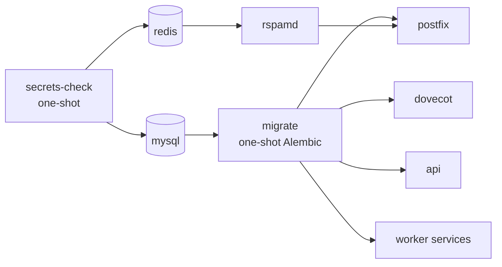

# Docker Deployment

The complete Docker Compose setup — the compose files, startup gating, services, volumes, networks, and ports explained.

## The Compose File Set

Mailyte does not ship a single compose file. It ships a base file plus overrides you stack on top:

| File | Role |
|------|------|
| `docker-compose.yml` | The full stack (~30 services) with development-friendly port bindings. Never run alone on an internet-facing host. |
| `docker-compose.dev.yml` | Development override: uvicorn hot-reload for the Python workers, live-reload docs server, console built from a sibling source checkout. |
| `docker-compose.prod.yml` | Production override: Traefik reverse proxy, every internal port rebound to `127.0.0.1`, memory limits, JSON log rotation, `api`/`webhooks`/`tracking` at 2 replicas, debug flags off. |
| `docker-compose.cloud.yml` | Replaces the local `mysql`/`redis` containers with no-op stubs and points every service at a remote database/Redis (RDS, ElastiCache, ...). |
| `docker-compose.override.yml.example` | Template for machine-specific tweaks (port conflicts). Copy to `docker-compose.override.yml` (gitignored) — Compose loads it automatically for a plain `docker compose up`. |

```bash
# Development
docker compose -f docker-compose.yml -f docker-compose.dev.yml up -d    # ./start.sh dev

# Production
docker compose -f docker-compose.yml -f docker-compose.prod.yml up -d   # ./start.sh prod

# Cloud DB/Redis
docker compose -f docker-compose.yml -f docker-compose.cloud.yml up -d  # ./start.sh cloud
```

`start.sh` (and `scripts/mailyte-ctl.sh` behind it) wraps these combinations and also passes `--profile console` so the console behaves like any other service.

!!! note "Compose v2.24+ required"
    The prod and override files use the `!override` and `!reset` YAML tags to *replace* port lists instead of appending to them. Older Compose releases fail to parse these files.

## Startup Gating

Order is enforced with `depends_on` conditions, not sleep loops:



1. **`secrets-check`** runs first and validates the required secrets (fail-closed — a weak `DB_PASSWORD` stops the entire stack before a single service starts).
2. **`mysql`** boots from the `secrets/db_root_password` file (`MYSQL_ROOT_PASSWORD_FILE`, not a plain env var).
3. **`migrate`** runs `alembic upgrade head` once per `up`. Every schema-touching service waits on `condition: service_completed_successfully`, so a failed migration stops the deploy instead of letting a half-migrated API start.
4. Everything else starts once its dependencies are healthy.

Both one-shot containers are *supposed* to show `Exited (0)` in `docker compose ps -a`.

!!! warning "Rebuild the migrate image when migrations change"
    The `migrate` service bakes `alembic/` into its own image (`worker/api/Dockerfile.migrate`). After pulling new code that adds migrations, a **stale image silently no-ops** — it still contains the previous release's migration files, reports the old head, and exits 0. Rebuild it first:

    ```bash
    docker compose build migrate && docker compose up -d
    ```

    `deployment/deploy.sh` rebuilds all images on every deploy for exactly this reason.

## Service Inventory

| Group | Services |
|-------|----------|
| **Mail core** | `postfix` (SMTP), `dovecot` (IMAP/POP3/Sieve), `rspamd` (spam/DKIM), `cert_manager` (ACME), `acme_webroot`, `log_ingestor` (Postfix log → `mail_logs` + webhooks) |
| **Control plane** | `api` (FastAPI gateway — the REST API everything else fronts) |
| **Workers** | `webhooks`, `tracking`, `rate_limiter`, `queue_manager`, `storage_usage`, `analytics`, `monitoring`, `archiver`, `dashboard`, `encryption`, `templates`, `url_protection`, `oauth`, `delivery_optimizer`, `jmap`, `caldav`, `migration`, `autoconfig`, `activesync`, `rag` |
| **Infrastructure** | `mysql` (8.0.35, pinned — newer 8.0.x images need x86-64-v2 CPUs), `redis`, `qdrant`, `kafka` + `zookeeper`, `radicale`, `docker-proxy` (scoped Docker socket access for monitoring/cert_manager), `secrets-check`, `migrate` |
| **Monitoring** | `prometheus` (v2.51.0), `grafana` (10.4.0), `alertmanager` (v0.27.0), `mysql-exporter`, `redis-exporter` |
| **Security** | `dlp`, `totp`, `geo_blocking` |
| **UI (profiles)** | `console` (profile `console`), `webmail` (profile `webmail`), `roundcube` (profile `roundcube`), `sogo` (profile `sogo`), `docs` (this handbook) |

Container names match service names (`container_name: api`, `postfix`, ...) — except `api`, `webhooks`, and `tracking` in production, where fixed names are reset because they run 2 replicas.

## Port Mappings (base file)

Host bindings from `docker-compose.yml`. In production, everything below the mail rows is rebound to `127.0.0.1` and reached externally only through Traefik on 443.

| Host Port | Container | Service | Notes |
|-----------|-----------|---------|-------|
| 25, 587, 465 | same | postfix | Public mail ports; 10026 is the internal rspamd reinjection listener |
| 143, 993, 110, 995, 4190 | same | dovecot | IMAP/S, POP3/S, ManageSieve |
| 11332, 11334 | same | rspamd | 11334 is the web UI |
| 8083 | 8080 | api | REST API (`/health`, `/api-docs`) |
| 8081 | 8081 | webhooks | |
| 8082 | 8082 | rate_limiter | |
| 8084 | 80 | activesync | |
| 8085 | 8085 | monitoring | |
| 8086 | 8086 | tracking | |
| 8087 | 8085 | analytics | |
| 8088 | 8088 | dashboard | |
| 8089 | 8083 | archiver | |
| 8090 | 8090 | queue_manager | |
| 8091 | 8090 | rag | |
| 8092 | 8092 | storage_usage | |
| 8093 | 8084 | encryption | |
| 8094 | 8088 | delivery_optimizer | |
| 8095 | 8089 | templates | |
| 8096 | 8090 | url_protection | |
| 8097 | 8091 | oauth | |
| 8098 | 8098 | jmap | |
| 8099 | 8099 | migration | |
| 8100 | 8100 | autoconfig | |
| 8101 | 8101 | caldav | |
| 8102 / 8103 / 8104 | same | dlp / totp / geo_blocking | |
| 6333 | 6333 | qdrant | |
| 9092 | 9092 | kafka | |
| 5232 | 5232 | radicale | |
| 9090 / 3000 / 9093 | same | prometheus / grafana / alertmanager | |
| 9104 / 9121 | same | mysql-exporter / redis-exporter | |
| 8000 | 80 | docs | `DOCS_PORT` overrides the host side |
| 3100 | 3100 | console | profile `console` |
| 127.0.0.1:3200 | 3000 | webmail | profile `webmail` |
| 8880 / 8881 | 80 | roundcube / sogo | profiles `roundcube` / `sogo` |

MySQL and Redis publish **no** host ports — they are reachable only on the Docker network.

## Volumes and Persistent Data

Two kinds of persistence, and the distinction matters for backups and deploys:

### Named volumes (live under `/var/lib/docker/volumes`)

| Volume | Purpose | Backup priority |
|--------|---------|----------------|
| `mysql_data` | All database tables | Critical |
| `postfix_spool` | The Postfix queue — accepted-but-undelivered mail. Shared with `queue_manager` so `postqueue -p` works there | Critical while non-empty |
| `redis_data` | Cache, rate-limit state, queues | Low |
| `rspamd_data` | Learned spam/ham data | Medium |
| `letsencrypt_data` | cert_manager's ACME account/state | Medium |
| `log_ingestor_state` | Read offset into the Postfix log | Low |
| `prometheus_data`, `grafana_data`, `alertmanager_data` | Metrics and dashboards | Low |
| `kafka_data`, `zookeeper_data`, `zookeeper_log`, `radicale_data`, `docs_site` | Per-service state | Low |

With `COMPOSE_PROJECT_NAME=mailyte-prod` these appear as `mailyte-prod_mysql_data`, etc. Pinning the project name is what keeps volumes attached across release directories — see `deployment/deploy.sh`'s header.

### Bind mounts (live in the project tree)

| Host path | Used by | Contents |
|-----------|---------|----------|
| `storage/mail_data/` | postfix, dovecot, storage_usage | The Maildirs — **critical** |
| `storage/dkim_keys/` | rspamd | DKIM private keys (encrypted under the KEK) |
| `storage/ssl_certs/`, `storage/ssl_private/`, `storage/sni_config/` | cert_manager, postfix, dovecot, traefik | TLS certificates and SNI maps |
| `storage/backups/` | backup.sh | Local backup sets |
| `storage/archive-spool/`, `storage/api_data/`, `storage/qdrant_data/`, `storage/acme_challenge/` | archiver, api, qdrant, acme_webroot | Service state |
| `logs/` | postfix, dovecot, rspamd, workers | Real mail logs (`logs/mailer/postfix/mail.log` is the delivery record) |
| `config/mailer/*` | postfix, dovecot, rspamd, roundcube | Custom configuration |
| `secrets/db_root_password`, `secrets/encryption_kek`, `secrets/archive_age_identity` | mysql, api, rspamd, encryption, archiver | Mounted secret files — **critical, escrow them** |

```bash
# See volume sizes
docker system df -v | grep -A 25 "VOLUME NAME"

# Inspect a specific volume
docker volume inspect mailyte-prod_mysql_data
```

## Networks

| Network | Subnet | Members |
|---------|--------|---------|
| `mailserver_network` | 172.25.0.0/16 | Everything except docker-proxy |
| `internal_only` | 172.26.0.0/16 (internal) | `docker-proxy` plus the two services allowed to call it (`monitoring`, `cert_manager`) |

`docker-proxy` is the only container that touches `/var/run/docker.sock`, and it is scoped to list/inspect/restart — no exec, no images, no volumes. `monitoring` restarts unhealthy containers through it; `cert_manager` SIGHUPs postfix/dovecot after certificate rotation.

!!! note "host.docker.internal is not automatic here"
    This stack runs on a custom bridge network, where `host.docker.internal` does not resolve unless a service carries an explicit `extra_hosts: ["host.docker.internal:host-gateway"]` mapping. The services that need it (`webhooks`, `tracking`, `storage_usage`, `archiver`) already have it.

## Common Operations

```bash
# Start everything (interactive menu with staged startup)
./start.sh

# Start / stop / status via CLI
./start.sh start
./start.sh stop
./start.sh status
./start.sh logs postfix
./start.sh health

# Or raw compose
docker compose up -d
docker compose down            # stops; keeps data
docker compose down -v         # DESTROYS named volumes (database, queue)

# Restart a single service
docker compose restart postfix

# Rebuild one service after a code change
./start.sh dev --rebuild api   # or:
docker compose build api && docker compose up -d api

# Run migrations / check status
python3 manage.py migrate
python3 manage.py migrate:status

# Enter a container
docker compose exec postfix bash
docker compose exec mysql sh -c 'mysql -u root -p"$(cat /run/secrets/db_root_password)"'
```

!!! warning "Never `docker volume prune` on a shared host"
    It is not scoped to this project. `deployment/deploy.sh` deliberately cleans up by compose-project label only.

## Environment Variables

Interpolation values come from `.env` (see [Configuration](../getting-started/configuration.md)). The essentials:

| Variable | Required | Description |
|----------|----------|-------------|
| `COMPOSE_PROJECT_NAME` | Yes (production) | Pin to `mailyte-prod` so volumes survive release-directory deploys |
| `DOMAIN`, `HOSTNAME` | Yes | Server identity |
| `DB_PASSWORD`, `DB_ROOT_PASSWORD` | Yes | Validated fail-closed at startup |
| `WEBHOOK_SECRET`, `OAUTH_TOKEN_SECRET`, `URL_HMAC_SECRET`, `ADMIN_PASSWORD`, `ADMIN_TOKEN_SECRET`, `GRAFANA_ADMIN_PASSWORD` | Yes | Generated by `scripts/generate-secrets.sh` |
| `ACME_EMAIL`, `ACME_STAGING`, `CERT_SERVER_IPS` | Production | cert_manager / Let's Encrypt |
| `TRAEFIK_DASHBOARD_USER`, `TRAEFIK_DASHBOARD_PASS` | Production | Traefik dashboard basic auth |
| `CONSOLE_ALLOWED_IPS` | Production | Console IP allowlist (fails closed to loopback) |
| `COMPOSE_PROFILES` | No | `roundcube`, `sogo` to enable those webmail clients |
| `CONSOLE_VERSION`, `WEBMAIL_VERSION` | Production | Pin the console/webmail image tags |
