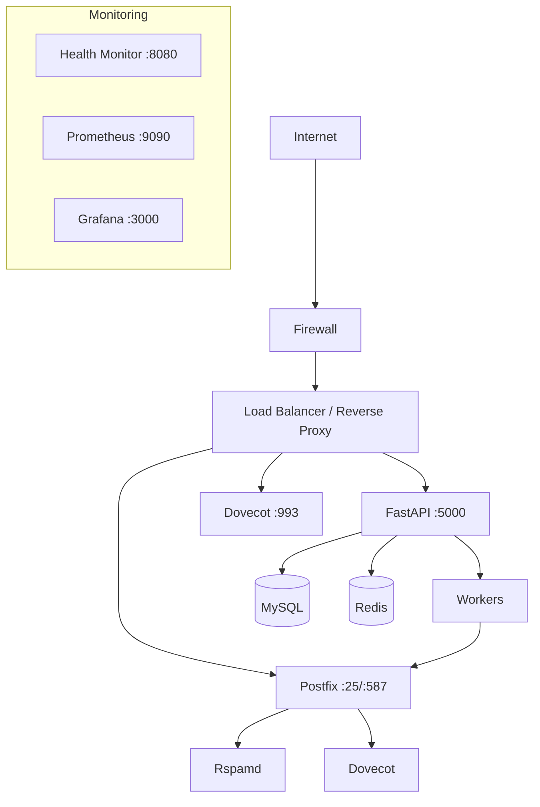

# Deployment

How to get Mailyte running in production — from a single Docker Compose setup to a full Kubernetes cluster. This section covers requirements, setup, hardening, scaling, backups, and disaster recovery.

---

## Choose Your Deployment Model

=== "Docker Compose"

    **Best for:** Single server, small to medium organizations, getting started quickly.

    - Everything runs on one machine
    - Simple to manage with standard Docker tooling
    - Handles thousands of mailboxes comfortably

    [:octicons-arrow-right-24: Docker Deployment Guide](docker-deployment.md)

=== "Kubernetes"

    **Best for:** High availability, horizontal scaling, multi-region deployments.

    - Helm charts and StatefulSet manifests included
    - Auto-scaling based on queue depth
    - Rolling updates with zero downtime

    [:octicons-arrow-right-24: Kubernetes Guide](kubernetes.md)

!!! tip "Start with Docker Compose"
    Most teams start with Docker Compose. It handles everything on a single server and is straightforward to manage. Move to Kubernetes when you need horizontal scaling or multi-region deployments.

## Architecture Overview



## In This Section

<div class="grid cards" markdown>

-   :material-clipboard-check:{ .lg .middle } **Requirements**

    ---

    CPU, RAM, disk, network, and software prerequisites. Check this before you begin.

    [:octicons-arrow-right-24: Requirements](requirements.md)

-   :material-rocket-launch:{ .lg .middle } **Production Setup**

    ---

    Step-by-step production deployment walkthrough from zero to running.

    [:octicons-arrow-right-24: Production Setup](production-setup.md)

-   :material-format-list-checks:{ .lg .middle } **Production Checklist**

    ---

    Pre-launch verification checklist — DNS, TLS, firewall, backups, monitoring.

    [:octicons-arrow-right-24: Production Checklist](production-checklist.md)

-   :material-docker:{ .lg .middle } **Docker Deployment**

    ---

    Docker Compose deep dive — service ordering, volumes, networking, and resource limits.

    [:octicons-arrow-right-24: Docker Deployment](docker-deployment.md)

-   :material-kubernetes:{ .lg .middle } **Kubernetes**

    ---

    K8s manifests, Helm charts, StatefulSets, and ingress configuration.

    [:octicons-arrow-right-24: Kubernetes](kubernetes.md)

-   :material-chart-line:{ .lg .middle } **Monitoring Stack**

    ---

    Deploying Prometheus, Grafana, and Alertmanager alongside your mail server.

    [:octicons-arrow-right-24: Monitoring Stack](monitoring-stack.md)

</div>

### Operations & Reliability

| Page | What It Covers |
|------|---------------|
| [Maintenance](maintenance.md) | Routine tasks — log rotation, database optimization, certificate renewal |
| [Backup Strategies](backup-strategies.md) | What to back up, how often, and where to store it |
| [Disaster Recovery](disaster-recovery.md) | Recovery procedures when things go seriously wrong |
| [Security Hardening](security-hardening.md) | Firewall rules, TLS policies, fail2ban, and access control |
| [Scaling Guide](scaling-guide.md) | When and how to scale each component — vertical and horizontal |

## Quick Start

If you just want to get Mailyte running:

```bash
# 1. Clone the repo
git clone https://github.com/TechiesAfrica/mailyte-email-server.git
cd mailyte-email-server

# 2. Copy and edit the environment file
cp .env.example .env
# Edit .env with your domain, passwords, etc.

# 3. Start everything
docker compose up -d

# 4. Verify
curl http://localhost:8080/health
```

!!! warning "Not production-ready yet"
    The quick start above gets you running, but it's not hardened for production. For a proper deployment, start with [Requirements](requirements.md) and work through the [Production Setup](production-setup.md) guide, then validate against the [Production Checklist](production-checklist.md).

## Minimum Server Requirements

| Resource | Small (< 100 mailboxes) | Medium (100–1,000) | Large (1,000+) |
|----------|------------------------|-------------------|----------------|
| **CPU** | 2 cores | 4 cores | 8+ cores |
| **RAM** | 4 GB | 8 GB | 16+ GB |
| **Disk** | 40 GB SSD | 100 GB SSD | 500+ GB SSD |
| **Network** | 100 Mbps | 1 Gbps | 1 Gbps+ |

See [Requirements](requirements.md) for the full breakdown including software dependencies.

## Related Sections

- **[Configuration](../configuration/index.md)** — Environment variables, service tuning, and DNS setup
- **[Monitoring](../monitoring/index.md)** — Dashboards, alerts, and health checks
- **[Guides > Scaling to Millions](../guides/scaling-to-millions.md)** — Advanced scaling strategies
- **[Guides > Backup Automation](../guides/backup-automation.md)** — Automated backup scripts and schedules
