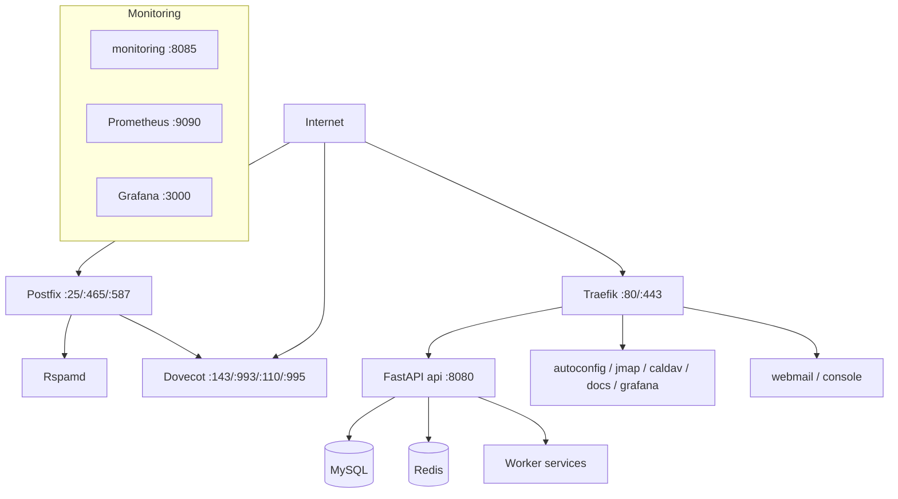

# Deployment

How to get Mailyte running in production on the supported single-host Docker Compose stack. This section covers requirements, setup, hardening, scaling, backups, and disaster recovery.

---

## Choose Your Deployment Model

=== "Docker Compose"

    **Best for:** Everyone. This is the only supported deployment model.

    - Everything runs on one machine
    - Simple to manage with standard Docker tooling, `start.sh`, and `deployment/deploy.sh`
    - Handles thousands of mailboxes comfortably

    [:octicons-arrow-right-24: Docker Deployment Guide](docker-deployment.md)

=== "Kubernetes"

    **Not currently supported.** The repository ships no Kubernetes manifests or Helm charts, and several services (Postfix spool, Dovecot maildirs, cert_manager's SIGHUP-over-docker-proxy reloads) assume the single-host Compose topology.

    [:octicons-arrow-right-24: Details](kubernetes.md)

!!! tip "Docker Compose is the supported path"
    Every script, health check, and the deploy pipeline in this repository targets the Docker Compose stack on a single host. Scale vertically first -- see the [Scaling Guide](scaling-guide.md).

## Architecture Overview



In production (`docker-compose.prod.yml`), only the mail ports and Traefik's 80/443 are public -- every internal service port is bound to `127.0.0.1` on the host (hardening applied 2026-08-22). Traefik serves `api.<domain>`, `grafana.<domain>`, `docs.<domain>`, the autoconfig/autodiscover hosts, the webmail, and the operator console over HTTPS.

## In This Section

<div class="grid cards" markdown>

-   :material-clipboard-check:{ .lg .middle } **Requirements**

    ---

    CPU, RAM, disk, network, and software prerequisites. Check this before you begin.

    [:octicons-arrow-right-24: Requirements](requirements.md)

-   :material-rocket-launch:{ .lg .middle } **Production Setup**

    ---

    Step-by-step production deployment walkthrough from zero to running.

    [:octicons-arrow-right-24: Production Setup](production-setup.md)

-   :material-format-list-checks:{ .lg .middle } **Production Checklist**

    ---

    Pre-launch verification checklist — DNS, TLS, firewall, backups, monitoring.

    [:octicons-arrow-right-24: Production Checklist](production-checklist.md)

-   :material-docker:{ .lg .middle } **Docker Deployment**

    ---

    Docker Compose deep dive — service ordering, volumes, networking, and resource limits.

    [:octicons-arrow-right-24: Docker Deployment](docker-deployment.md)

-   :material-kubernetes:{ .lg .middle } **Kubernetes**

    ---

    Why Kubernetes is not a supported deployment target, and what to do instead.

    [:octicons-arrow-right-24: Kubernetes](kubernetes.md)

-   :material-chart-line:{ .lg .middle } **Monitoring Stack**

    ---

    Deploying Prometheus, Grafana, and Alertmanager alongside your mail server.

    [:octicons-arrow-right-24: Monitoring Stack](monitoring-stack.md)

</div>

### Operations & Reliability

| Page | What It Covers |
|------|---------------|
| [Maintenance](maintenance.md) | Routine tasks — log rotation, database optimization, certificate renewal |
| [Backup Strategies](backup-strategies.md) | What to back up, how often, and where to store it |
| [Disaster Recovery](disaster-recovery.md) | Recovery procedures when things go seriously wrong |
| [Security Hardening](security-hardening.md) | Firewall rules, TLS policies, fail2ban, and access control |
| [Scaling Guide](scaling-guide.md) | When and how to scale each component — vertical and horizontal |

## Quick Start

If you just want to get Mailyte running:

```bash
# 1. Clone the repo
git clone https://github.com/Techies-Africa/mailyte-email-server.git
cd mailyte-email-server

# 2. Generate .env and the required secrets (fail-closed -- the stack
#    refuses to boot with weak or missing secrets)
./scripts/generate-secrets.sh
./scripts/generate_dkim_kek.sh
# Edit .env: HOSTNAME, DOMAIN, ADMIN_EMAIL

# 3. Start everything
./start.sh start          # or: docker compose up -d

# 4. Verify
curl http://localhost:8083/health
```

!!! warning "Not production-ready yet"
    The quick start above gets you running, but it's not hardened for production. For a proper deployment, start with [Requirements](requirements.md) and work through the [Production Setup](production-setup.md) guide, then validate against the [Production Checklist](production-checklist.md).

## How Production Deploys Actually Run

Two mechanisms exist, and it is worth knowing which one your host uses:

1. **`deployment/deploy.sh`** -- the DevPilot-driven production deploy. Each release lands in a fresh timestamped directory with a `current` symlink pointing at the live one; `storage/`, `secrets/`, and `logs/` are anchored outside the release path so they survive. The script pins the Compose project name (`mailyte-prod`), takes a pre-deploy backup (a database dump whenever a migration is pending), builds all images, brings up singleton services, and rolling-updates the replicated ones (`api`, `webhooks`, `tracking`).

    !!! warning "Hotfixes must target the `current` symlink"
        Copying a fixed file into a pinned `deployments/<timestamp>/` path silently patches a dead release. Always edit through the `current` symlink, and verify by checking for the new code inside the running container -- not with a syntax check.

2. **GitHub Actions `Deploy` workflow** (`.github/workflows/deploy.yml`) -- **manual only** (`workflow_dispatch`) with `environment` (staging/production), `services`, `skip_backup`, and `dry_run` inputs. Automatic deploy-on-merge to `develop` was disabled 2026-07-31 because the staging environment and its secrets do not exist yet; production runs must come from the `main` branch. CI (`ci.yml`) still runs on every push to `main`/`develop` and on PRs.

## Minimum Server Requirements

| Resource | Small (< 100 mailboxes) | Medium (100–1,000) | Large (1,000+) |
|----------|------------------------|-------------------|----------------|
| **CPU** | 2 cores | 4 cores | 8+ cores |
| **RAM** | 4 GB | 8 GB | 16+ GB |
| **Disk** | 40 GB SSD | 100 GB SSD | 500+ GB SSD |
| **Network** | 100 Mbps | 1 Gbps | 1 Gbps+ |

See [Requirements](requirements.md) for the full breakdown including software dependencies.

## Related Sections

- **[Configuration](../configuration/index.md)** — Environment variables, service tuning, and DNS setup
- **[Monitoring](../monitoring/index.md)** — Dashboards, alerts, and health checks
- **[Guides > Scaling to Millions](../guides/scaling-to-millions.md)** — Advanced scaling strategies
- **[Guides > Backup Automation](../guides/backup-automation.md)** — Automated backup scripts and schedules
