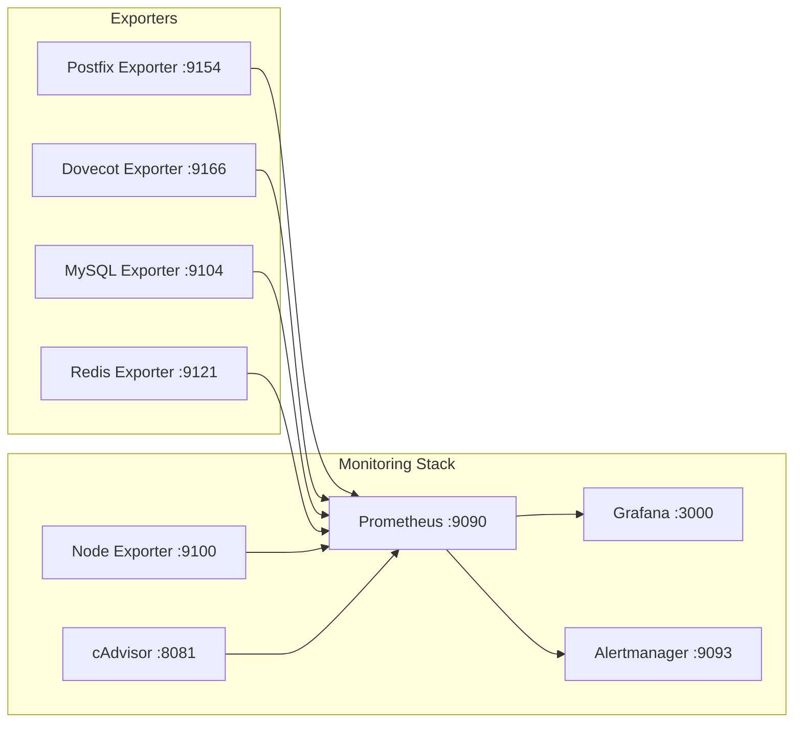

# Monitoring Stack Deployment

> **Enterprise Edition** — This feature is available in [Mailyte Enterprise](https://mailyte.com). The Community Edition does not include this functionality.


How to deploy the full monitoring stack — Prometheus, Grafana, and Alertmanager — alongside your Mailyte email server.

## Overview

The monitoring stack runs as its own Docker Compose file (or can be merged into the main one). It's optional but strongly recommended for production.



## Docker Compose File

```yaml
# docker-compose.monitoring.yml
version: "3.8"

services:
  # ─────────────────────────────────────────
  # Prometheus — Metrics storage and queries
  # ─────────────────────────────────────────
  prometheus:
    image: prom/prometheus:latest
    container_name: mailyte-prometheus
    restart: unless-stopped
    ports:
      - "127.0.0.1:9090:9090"   # Localhost only
    volumes:
      - ./monitoring/prometheus/prometheus.yml:/etc/prometheus/prometheus.yml:ro
      - ./monitoring/prometheus/rules:/etc/prometheus/rules:ro
      - prometheus-data:/prometheus
    command:
      - "--config.file=/etc/prometheus/prometheus.yml"
      - "--storage.tsdb.path=/prometheus"
      - "--storage.tsdb.retention.time=30d"
      - "--storage.tsdb.retention.size=10GB"
      - "--web.enable-lifecycle"        # Allows config reload via API
      - "--web.enable-admin-api"        # Allows admin operations
    networks:
      - mailyte-network
      - monitoring-network
    deploy:
      resources:
        limits:
          cpus: "1.0"
          memory: 2G

  # ─────────────────────────────────────────
  # Grafana — Dashboards and visualization
  # ─────────────────────────────────────────
  grafana:
    image: grafana/grafana:latest
    container_name: mailyte-grafana
    restart: unless-stopped
    ports:
      - "127.0.0.1:3000:3000"   # Localhost only
    volumes:
      - grafana-data:/var/lib/grafana
      - ./monitoring/grafana/provisioning:/etc/grafana/provisioning:ro
      - ./monitoring/grafana/dashboards:/var/lib/grafana/dashboards:ro
    environment:
      - GF_SECURITY_ADMIN_USER=admin
      - GF_SECURITY_ADMIN_PASSWORD=${GRAFANA_PASSWORD:-changeme}
      - GF_USERS_ALLOW_SIGN_UP=false
      - GF_AUTH_ANONYMOUS_ENABLED=false
      - GF_SERVER_ROOT_URL=http://localhost:3000
      - GF_INSTALL_PLUGINS=grafana-clock-panel,grafana-piechart-panel
    depends_on:
      - prometheus
    networks:
      - monitoring-network
    deploy:
      resources:
        limits:
          cpus: "0.5"
          memory: 512M

  # ─────────────────────────────────────────
  # Alertmanager — Alert routing
  # ─────────────────────────────────────────
  alertmanager:
    image: prom/alertmanager:latest
    container_name: mailyte-alertmanager
    restart: unless-stopped
    ports:
      - "127.0.0.1:9093:9093"
    volumes:
      - ./monitoring/alertmanager/alertmanager.yml:/etc/alertmanager/alertmanager.yml:ro
      - alertmanager-data:/alertmanager
    command:
      - "--config.file=/etc/alertmanager/alertmanager.yml"
      - "--storage.path=/alertmanager"
    networks:
      - monitoring-network
    deploy:
      resources:
        limits:
          cpus: "0.25"
          memory: 128M

  # ─────────────────────────────────────────
  # Node Exporter — OS metrics
  # ─────────────────────────────────────────
  node-exporter:
    image: prom/node-exporter:latest
    container_name: mailyte-node-exporter
    restart: unless-stopped
    pid: host
    volumes:
      - /proc:/host/proc:ro
      - /sys:/host/sys:ro
      - /:/rootfs:ro
    command:
      - "--path.procfs=/host/proc"
      - "--path.sysfs=/host/sys"
      - "--path.rootfs=/rootfs"
      - "--collector.filesystem.mount-points-exclude=^/(sys|proc|dev|host|etc)($$|/)"
    networks:
      - monitoring-network

  # ─────────────────────────────────────────
  # cAdvisor — Container metrics
  # ─────────────────────────────────────────
  cadvisor:
    image: gcr.io/cadvisor/cadvisor:latest
    container_name: mailyte-cadvisor
    restart: unless-stopped
    volumes:
      - /:/rootfs:ro
      - /var/run:/var/run:ro
      - /sys:/sys:ro
      - /var/lib/docker/:/var/lib/docker:ro
      - /dev/disk/:/dev/disk:ro
    privileged: true
    devices:
      - /dev/kmsg
    networks:
      - monitoring-network

  # ─────────────────────────────────────────
  # Service Exporters
  # ─────────────────────────────────────────
  postfix-exporter:
    image: mailyte/postfix-exporter:latest
    container_name: mailyte-postfix-exporter
    restart: unless-stopped
    environment:
      - POSTFIX_HOST=postfix
    networks:
      - mailyte-network
      - monitoring-network

  mysql-exporter:
    image: prom/mysqld-exporter:latest
    container_name: mailyte-mysql-exporter
    restart: unless-stopped
    environment:
      - DATA_SOURCE_NAME=exporter:${MYSQL_EXPORTER_PASSWORD}@(mysql:3306)/
    networks:
      - mailyte-network
      - monitoring-network

  redis-exporter:
    image: oliver006/redis_exporter:latest
    container_name: mailyte-redis-exporter
    restart: unless-stopped
    environment:
      - REDIS_ADDR=redis://redis:6379
      - REDIS_PASSWORD=${REDIS_PASSWORD}
    networks:
      - mailyte-network
      - monitoring-network

volumes:
  prometheus-data:
  grafana-data:
  alertmanager-data:

networks:
  monitoring-network:
    driver: bridge
  mailyte-network:
    external: true
    name: mailyte_mailyte-network
```

## Directory Structure

Create the monitoring config directories:

```bash
mkdir -p monitoring/{prometheus/rules,grafana/{provisioning/{datasources,dashboards},dashboards},alertmanager}
```

```
monitoring/
├── prometheus/
│   ├── prometheus.yml        # Main Prometheus config
│   └── rules/
│       ├── postfix.yml       # Mail alert rules
│       ├── services.yml      # Service health rules
│       ├── infrastructure.yml # CPU, disk, memory rules
│       └── database.yml      # MySQL and Redis rules
├── grafana/
│   ├── provisioning/
│   │   ├── datasources/
│   │   │   └── prometheus.yml
│   │   └── dashboards/
│   │       └── dashboards.yml
│   └── dashboards/
│       ├── mail-flow.json
│       ├── queue-status.json
│       ├── api-performance.json
│       └── system-overview.json
└── alertmanager/
    └── alertmanager.yml
```

## Starting the Stack

```bash
# Start the monitoring stack
docker compose -f docker-compose.monitoring.yml up -d

# Or if you merged it into the main compose file
docker compose --profile monitoring up -d

# Verify everything is running
docker compose -f docker-compose.monitoring.yml ps
```

## Post-Deploy Verification

```bash
# 1. Check Prometheus is up and scraping
curl -s http://localhost:9090/-/healthy
curl -s http://localhost:9090/api/v1/targets | python3 -c "
import json, sys
data = json.load(sys.stdin)
for t in data['data']['activeTargets']:
    print(f\"  [{t['health']}] {t['labels']['job']}\")
"

# 2. Check Grafana is accessible
curl -s http://localhost:3000/api/health

# 3. Check Alertmanager
curl -s http://localhost:9093/-/healthy

# 4. Verify a metric exists
curl -s 'http://localhost:9090/api/v1/query?query=up' | python3 -m json.tool
```

## Accessing Remotely

These services are bound to `127.0.0.1` for security. To access them:

### Option 1: SSH Tunnel (Recommended for occasional use)

```bash
# From your local machine
ssh -L 3000:localhost:3000 -L 9090:localhost:9090 user@your-server
# Now open http://localhost:3000 in your browser
```

### Option 2: Reverse Proxy (Recommended for team access)

```nginx
# /etc/nginx/sites-available/grafana
server {
    listen 443 ssl;
    server_name grafana.yourdomain.com;

    ssl_certificate /etc/letsencrypt/live/grafana.yourdomain.com/fullchain.pem;
    ssl_certificate_key /etc/letsencrypt/live/grafana.yourdomain.com/privkey.pem;

    location / {
        proxy_pass http://127.0.0.1:3000;
        proxy_set_header Host $host;
        proxy_set_header X-Real-IP $remote_addr;
    }
}
```

### Option 3: VPN

If your team uses a VPN, just make sure the monitoring ports are reachable through the VPN tunnel.

## Resource Usage

The monitoring stack itself uses resources. Here's what to expect:

| Component | CPU (idle) | CPU (busy) | Memory |
|-----------|-----------|-----------|--------|
| Prometheus | 0.1 core | 0.5 core | 500MB - 2GB |
| Grafana | 0.05 core | 0.2 core | 150MB - 300MB |
| Alertmanager | 0.01 core | 0.05 core | 50MB |
| Node Exporter | 0.01 core | 0.05 core | 30MB |
| cAdvisor | 0.05 core | 0.2 core | 100MB |
| Exporters (total) | 0.05 core | 0.1 core | 100MB |

**Total:** About 1 GB of RAM and 0.3 CPU cores when idle. Budget 2-3 GB for the full monitoring stack.

> **Tip:** If you're tight on resources, skip cAdvisor and rely on `docker stats` for container metrics. It saves about 200MB of RAM.
