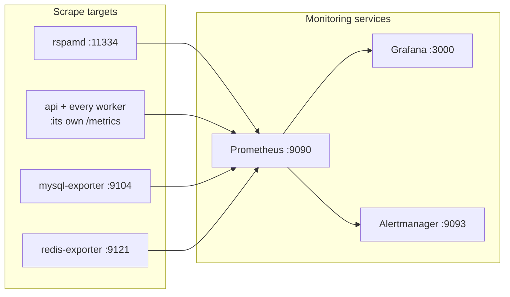

# Monitoring Stack Deployment

How the monitoring stack — Prometheus, Grafana, and Alertmanager — is deployed alongside your Mailyte email server.

## Overview

There is no separate monitoring compose file. Prometheus, Grafana, Alertmanager, and the database exporters are services **inside the main `docker-compose.yml`** and come up with the rest of the stack.



The images are pinned in the compose file:

| Service | Image | Host port (base file) |
|---------|-------|----------------------|
| `prometheus` | `prom/prometheus:v2.51.0` | 9090 |
| `grafana` | `grafana/grafana:10.4.0` | 3000 |
| `alertmanager` | `prom/alertmanager:v0.27.0` | 9093 |
| `mysql-exporter` | `prom/mysqld-exporter:v0.15.1` | 9104 |
| `redis-exporter` | `oliver006/redis_exporter:v1.58.0` | 9121 |

In production (`docker-compose.prod.yml`), all five are rebound to `127.0.0.1`; Grafana additionally gets a Traefik router at `https://grafana.<DOMAIN>`.

## Configuration Layout

All configuration is bind-mounted from the repository's `monitoring/` directory — edit there, then restart the service:

```
monitoring/
├── prometheus/
│   ├── prometheus.yml            # Scrape configs (15s interval) + alerting wiring
│   └── rules/
│       ├── mail_alerts.yml       # Mail-flow alert rules
│       └── backup_alerts.yml     # Backup freshness alert rules
├── grafana/
│   ├── provisioning/
│   │   ├── datasources/prometheus.yml
│   │   └── dashboards/dashboards.yml
│   └── dashboards/
│       ├── mail_overview.json
│       └── security_dashboard.json
└── alertmanager/
    └── alertmanager.yml
```

Prometheus scrapes every worker service on its **container** port (`api:8080`, `webhooks:8081`, `monitoring:8085`, ...), plus rspamd's built-in `/metrics` on 11334 and the two exporters. Time-series data lives in the `prometheus_data` named volume with 30-day retention.

## Credentials

Grafana's admin login comes from `.env`:

```dotenv
GRAFANA_ADMIN_USER=admin
GRAFANA_ADMIN_PASSWORD=<generated by scripts/generate-secrets.sh>
```

`GRAFANA_ADMIN_PASSWORD` is one of the eight secrets the stack validates fail-closed at startup — sign-up is disabled (`GF_USERS_ALLOW_SIGN_UP=false`).

The MySQL exporter authenticates as the application user (`DB_USER`/`DB_PASSWORD`) and runs with `--no-collect.slave_status` because no replica exists in this stack.

## Starting and Reloading

The monitoring services start with the stack — there is nothing extra to run:

```bash
docker compose up -d prometheus grafana alertmanager   # or just: docker compose up -d
```

After editing configuration:

```bash
# Prometheus supports live reload (--web.enable-lifecycle is on)
curl -X POST http://localhost:9090/-/reload

# Grafana and Alertmanager need a restart
docker compose restart grafana alertmanager
```

## Post-Deploy Verification

```bash
# 1. Check Prometheus is up and scraping
curl -s http://localhost:9090/-/healthy
curl -s http://localhost:9090/api/v1/targets | python3 -c "
import json, sys
data = json.load(sys.stdin)
for t in data['data']['activeTargets']:
    print(f\"  [{t['health']}] {t['labels']['job']}\")
"

# 2. Check Grafana is accessible
curl -s http://localhost:3000/api/health

# 3. Check Alertmanager
curl -s http://localhost:9093/-/healthy

# 4. Verify a metric exists
curl -s 'http://localhost:9090/api/v1/query?query=up' | python3 -m json.tool
```

!!! note "Two targets are expected to be down"
    `prometheus.yml` still defines `postfix` and `dovecot` scrape jobs pointing at `postfix-exporter:9154` / `dovecot-exporter:9166` — exporters that are not part of the compose stack. Those two targets showing `down` is a known configuration leftover, not a mail problem; Postfix delivery data reaches the platform through the `log_ingestor` service instead.

## Accessing Remotely

In production these services are bound to `127.0.0.1`. To reach them:

### Option 1: Traefik (Grafana only, built in)

`docker-compose.prod.yml` already routes `https://grafana.<DOMAIN>` to Grafana, with a certificate issued by cert_manager (`grafana` is in the default `TRAEFIK_ADMIN_SUBDOMAINS`). Just publish the DNS record.

### Option 2: SSH Tunnel (Prometheus / Alertmanager)

```bash
# From your local machine
ssh -L 3000:localhost:3000 -L 9090:localhost:9090 -L 9093:localhost:9093 user@your-server
# Now open http://localhost:9090 in your browser
```

### Option 3: VPN

If your team uses a VPN terminating on the server, the loopback-bound ports are reachable through it.

Do **not** add your own nginx on the host for this — Traefik already owns ports 80/443, and only one process can bind them.

## Beyond Prometheus: the monitoring service

Do not confuse the Prometheus stack with the `monitoring` **worker service** (port 8085). That service is Mailyte's own health monitor: it checks the other containers and restarts unhealthy ones through the scoped `docker-proxy` — the auto-healing described in [Monitoring > Auto-healing](../monitoring/auto-healing.md). Both run by default.

## Resource Usage

Production memory limits from `docker-compose.prod.yml`:

| Component | Limit |
|-----------|-------|
| Prometheus | 1 GB |
| Grafana | 512 MB |
| Alertmanager | 256 MB |
| mysql-exporter / redis-exporter | 128 MB each |

Budget roughly 2 GB for the whole monitoring tier at moderate scrape volume.
