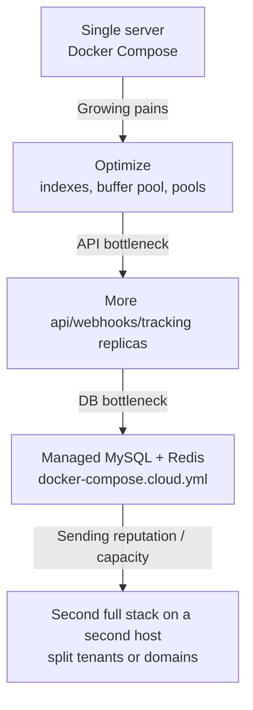

# Scaling Guide

When to scale, what to scale, and how — within the single-host Docker Compose model this stack is built around.

## Signs You Need to Scale

Before scaling anything, confirm you actually have a bottleneck:

| Symptom | Likely Bottleneck | First Action |
|---------|------------------|--------------|
| API responses slow | API or database | Check query times, add api replicas |
| Mail queue growing | Delivery being throttled or refused | Read `logs/mailer/postfix/mail.log` — deferrals name their reason |
| High CPU | Rspamd or MySQL | Profile and optimize first |
| High memory | MySQL buffer pool or Rspamd | Tune settings, then add RAM |
| Disk filling up | Mail storage or backups | Clean up first, expand disk |
| IMAP slow for users | Dovecot or disk I/O | Faster storage |

> **Note:** Always optimize before you scale. Throwing hardware at a bad query or misconfiguration is expensive and doesn't fix the root cause.

## What Can and Cannot Scale Horizontally

This distinction is architectural, not aspirational:

| Tier | Services | Scaling |
|------|----------|---------|
| **Stateless HTTP** | `api`, `webhooks`, `tracking` | Horizontal — already 2 replicas each in `docker-compose.prod.yml`, load-balanced by Traefik / shared-nothing behind the internal network |
| **Singleton stateful** | `postfix`, `dovecot`, `mysql`, `redis`, `rspamd`, everything else | Vertical only — exactly one of each exists, and running two against the same spool/Maildir/data directory is actively unsafe |

## Scaling the Stateless Services

`api`, `webhooks`, and `tracking` are the services prepared for replication: the production override resets their fixed `container_name` and host ports precisely so multiple replicas can run.

```bash
# Temporarily run a third api replica
docker compose -f docker-compose.yml -f docker-compose.prod.yml \
  up -d --scale api=3 --no-deps api
```

To make it permanent, raise `deploy.replicas` for the service in `docker-compose.prod.yml`:

```yaml
  api:
    deploy:
      replicas: 3        # was 2
      resources:
        limits:
          memory: 512M
```

Traefik discovers all replicas of `api` automatically and load-balances `api.<DOMAIN>` across them. `deployment/deploy.sh` rolls exactly these three services on every deploy (scale up alongside the old container, confirm health, then retire the old one).

!!! warning "Do not replicate the other services"
    Adding `--scale postfix=2` (or dovecot, or mysql) makes two containers fight over the same ports, spool, and data. The base file's fixed `container_name` on most services will refuse it — that is a guard, not an oversight.

## Database Scaling

MySQL is usually the hardest bottleneck to fix because it's stateful.

### Step 1: Optimize First

```sql
-- Find slow queries
SELECT * FROM sys.statements_with_full_table_scans
ORDER BY exec_count DESC LIMIT 10;

-- Tune buffer pool (~70% of available RAM for a dedicated DB host)
SET GLOBAL innodb_buffer_pool_size = 4294967296;  -- 4GB
```

Raise the production memory limit for `mysql` in `docker-compose.prod.yml` (2 GB by default) to match.

Connection pooling is tunable in `.env` (`DB_POOL_SIZE`, `DB_MAX_OVERFLOW`, `DB_POOL_TIMEOUT`, `DB_POOL_RECYCLE`).

### Step 2: Move to a Managed Database

This is the supported "big" move, and it has a dedicated override file. `docker-compose.cloud.yml` replaces the local `mysql` and `redis` containers with no-op stubs and points every service at remote hosts:

```bash
# .env
DB_HOST=your-instance.xxxx.rds.amazonaws.com
DB_PORT=3306
REDIS_HOST=your-cluster.xxxx.cache.amazonaws.com
REDIS_PORT=6379
```

```bash
./start.sh cloud
# or, combined with the production override:
docker compose -f docker-compose.yml -f docker-compose.cloud.yml -f docker-compose.prod.yml up -d
```

A managed MySQL brings read replicas, automated failover, and point-in-time recovery without this stack having to implement them.

!!! note "MySQL image pin"
    The local `mysql` service is pinned to `8.0.35` because newer 8.0.x images require the x86-64-v2 CPU microarchitecture level, which some VPS-provider virtual CPUs lack. If you move hosts and MySQL crash-loops with "Fatal glibc error: CPU does not support x86-64-v2", that pin (and its comment in `docker-compose.yml`) is the story.

## Redis

A single Redis instance handles hundreds of thousands of operations per second — clustering is far beyond this stack's needs. If Redis becomes a problem, it is almost always memory:

```bash
docker compose exec redis redis-cli info memory | head -5
```

The container already runs with `--maxmemory 256mb --maxmemory-policy allkeys-lru`; raise the maxmemory in the `redis` service `command:` (and the prod memory limit) if evictions hurt hit rates. Or move to a managed Redis via `docker-compose.cloud.yml` as above.

## Mail Throughput

Outbound throughput is rarely limited by Postfix's capacity — it is limited by how fast receiving ISPs will accept your mail. That is what the `delivery_optimizer` service manages: per-ISP throttling, IP warming schedules, and bounce processing. If the queue grows with deferrals from specific providers, the fix is reputation and pacing, not a second Postfix.

For genuinely independent capacity (or a separate sending reputation), deploy a **second complete stack on a second host** with its own IP and hostname, and split domains or tenants between them. Multiple MX records pointing at the two hosts give inbound redundancy. There is no supported shared-Maildir multi-Postfix topology.

## Scaling Roadmap



| Stage | Email Volume | Server Specs |
|-------|-------------|--------------|
| Single server, defaults | < 50k/day | 4 CPU, 8 GB RAM |
| Tuned + extra replicas | 50k-200k/day | 8 CPU, 16 GB RAM |
| Cloud DB/Redis | 200k-1M/day | App host + managed data services |
| Multiple stacks | 1M+/day | Per-host as above |

## Capacity Planning

Track these to predict when you'll need to scale:

```promql
# Are all services up?
sum(up == 0)

# MySQL connection pressure
mysql_global_status_threads_connected / mysql_global_variables_max_connections

# Redis memory pressure
redis_memory_used_bytes / redis_memory_max_bytes

# Host CPU/disk come from `docker stats` and `df` (no node-exporter is deployed)
```

Mail volume itself lives in the `mail_logs` table (populated by the `log_ingestor`) and the analytics service — the console and Grafana's `mail_overview` dashboard chart it.

> **Tip:** Review capacity monthly. Scale proactively when sustained growth approaches your current ceiling — and see [Guides > Scaling to Millions](../guides/scaling-to-millions.md) for the long-horizon view.
