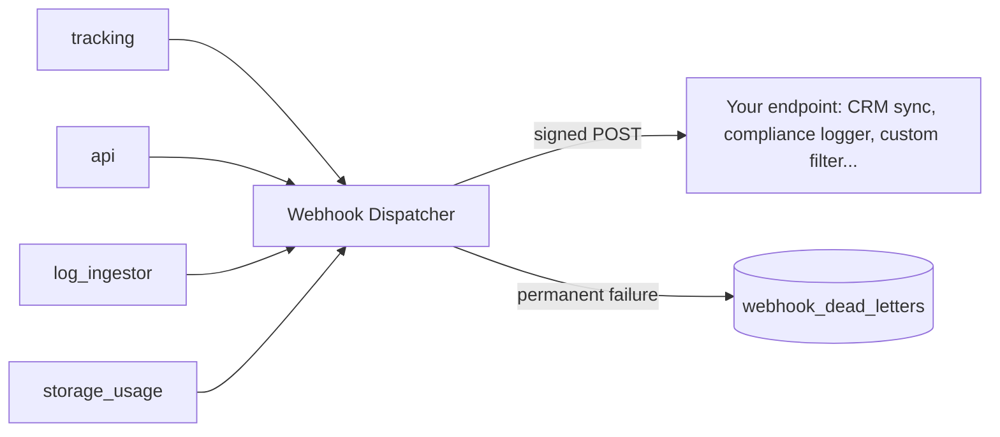

# Plugin Development

!!! warning "There is no in-process plugin API"
    As of 2026-08-30, Mailyte has no plugin loader, no `plugins/` directory, and no in-process event bus that third-party code can register against. Earlier versions of this page documented such a system; it was never built. What Mailyte **does** have is a set of real extension points that cover the same use cases — integrating with external systems, reacting to email events, and adding processing of your own — without patching core code.

## The Extension Points

| You want to... | Use |
|---|---|
| React to email/system events from an external app | **Webhooks** — every event is delivered to your HTTP endpoint |
| Add new background processing inside the platform | **A custom worker** — a first-class service in the stack |
| Filter or file mail per-mailbox | **Sieve scripts** — managed over ManageSieve via the API |
| Adjust spam filtering / add mail-time rules | **Rspamd configuration** (`mailer/rspamd/`) |
| Add API middleware or routes | A change to `worker/api/` — see [Adding Features](adding-features.md) |

## Webhooks: The Event Integration Point

All events in the system are funneled through one dispatcher, `shared/webhook_dispatcher.py`. Every service calls `dispatch_event()` and the dispatcher handles queuing, signing, delivery, retries, and dead-lettering. Your "plugin" is an HTTP endpoint that receives them.



### Configuration

The dispatcher posts every event to the global webhook URL, signed with the shared secret:

```bash
# .env
WEBHOOK_URLS=https://app.example.com/mailyte/webhook
WEBHOOK_SECRET=your-webhook-secret
```

### The Envelope

Every payload has a consistent envelope: event type, timestamp, source service, org/domain context, the event-specific data, and a Mailgun-style `signature` block (timestamp + token + HMAC) for replay-attack prevention. Delivery details, headers (`X-Webhook-Event`), retry/backoff behavior, and the signature verification recipe are documented in [Webhook Events](../reference/webhook-events.md) and the [Webhooks feature guide](../features/webhooks.md).

### Event Catalog

The authoritative list is the `Events` class at the bottom of `shared/webhook_dispatcher.py` — naming convention `{category}.{action}` or `{category}.{subcategory}.{action}`. A sample of what's there:

| Event | When it fires |
|-------|--------------|
| `email.accepted` / `email.delivered` / `email.bounced` / `email.deferred` | SMTP lifecycle |
| `email.read` / `email.moved` / `email.deleted` / `email.flagged` | IMAP user actions |
| `tracking.open` / `tracking.click` / `tracking.unsubscribe` | Engagement tracking |
| `folder.created` / `folder.renamed` / ... | Folder operations |
| `storage.quota.warning` / `storage.quota.exceeded` | Quota monitoring |
| `rate_limit.limit_exceeded` | Rate limiting |

See [Webhook Events](../reference/webhook-events.md) for the full reference.

### Delivery Semantics Worth Knowing

- **Retries with backoff** — transient failures are retried; a `406` response from your endpoint means "don't retry this one"
- **Dead letter queue** — permanently failed events land in the `webhook_dead_letters` table so an operator can see what was lost and requeue it
- **Ordering is not guaranteed** — treat events as idempotent facts, keyed by the envelope's id

### A "Plugin" as a Webhook Consumer

The CRM-sync example this page used to show as an in-process plugin is, in reality, a small HTTP service:

```python
# your-crm-sync-service (runs anywhere that can receive HTTPS)
from fastapi import FastAPI, Request

app = FastAPI()


@app.post("/mailyte/webhook")
async def receive(request: Request):
    envelope = await request.json()
    # 1. Verify envelope["signature"] with your WEBHOOK_SECRET (see webhook docs)
    # 2. Route on the event type
    match envelope["event"]:
        case "email.inbound" | "email.outbound":
            await sync_to_crm(envelope["data"])
        case "email.bounced":
            await flag_contact(envelope["data"])
    return {"status": "ok"}
```

## Firing Your Own Events

If you're adding code inside the platform (a feature or a custom worker) and want it to notify integrations, dispatch — don't build your own HTTP delivery:

```python
from shared.webhook_dispatcher import dispatch_event

dispatch_event(
    event_type="my_feature.thing.happened",  # {category}.{action} convention
    data={"item_id": item_id},
    org_id=org_id,
    domain=domain,
    source_service="my_worker",
)
```

`dispatch_event()` is fire-and-forget: if no `WEBHOOK_URL` is configured it silently no-ops, otherwise the envelope is queued to a worker pool (or published via Redis with `use_redis=True`, for callers without their own worker pool such as Postfix scripts).

## Custom Workers

For processing that must run **inside** the platform — with database access, the shared libraries, and a place in the compose stack — build a worker. That is the supported way to add a new long-running component; see [Custom Workers](custom-workers.md).

## Mail-Pipeline Hooks

- **Sieve** — per-mailbox filtering (vacation, file-into-folder, reject) is standard Sieve, managed through Dovecot's ManageSieve service; the API's filter endpoints (`worker/api/utils/managesieve.py`) speak that protocol on your behalf.
- **Rspamd** — spam scoring, greylisting, and custom symbols/rules are configured under `mailer/rspamd/`. Changes there apply at mail-time to every message.

## Best Practices for Integrations

- **Verify signatures** — never act on an unsigned or badly-signed webhook payload
- **Return quickly** — acknowledge with a 2xx and process asynchronously; slow endpoints eat the retry budget
- **Be idempotent** — retries mean you may see the same event twice
- **Use 406 deliberately** — it's the documented "drop this event, don't retry" signal
- **Watch the dead letter queue** — `webhook_dead_letters` is where lost events surface
