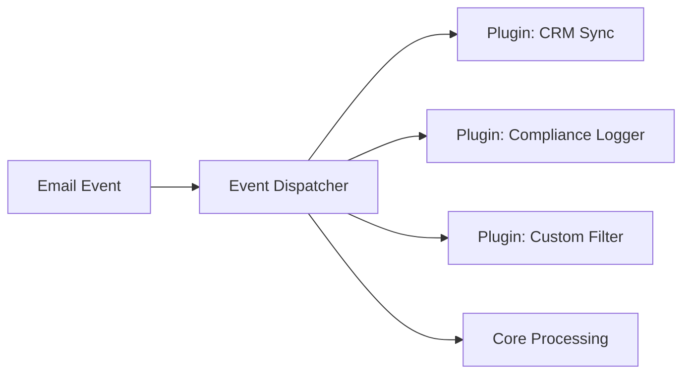

# Plugin Development

> **Enterprise Edition** — This feature is available in [Mailyte Enterprise](https://mailyte.com). The Community Edition does not include this functionality.


Plugins let you extend Mailyte without modifying core code. You can hook into email events, add middleware to the API, create custom processing pipelines, and integrate with external services.

## Plugin Architecture

Plugins are Python modules that register themselves with Mailyte's event system. They can:

- Listen for events (email received, sent, bounced, etc.)
- Add API middleware (custom auth, logging, rate limiting)
- Add custom API routes
- Modify email processing pipelines
- Integrate with external services



## Plugin Structure

```
plugins/
  my_plugin/
    __init__.py        # Plugin registration
    plugin.py          # Plugin logic
    config.py          # Plugin configuration
    requirements.txt   # Additional dependencies
```

## Creating a Plugin

### Step 1: Define the Plugin

```python
# plugins/my_plugin/__init__.py
from .plugin import MyPlugin

PLUGIN_NAME = "my_plugin"
PLUGIN_VERSION = "1.0.0"
PLUGIN_DESCRIPTION = "Syncs email events to an external CRM"

def register(app, event_bus):
    """Called by Mailyte during startup."""
    plugin = MyPlugin()
    plugin.setup(app, event_bus)
    return plugin
```

### Step 2: Implement the Plugin

```python
# plugins/my_plugin/plugin.py
import logging
from typing import Any

logger = logging.getLogger(__name__)

class MyPlugin:
    def __init__(self):
        self.name = "my_plugin"
        self.enabled = True

    def setup(self, app, event_bus):
        """Register event handlers and middleware."""
        # Listen for email events
        event_bus.subscribe("email.smtp.inbound", self.on_email_received)
        event_bus.subscribe("email.smtp.outbound", self.on_email_sent)
        event_bus.subscribe("email.tracking.bounced", self.on_email_bounced)

        # Add custom API routes
        self.register_routes(app)

        logger.info("MyPlugin initialized")

    async def on_email_received(self, event: dict):
        """Called when an email is received."""
        sender = event["payload"]["metadata"]["from"]
        recipient = event["payload"]["metadata"]["to"]
        subject = event["payload"]["metadata"]["subject"]

        logger.info("Email received from %s to %s: %s", sender, recipient, subject)

        # Your custom logic here
        await self.sync_to_crm(sender, "inbound", subject)

    async def on_email_sent(self, event: dict):
        """Called when an email is sent."""
        recipient = event["payload"]["metadata"]["to"]
        await self.sync_to_crm(recipient, "outbound", event["payload"]["metadata"]["subject"])

    async def on_email_bounced(self, event: dict):
        """Called when an email bounces."""
        recipient = event["payload"]["delivery_info"]["recipient"]
        reason = event["payload"]["delivery_info"].get("bounce_reason", "unknown")
        logger.warning("Bounce for %s: %s", recipient, reason)

    async def sync_to_crm(self, email: str, direction: str, subject: str):
        """Sync event to external CRM."""
        # Your CRM API call here
        pass

    def register_routes(self, app):
        """Add custom API routes."""
        @app.get("/api/v1/plugins/my_plugin/status")
        async def plugin_status():
            return {
                "plugin": self.name,
                "enabled": self.enabled,
                "status": "running",
            }
```

## Event Bus

The event bus is how plugins receive notifications from the core system.

### Available Events

| Event | When it fires | Payload |
|-------|--------------|---------|
| `email.smtp.inbound` | Email received | Full webhook payload |
| `email.smtp.outbound` | Email sent | Full webhook payload |
| `email.tracking.opened` | Tracking pixel hit | Tracking event data |
| `email.tracking.clicked` | Link clicked | Tracking event data |
| `email.tracking.bounced` | Email bounced | Bounce data |
| `email.tracking.complained` | Spam complaint | Complaint data |
| `domain.created` | Domain added | Domain data |
| `domain.deleted` | Domain removed | Domain data |
| `mailbox.created` | Mailbox added | Mailbox data |
| `mailbox.deleted` | Mailbox removed | Mailbox data |
| `organization.created` | Org added | Org data |
| `quota.warning` | Approaching quota limit | Usage data |
| `quota.exceeded` | Quota exceeded | Usage data |
| `cert.renewed` | SSL cert renewed | Cert data |
| `cert.expiring` | SSL cert expiring soon | Cert data |

### Subscribing to Events

```python
# Subscribe to a single event
event_bus.subscribe("email.smtp.inbound", self.handler)

# Subscribe to multiple events
for event in ["email.smtp.inbound", "email.smtp.outbound"]:
    event_bus.subscribe(event, self.handler)

# Subscribe with a filter
event_bus.subscribe("email.smtp.inbound", self.handler, filter={
    "organization_id": "specific-org"
})
```

### Event Handler Signature

```python
async def handler(self, event: dict):
    """
    event = {
        "event": "email.smtp.inbound",
        "timestamp": "2025-03-25T14:30:00Z",
        "payload": { ... }
    }
    """
    pass
```

Handlers run asynchronously. If your handler is slow, it won't block other handlers or core processing.

## Custom Middleware

Add middleware to the API for cross-cutting concerns:

```python
# plugins/my_plugin/middleware.py
from starlette.middleware.base import BaseHTTPMiddleware
from starlette.requests import Request
import time
import logging

logger = logging.getLogger(__name__)

class AuditLogMiddleware(BaseHTTPMiddleware):
    async def dispatch(self, request: Request, call_next):
        start = time.time()
        response = await call_next(request)
        duration = time.time() - start

        # Log every API call
        logger.info(
            "API %s %s - %d (%.3fs) - %s",
            request.method,
            request.url.path,
            response.status_code,
            duration,
            request.headers.get("X-API-Key", "no-key")[:8] + "...",
        )

        return response
```

Register it in your plugin setup:

```python
def setup(self, app, event_bus):
    from .middleware import AuditLogMiddleware
    app.add_middleware(AuditLogMiddleware)
```

## Custom Email Filter

Create a plugin that filters or modifies emails during processing:

```python
class ComplianceFilterPlugin:
    def setup(self, app, event_bus):
        event_bus.subscribe("email.smtp.outbound.pre_send", self.check_compliance)

    async def check_compliance(self, event: dict):
        """Check outbound email against compliance rules before sending."""
        recipient = event["payload"]["metadata"]["to"]
        org_id = event["payload"].get("organization_id")

        # Check suppression list
        if await self.is_suppressed(recipient, org_id):
            return {"action": "reject", "reason": "recipient_suppressed"}

        # Check for sensitive content
        subject = event["payload"]["metadata"].get("subject", "")
        if self.contains_sensitive_data(subject):
            return {"action": "hold", "reason": "compliance_review_needed"}

        return {"action": "allow"}
```

## Plugin Configuration

```python
# plugins/my_plugin/config.py
import os

class PluginConfig:
    ENABLED = os.environ.get("PLUGIN_MY_PLUGIN_ENABLED", "true").lower() == "true"
    CRM_API_URL = os.environ.get("PLUGIN_MY_PLUGIN_CRM_URL", "")
    CRM_API_KEY = os.environ.get("PLUGIN_MY_PLUGIN_CRM_KEY", "")
    LOG_LEVEL = os.environ.get("PLUGIN_MY_PLUGIN_LOG_LEVEL", "INFO")
```

Add the env vars to your `.env` file:

```bash
PLUGIN_MY_PLUGIN_ENABLED=true
PLUGIN_MY_PLUGIN_CRM_URL=https://api.mycrm.com
PLUGIN_MY_PLUGIN_CRM_KEY=secret
```

## Testing Plugins

```python
# tests/test_my_plugin.py
import pytest
from plugins.my_plugin.plugin import MyPlugin

class TestMyPlugin:
    def setup_method(self):
        self.plugin = MyPlugin()

    @pytest.mark.asyncio
    async def test_on_email_received(self):
        event = {
            "event": "email.smtp.inbound",
            "timestamp": "2025-03-25T14:30:00Z",
            "payload": {
                "metadata": {
                    "from": "sender@example.com",
                    "to": "recipient@test.com",
                    "subject": "Test"
                }
            }
        }
        # Should not raise
        await self.plugin.on_email_received(event)
```

## Best Practices

- **Keep plugins focused** — one plugin, one job
- **Handle errors gracefully** — a plugin crash shouldn't break email delivery
- **Use async handlers** — don't block the event loop
- **Log at appropriate levels** — INFO for normal ops, WARNING for issues
- **Document your config** — list all env vars the plugin needs
- **Write tests** — especially for filter/compliance plugins
