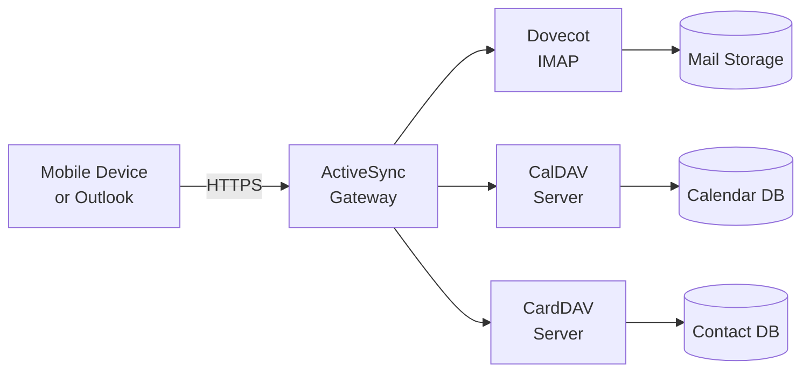

# ActiveSync

> **Enterprise Edition** — This feature is available in [Mailyte Enterprise](https://mailyte.com). The Community Edition does not include this functionality.

**Microsoft Exchange ActiveSync protocol support for mobile devices and Outlook clients.**

!!! warning "Under Construction"
    ActiveSync support is currently in development. This page describes the planned functionality. The feature is not yet available for use.

## What's planned

ActiveSync is the protocol that Microsoft Exchange uses to sync email, contacts, and calendars to mobile devices and desktop Outlook clients. Adding ActiveSync support means Mailyte users can connect their iPhones, Android phones, and Outlook desktop clients using the familiar "Exchange" account type -- no special app or IMAP configuration needed.

### Why ActiveSync matters

IMAP works fine for syncing email, but it doesn't handle contacts and calendars. ActiveSync bundles all three into one protocol, which is what users expect when they set up "Exchange" on their phone. Without it, you need separate protocols (IMAP for mail, CardDAV for contacts, CalDAV for calendars) and most non-technical users struggle with that setup.

## Planned architecture

The ActiveSync gateway will act as a translation layer, converting ActiveSync protocol commands into IMAP, CalDAV, and CardDAV requests against the existing backends.

### Planned features

- **Email push notifications.** Real-time email delivery notifications to mobile devices (no polling delay).
- **Contact sync.** Two-way sync of contacts between the server and connected devices.
- **Calendar sync.** Two-way sync of calendar events, including meeting invitations.
- **Remote wipe.** If a device is lost or stolen, remotely erase email data from it.
- **Per-org provisioning.** Organizations can control which ActiveSync features are available to their users.
- **Multi-tenant aware.** Each organization's data is isolated, just like all other Mailyte features.

## Planned configuration

| Variable | Planned Default | Description |
|----------|----------------|-------------|
| `ACTIVESYNC_ENABLED` | `false` | Enable ActiveSync gateway |
| `ACTIVESYNC_PORT` | `443` | HTTPS port for ActiveSync |
| `ACTIVESYNC_MAX_DEVICES_PER_USER` | `5` | Max devices per user |
| `ACTIVESYNC_PUSH_ENABLED` | `true` | Enable push notifications |
| `ACTIVESYNC_REMOTE_WIPE_ENABLED` | `true` | Enable remote wipe capability |

## Things to know

- **This feature doesn't exist yet.** No ActiveSync configuration settings are functional.
- **IMAP and POP3 are fully available today.** If you need email access on mobile devices right now, configure them with IMAP (preferred) or POP3. Most modern email clients support IMAP.
- **ActiveSync is a complex protocol.** Microsoft's specification is extensive, and compatibility across different client versions (iOS Mail, Android Gmail, Outlook 2016 vs. 2019 vs. new Outlook) varies. The implementation will be rolled out incrementally, starting with email sync and expanding to contacts and calendars.
- **Z-Push or similar.** The planned implementation may be based on an open-source ActiveSync implementation like Z-Push, adapted for Mailyte's multi-tenant architecture.
