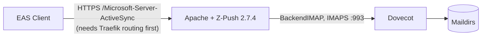

# ActiveSync

**Microsoft Exchange ActiveSync support via Z-Push — deployed, but not yet reachable from the outside.**

The ActiveSync container ships a real [Z-Push](https://z-push.org/) 2.7.4 installation (container port `80`, published on host port `8084`) configured with the IMAP backend against Dovecot. Apache serves the protocol at the standard `/Microsoft-Server-ActiveSync` path, and a health/status page reports on the installation.

!!! warning "Not publicly routed"
    As of 2026-08-30 there is **no Traefik router for ActiveSync** in the production compose file — the container is bound to `127.0.0.1:8084` and is reachable only from the host or the compose network. Phones and Outlook clients on the internet cannot use it until a router (e.g. `Host(\`mail.yourdomain\`) && PathPrefix(\`/Microsoft-Server-ActiveSync\`)`) is added on the TLS entrypoint. Treat the feature as deployed-but-disabled.

## What works today

- **Z-Push 2.7.4** installed from the upstream release, with file-based state in `/var/lib/z-push`.
- **`BackendIMAP` against Dovecot** (`IMAP_SERVER=dovecot`, port 993 with SSL). Users authenticate with their full email address and mailbox password — the same credentials as IMAP.
- **Email sync only.** The IMAP backend syncs mail folders (Sent/Trash/Drafts mapped in `config/z-push.conf.php`). It does **not** provide contacts or calendar sync — those would require wiring Z-Push's combined backend to the CalDAV/CardDAV services (Radicale/caldav are separate containers routed at `caldav.${DOMAIN}`).
- **Health endpoint** at `/health` reports whether Z-Push is installed, configured, and its state/log directories are writable.

## Configuration

| Setting | Value | Where |
|---------|-------|-------|
| Backend | `BackendIMAP` | `worker/activesync/config/z-push.conf.php` |
| IMAP server | `dovecot:993` (SSL) | same, `IMAP_HOST` env overridable |
| State | File-based, `/var/lib/z-push` | same |
| Protocol path | `/Microsoft-Server-ActiveSync` | Apache alias, `worker/activesync/config/apache.conf` |
| Timezone | `TIMEZONE` env (default UTC) | z-push config |

## What is not implemented

- **Public routing / TLS** — see the warning above.
- **Contacts and calendar sync** — mail only.
- **Push email** — BackendIMAP polls; there is no real-time push wiring.
- **Device management / remote wipe / policies** — Z-Push supports provisioning, but nothing in Mailyte manages devices or policies, and no admin surface exposes them.
- **Autodiscover for EAS** — the [autoconfig service](autoconfig.md) answers Microsoft Autodiscover requests for IMAP/SMTP settings; it does not advertise an ActiveSync endpoint.

## Things to know

- **IMAP is the supported mobile path today.** Client auto-setup via [autoconfig/autodiscover](autoconfig.md) hands devices working IMAP/SMTP settings, which covers mail on every modern client.

- **Enabling ActiveSync for real** requires: a Traefik router on 443 for the `/Microsoft-Server-ActiveSync` path (or a dedicated hostname), a certificate for the chosen host, and testing against the clients you care about. EAS client compatibility varies by version; roll out incrementally.

- **State is per-container-volume.** Z-Push device state lives in `/var/lib/z-push`; wiping it forces every device to re-sync from scratch.
