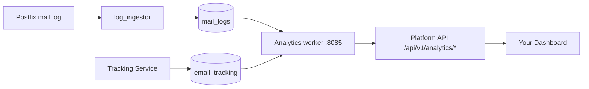

# Analytics

**See what's happening with your email: volume, delivery rates, engagement, and deliverability per domain.**

Analytics are computed from two real data sources:

- **`mail_logs`** — one row per message per delivery attempt, produced by the **log ingestor** (`mailer/log_ingestor/`), which tails the Postfix mail log. This producer shipped on 2026-08-22; before that the table (and every view built on it) was empty.
- **`email_tracking`** — open/click/unsubscribe events written by the [Tracking service](email-tracking.md).

Two services expose the numbers: the **Analytics worker** (container port `8085`, published on host port `8087`) computes per-domain dashboards, and the **platform API** proxies them with authentication under `/api/v1/analytics/`.

## How it works



### What gets recorded

Every `mail_logs` row carries queue ID, message ID, sender, recipient, direction, status (`delivered`, `bounced`, `deferred`, `rejected`), relay, DSN code, size, and timestamp. Tracking events add recipient, event type, IP address, and user agent.

## Key metrics

| Metric | What it measures |
|--------|-----------------|
| **Sent / Delivered** | Messages accepted and successfully handed to the recipient's server (`mail_logs`) |
| **Bounced / Deferred / Rejected** | Delivery failures by class |
| **Opens / Unique opens** | Pixel loads, total and deduplicated by recipient |
| **Clicks / Unique clicks** | Link clicks, total and deduplicated |
| **Open rate** | Unique opens / delivered |
| **Click rate** | Unique clicks / delivered |
| **Click-to-open rate** | Clicks / opens |
| **Complaints** | Spam-complaint events |

## API endpoints

### Via the platform API (authenticated with `X-API-Key`)

```
GET  /api/v1/analytics/dashboard/{domain}?days=30       # combined dashboard
GET  /api/v1/analytics/email-volume/{domain}?days=30    # per-day volume
GET  /api/v1/analytics/engagement/{domain}?days=30      # opens/clicks/rates
GET  /api/v1/analytics/deliverability/{domain}?days=30  # delivered/bounce/complaint rates
GET  /api/v1/analytics/metrics/{domain}?days=30
POST /api/v1/analytics/reports/generate
GET  /api/v1/analytics/reports/scheduled                # list scheduled reports
POST /api/v1/analytics/reports/scheduled               # create a scheduled report
GET  /api/v1/analytics/reports/{report_id}
```

### Direct worker endpoints (compose network / host port 8087)

```
GET /stats?days=30                      # server-wide delivery stats
GET /user-activity/{email}?days=7
GET /analytics/dashboard/{domain}
GET /analytics/email-volume/{domain}
GET /analytics/engagement/{domain}
GET /analytics/deliverability/{domain}
GET /health
GET /metrics                            # Prometheus
```

### Per-message tracking stats

For a single message, query the tracking service directly (`GET /api/tracking/stats/{email_id}` on port 8086, or via `/api/v1/tracking/`).

## Scheduled reports

The analytics worker can generate reports on demand (`POST /reports/generate`) and run **scheduled reports** per organization, delivered by email over the internal submission path. Scheduled report definitions are stored in the database and evaluated by a background loop in the worker.

## Things to know

- **There is no GeoIP or device-detection pipeline in the tracking path.** Tracking events store IP and user-agent strings; country/region/city columns exist in the schema but nothing performs MaxMind lookups for tracking events, so geographic and device breakdowns are not populated. (A GeoIP reader exists in the legacy `mailer/log_analyzer` component and the geo-blocking security service, neither of which feeds analytics.)

- **Open rates are approximate.** See [Email Tracking](email-tracking.md): image blocking undercounts, prefetching overcounts. Use unique counts and treat rates as trends.

- **Data is per-organization/per-domain.** The platform API verifies domain ownership against the caller's API key before returning analytics.

- **History starts when the producer started.** `mail_logs` has data from 2026-08-22 onward on the production deployment; there is no backfill of earlier traffic.

- **Retention follows the source tables.** Tracking data is pruned per `TRACKING_DATA_RETENTION_DAYS` (default 365); `mail_logs` rows are kept indefinitely unless pruned operationally. There are no separate weekly/monthly rollup tables — queries aggregate the raw tables directly.
