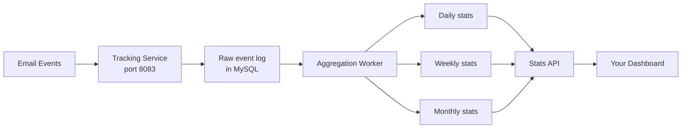

# Analytics

> **Enterprise Edition** — This feature is available in [Mailyte Enterprise](https://mailyte.com). The Community Edition does not include this functionality.


**See exactly what's happening with your email: delivery rates, open rates, click rates, geographic data, and device breakdowns.**

Mailyte's analytics are built on top of the tracking and webhook services. Every email event (sent, delivered, bounced, opened, clicked, complained) is recorded with metadata, then aggregated into daily, weekly, and monthly summaries. You can query these stats through the API to power dashboards, reports, or billing systems.

## How it works



### What gets tracked

Every event is recorded with:

- **Timestamp** -- when the event occurred
- **IP address** -- where the request came from (can be anonymized)
- **User agent** -- browser/email client string
- **Geolocation** -- country and region (via GeoIP database)
- **Device info** -- mobile vs. desktop, OS, client name
- **Referrer** -- where the click came from (for click events)

The aggregation worker rolls these raw events into summary tables, so querying "how many emails did org X send last month" is a fast indexed lookup rather than a full table scan.

## Key metrics

| Metric | What it measures |
|--------|-----------------|
| **Sent** | Emails accepted by Postfix for delivery |
| **Delivered** | Emails successfully delivered to the recipient's server |
| **Bounced** | Delivery failures (hard bounces and soft bounces) |
| **Opened** | Unique opens detected via tracking pixel |
| **Clicked** | Unique link clicks detected via click tracking |
| **Complained** | Spam complaints from feedback loops |
| **Delivery rate** | Delivered / Sent |
| **Open rate** | Opened / Delivered |
| **Click rate** | Clicked / Delivered |
| **Bounce rate** | Bounced / Sent |
| **Complaint rate** | Complained / Delivered |

## Configuration

| Variable | Default | Description |
|----------|---------|-------------|
| `TRACK_USER_AGENT` | `true` | Record user agent strings |
| `TRACK_IP_ADDRESS` | `true` | Record IP addresses |
| `TRACK_GEOLOCATION` | `true` | Perform GeoIP lookups |
| `TRACK_DEVICE_INFO` | `true` | Parse device/OS info from user agents |
| `TRACK_REFERRER` | `true` | Record HTTP referrer on clicks |
| `TRACKING_ANONYMIZE_IP` | `false` | Hash IPs before storage |
| `GEOIP_DB_PATH` | `/usr/share/GeoIP/GeoLite2-Country.mmdb` | Path to MaxMind GeoIP database |
| `LOG_ANALYZER_ENABLED` | `true` | Enable log analysis for delivery stats |

## API endpoints

### Get tracking stats for an email

```bash
curl http://localhost:8083/api/tracking/stats/msg_456
```

```json
{
  "email_id": "msg_456",
  "sent_at": "2026-03-25T10:00:00Z",
  "opens": 3,
  "unique_opens": 2,
  "clicks": 5,
  "unique_clicks": 2,
  "bounced": false,
  "complained": false,
  "open_details": [
    {
      "timestamp": "2026-03-25T10:15:00Z",
      "ip_address": "203.0.113.42",
      "country": "US",
      "device": "iPhone",
      "os": "iOS 17"
    }
  ],
  "click_details": [
    {
      "timestamp": "2026-03-25T10:16:00Z",
      "url": "https://example.com/pricing",
      "ip_address": "203.0.113.42",
      "country": "US"
    }
  ]
}
```

### Get organization-level delivery stats

Query the main API for aggregate stats:

```bash
curl http://localhost:5000/api/v1/organizations/org_123/stats?period=daily&start=2026-03-01&end=2026-03-25
```

### Geographic breakdown

```bash
curl http://localhost:5000/api/v1/organizations/org_123/stats/geo?period=monthly
```

Returns opens and clicks grouped by country.

### Device breakdown

```bash
curl http://localhost:5000/api/v1/organizations/org_123/stats/devices?period=weekly
```

Returns opens grouped by device type (mobile, desktop, tablet) and email client.

## Aggregation periods

Stats are aggregated at three levels:

| Period | Granularity | Retention |
|--------|------------|-----------|
| Daily | One row per day per org/domain | 365 days |
| Weekly | One row per ISO week | 2 years |
| Monthly | One row per month | Indefinite |

The aggregation worker runs as a background task, typically triggered after the storage calculation cycle. Raw event data is kept according to `TRACKING_DATA_RETENTION_DAYS` (default: 365 days).

## GeoIP setup

Geographic data comes from MaxMind's GeoLite2 database. You need to:

1. Download the `GeoLite2-Country.mmdb` file from [MaxMind](https://dev.maxmind.com/)
2. Mount it into the container at the path specified by `GEOIP_DB_PATH`
3. Set up automatic updates (MaxMind updates the database weekly)

Without the GeoIP database, everything else still works -- you just won't get country/region data in your analytics.

## Things to know

- **Open rates are approximate.** See the [Email Tracking](email-tracking.md) page for why. In short: image blocking means you undercount, and image prefetching means you might overcount. Use open rates as a trend indicator, not an exact figure.

- **Unique vs. total counts.** The API returns both total events (every pixel load / link click) and unique events (deduplicated by recipient). For open rates and click rates, use unique counts to avoid inflating numbers from recipients who open the same email multiple times.

- **GeoIP data is country-level by default.** The free GeoLite2-Country database gives you country accuracy. If you need city-level precision, use the GeoLite2-City database (same setup, just a different `.mmdb` file).

- **Analytics data is per-organization.** Org A can't see Org B's stats. This isolation is enforced at both the API and database levels.

- **High-volume senders should watch aggregation lag.** If you're sending millions of emails per day, there can be a delay between events being logged and aggregated stats being updated. The raw event data is always up to date; the aggregated summaries might lag by up to one aggregation cycle.

- **Device detection isn't perfect.** User agent parsing is best-effort. Some email clients report misleading user agents, and proxy services (like Google's image proxy for Gmail) can mask the real client entirely.
