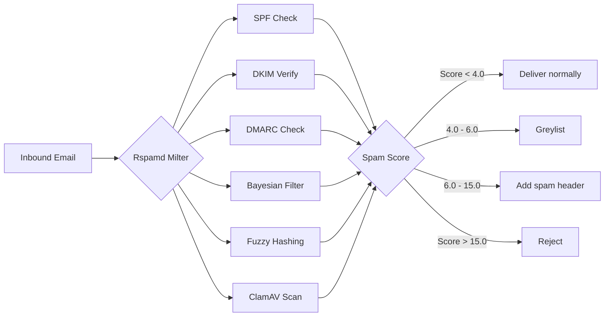

# Anti-Spam Protection

**Keeps junk out of your users' inboxes using machine learning, reputation checks, and virus scanning.**

Mailyte uses Rspamd as its spam filtering engine. Every inbound message passes through a gauntlet of checks -- Bayesian classification, DKIM/SPF/DMARC verification, greylisting, and ClamAV virus scanning -- before it reaches a mailbox. Messages get a score, and you decide what happens at each threshold.

## How it works



Think of the spam score like a suspicion meter. A perfectly clean email from a reputable sender scores near 0. A sketchy email with a forged sender, no DKIM, and "FREE VIAGRA" in the subject might score 25+. You set the thresholds that decide what to do at each level.

### What each layer does

**Bayesian filtering** -- Rspamd learns from the emails you mark as spam or ham. Over time, it gets smarter about what your users consider junk. This is the adaptive brain of the spam filter.

**SPF/DKIM/DMARC** -- These are authentication protocols that verify the sender is who they claim to be. If someone tries to forge your domain, these checks catch it.

**Greylisting** -- When an email looks suspicious but not clearly spam, greylisting temporarily rejects it with a "try again later" response. Legitimate mail servers retry; most spam bots don't. After the greylist timeout (default: 5 minutes), the retry is accepted.

**ClamAV** -- Scans attachments for viruses and malware. If something malicious is found, the message is rejected before it ever reaches a mailbox.

**Fuzzy hashing** -- Detects bulk spam campaigns by comparing message content against known spam fingerprints, even when the spammer makes small modifications to each copy.

## Configuration

### Rspamd settings

| Variable | Default | Description |
|----------|---------|-------------|
| `RSPAMD_ENABLED` | `true` | Enable Rspamd filtering |
| `RSPAMD_HOST` | `rspamd` | Rspamd service hostname |
| `RSPAMD_PORT` | `11333` | Rspamd HTTP port |

### Spam thresholds

| Variable | Default | Description |
|----------|---------|-------------|
| `SPAM_THRESHOLD_GREYLIST` | `4.0` | Score above which to greylist |
| `SPAM_THRESHOLD_ADD_HEADER` | `6.0` | Score above which to add `X-Spam: Yes` header |
| `SPAM_THRESHOLD_REJECT` | `15.0` | Score above which to reject outright |

### Security features

| Variable | Default | Description |
|----------|---------|-------------|
| `ENABLE_GREYLISTING` | `true` | Enable greylisting for suspicious messages |
| `GREYLIST_TIMEOUT` | `300` | Seconds before a greylisted sender can retry |
| `GREYLIST_EXPIRE` | `86400` | Seconds to remember a greylisted triplet |
| `ENABLE_DKIM_SIGNING` | `true` | Sign outbound mail with DKIM |
| `ENABLE_SPF_CHECK` | `true` | Verify inbound SPF records |
| `ENABLE_DMARC_CHECK` | `true` | Enforce DMARC policies |
| `ENABLE_ANTIVIRUS` | `true` | Enable ClamAV virus scanning |
| `ANTIVIRUS_ENGINE` | `clamav` | Antivirus engine to use |

### Adjusting thresholds

The defaults are tuned for a good balance between catching spam and avoiding false positives. But every environment is different:

- **Getting too much spam?** Lower `SPAM_THRESHOLD_ADD_HEADER` (e.g., to `4.0`) so more messages get flagged.
- **Losing legitimate mail?** Raise `SPAM_THRESHOLD_REJECT` (e.g., to `20.0`) to be more lenient about rejections.
- **Greylisting annoying your users?** You can disable it with `ENABLE_GREYLISTING=false`, but know that you'll see more spam slip through.

## Rspamd web UI

Rspamd ships with a web interface for inspecting scan results, training the Bayesian filter, and viewing statistics. It's available at:

```
http://your-mail-server:11334
```

!!! tip "Training the Bayesian filter"
    The filter gets dramatically better once it has seen a few hundred examples of spam and ham. Use the Rspamd web UI or the `rspamc` CLI to feed it training data from your existing mailboxes.

## How Postfix integrates with Rspamd

Postfix sends every inbound message to Rspamd via the milter protocol. The Rspamd milter evaluates the message and returns one of:

- **Accept** -- deliver normally
- **Soft reject** -- greylist (temporary rejection)
- **Add header** -- deliver but mark as spam
- **Reject** -- bounce the message back

This is configured in `main.cf` via the Rspamd milter socket. You generally don't need to touch this -- the Docker setup handles it automatically.

## Things to know

- **Rspamd needs time to learn.** Out of the box, the Bayesian filter is essentially empty. It starts being useful after you train it with a few hundred messages. Until then, it relies on the other checks (SPF, DKIM, DMARC, fuzzy hashing).

- **ClamAV updates its signatures automatically.** The `freshclam` daemon runs in the background and downloads new virus definitions. Make sure the container has internet access for this to work.

- **Greylisting causes delivery delays.** First-time senders to your server will experience a delay of about 5 minutes (the `GREYLIST_TIMEOUT`). After the first successful delivery, the sender is whitelisted and subsequent emails arrive instantly.

- **False positives happen.** No spam filter is perfect. Set up a way for users to report false positives (e.g., a "Not Spam" button in your webmail) and feed those back to the Bayesian filter as ham.

- **DKIM signing is for outbound mail.** Mailyte signs all outgoing messages with DKIM so that receiving servers trust your emails. This is separate from DKIM *verification* on inbound mail, which checks that incoming messages haven't been tampered with.

- **Rspamd is multi-tenant aware.** Spam scores and Bayesian data are tracked per-domain, so one organization's training data doesn't affect another's.
