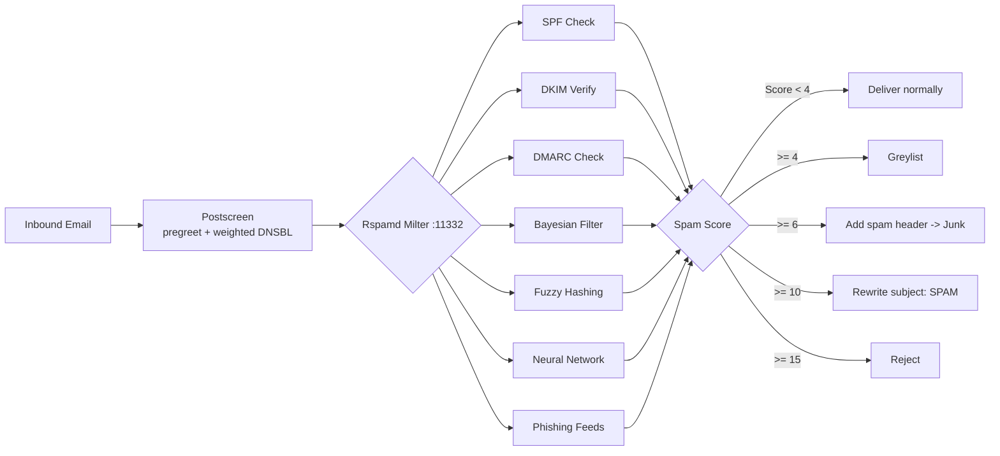

# Anti-Spam Protection

**Keeps junk out of your users' inboxes using layered filtering, reputation checks, and adaptive learning.**

Mailyte uses Rspamd as its filtering engine, fronted by Postfix postscreen. Inbound mail is scored by Bayesian classification, SPF/DKIM/DMARC verification, fuzzy hashing, a neural network, and phishing feeds; the score decides whether a message is delivered, greylisted, tagged, or rejected. Rspamd also DKIM-signs all outbound mail.

## How it works

Before Rspamd ever sees a message, **postscreen** filters connections: bots that talk before the SMTP banner are rejected, and five DNSBLs are consulted with *weighted* scores (`zen.spamhaus.org*3`, `b.barracudacentral.org*2`, `bl.spamcop.net*2`, `dnsbl.sorbs.net*1`, `psbl.surriel.com*1`) against a threshold of 3 — so a single mid-confidence listing costs a sender points, not the message. In the SMTP session itself, only `zen.spamhaus.org` is used as an outright-reject RBL; the previous stack of eight hair-trigger lists was deliberately removed after it was measured rejecting legitimate transactional senders.

### Action thresholds

Thresholds live in `mailer/rspamd/config/local.d/actions.conf` (not environment variables):

| Score | Action | Effect |
|-------|--------|--------|
| >= 4 | `greylist` | Temporary rejection; legitimate servers retry |
| >= 6 | `add_header` | `X-Spam: Yes` header added; Dovecot Sieve files it to Junk |
| >= 10 | `rewrite_subject` | Subject prefixed with `[SPAM]` |
| >= 15 | `reject` | Message rejected outright |

Per-organization overrides are supported through Rspamd's settings module: org policies are stored in MySQL via the API, synced into Redis by `scripts/sync_rspamd_settings.py`, and read by Rspamd per-recipient at scan time (`local.d/settings.conf`).

### What each layer does

**Bayesian filtering** (`classifier-bayes.conf`) — Redis-backed, per-user and per-language, requiring 200 learned messages (`min_learns = 200`) before it contributes to scoring. Train it via the Rspamd web UI or `rspamc learn_spam` / `learn_ham`.

**SPF/DKIM/DMARC verification** — inbound authentication checks. DMARC failures follow the sending domain's published policy (`quarantine` → add header, `reject` → reject). Aggregate DMARC reporting is disabled.

**Greylisting** (`greylisting.conf`) — enabled, kicks in at score >= 1.0 for unknown senders. Initial delay 300 seconds, entries remembered 24 hours, whitelisted senders 7 days. Skipped entirely for authenticated users, local senders, and messages with valid DKIM/SPF/DMARC (`whitelist_symbols`).

**Fuzzy hashing** (`fuzzy_check.conf`) — a *local*, Redis-backed fuzzy store private to this installation. It learns from your own traffic and catches near-duplicate spam campaigns; hashes expire after 30 days.

**Neural network** (`neural.conf`) — enabled; trains itself on messages the other layers score confidently (spam >= 8, ham <= -2) and adds its own symbol once trained. Model lives in Redis.

**Phishing detection** (`phishing.conf`) — checks URLs against the OpenPhish and PhishTank feeds and flags display-text/target mismatches.

**DKIM signing** (`dkim_signing.conf`) — outbound only. Rspamd signs mail from authenticated users and local networks with per-domain keys at `/var/lib/rspamd/dkim/{domain}.{selector}.key`, generated by the platform API when a domain is created (or by `scripts/generate_dkim.py`) and shared via a Docker volume. Domains without a key are skipped, not rejected.

!!! warning "ClamAV antivirus is NOT deployed by default"
    `local.d/antivirus.conf` ships with `enabled = false` and no `clamav` container exists in docker-compose. To enable virus scanning: add a `clamav/clamav` service to the compose file, set `enabled = true`, and point `servers` at `clamav:3310`. Until then, no antivirus scanning happens — earlier versions of this page claiming ClamAV was active were wrong.

## How Postfix integrates with Rspamd

Postfix passes every message to Rspamd over the milter protocol (`smtpd_milters = inet:rspamd:11332`, and `non_smtpd_milters` for locally-generated mail). The proxy worker self-scans, so no separate scan hop is needed. `milter_default_action = accept` — if Rspamd is down, mail flows unscored rather than bouncing.

Authenticated submission ports (587/465) and the internal submission listener set `milter_macro_daemon_name=ORIGINATING`, which is what tells Rspamd to DKIM-sign rather than spam-score.

## Ports

| Port | Worker | Purpose |
|------|--------|---------|
| `11332` | rspamd_proxy | Milter interface used by Postfix |
| `11333` | normal | Scan API |
| `11334` | controller | Web UI and HTTP API (`http://your-mail-server:11334`; loopback-only in production) |

!!! tip "Training the Bayesian filter"
    The filter gets dramatically better once it has seen a few hundred examples of spam and ham. Use the Rspamd web UI (port 11334) or the `rspamc` CLI to feed it training data from your existing mailboxes.

## Things to know

- **There are no `SPAM_THRESHOLD_*` / `ENABLE_GREYLISTING` environment variables.** Global thresholds are edited in `local.d/actions.conf`; greylisting, fuzzy, neural, phishing, and antivirus each have their own file under `mailer/rspamd/config/local.d/`. Per-organization policy goes through the API → MySQL → Redis sync path.

- **Rspamd needs time to learn.** Bayes contributes nothing until it has 200 learned messages, and the neural network needs its own training volume. Early on, SPF/DKIM/DMARC, DNSBLs, and the phishing feeds carry the load.

- **Greylisting causes first-contact delays.** New senders wait ~5 minutes on their first message. Authenticated, local, and well-authenticated (DKIM/SPF/DMARC-passing) senders skip it.

- **Postscreen's deep after-220 tests are deliberately off.** They defer-and-retry by client IP, and large senders (Gmail) retry from different IPs each time — with them enabled, Gmail mail could not arrive at all. The pre-greeting tests (pregreet + weighted DNSBL) stay on.

- **Milter headers** — Rspamd injects `Authentication-Results` and `X-Spam-Status` headers and strips any upstream spam-flag headers to prevent spoofing. A custom `X-Email-Category` header is added by the email-classifier Lua plugin.

- **False positives happen.** Feed them back as ham (`rspamc learn_ham`) — the per-user Bayes and the neural net both improve from corrections.
