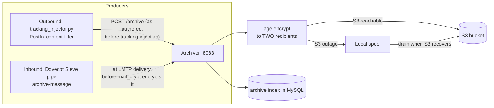

# Archiving

**Every accepted message is archived to encrypted object storage within seconds — plus retention policies, legal holds, and search.**

The Archiver service (container port `8083`, published on host port `8089`) is live and wired into both mail directions. It stores every message as raw RFC 2822, encrypted client-side with [age](https://age-encryption.org/) before it leaves the box, in S3 — with a local spool that absorbs S3 outages. This is the L2 layer of the disaster-recovery design (`plans/06-operations/00-PRD-disaster-recovery.md`): mail RPO drops from "whenever the last nightly backup ran" to approximately zero.

## How it works



- **Outbound half:** the Postfix tracking filter hands the archiver a copy of every submitted message *as the sender wrote it* — before tracking pixels and link rewriting. Controlled by `ARCHIVE_OUTBOUND_ENABLED` (default `true`); an archiver failure never blocks or bounces mail (3-second timeout, all errors swallowed).
- **Inbound half:** a global Dovecot Sieve `pipe :copy` action (`mailer/dovecot/scripts/sieve-pipe/archive-message`) sends every LMTP-delivered message to the archiver. This runs at the only moment inbound mail exists in plaintext on the host — once Dovecot writes the Maildir it is mail_crypt ciphertext.
- **Encryption:** each message is age-encrypted to **two recipients** — the offsite DR recipient and a service recipient whose identity lives in `secrets/` on the mail server, so `GET /archive/{message_id}` can actually decrypt and return content.
- **Spool, not fallback:** if S3 is unreachable, the object is written to a local spool (`ARCHIVE_SPOOL_PATH`, default `/app/storage/archive-spool`) and drained to S3 later. An S3 outage costs durability *lag*, not durability.

## Configuration

| Variable | Default | Description |
|----------|---------|-------------|
| `ARCHIVE_S3_BUCKET` (or `AWS_BUCKET`) | `mailyte-mail-archive` | S3 bucket |
| `ARCHIVE_S3_PREFIX` | `mail-archive` | Key prefix |
| `S3_ENDPOINT_URL` | *(empty = real AWS)* | For MinIO/R2/B2 |
| `ARCHIVE_SPOOL_PATH` | `/app/storage/archive-spool` | Local spool root |
| `ARCHIVE_AGE_IDENTITY_FILE` | `/run/secrets/archive_age_identity` | Service-side age identity (for retrieval) |
| `ARCHIVE_OUTBOUND_ENABLED` | `true` | Outbound producer switch (read by the Postfix filter) |
| `ARCHIVE_SERVICE_URL` | `http://archiver:8083` | Where producers reach the archiver |
| `ARCHIVE_TIMEOUT` | `3` | Producer timeout in seconds |

!!! warning "Requires S3 credentials and age recipients"
    Archiving to durable storage needs AWS credentials, the bucket, and the age recipient keys configured. Without S3 reachability everything lands in the local spool — functional, but the archive then lives on the same disk it is meant to survive.

## API endpoints

```
POST   /archive                      # archive a message (used by the producers)
GET    /archive/search               # search the index (org, sender, recipient, subject, dates)
GET    /archive/{message_id}         # retrieve + decrypt an archived message
DELETE /archive/{message_id}         # delete (refused while a legal hold applies)
POST   /retention-policy             # create/update an org's retention policy
GET    /retention-policy?org_id=     # read it
POST   /legal-hold                   # place a legal hold
DELETE /legal-hold/{hold_id}         # release a hold
GET    /legal-hold?org_id=           # list holds
GET    /archive/spool                # spool depth
POST   /archive/spool/drain          # force a spool drain
GET    /backup/history               # read-only view of scripts/backup.sh runs
GET    /health
GET    /metrics
```

Archive writes and retrievals dispatch `archive.stored` / `archive.restored` webhook events.

## Retention and holds

- **Per-organization retention policies** control how long archived mail is kept; expired archives are cleaned up on a schedule.
- **Legal holds** prevent deletion regardless of retention — a held message survives both retention expiry and explicit `DELETE` calls until the hold is released.

## Things to know

- **The archive stores messages as authored/as delivered, not as tracked.** Restored outbound mail has no tracking pixel or rewritten links.

- **A fan-out to many recipients is one stored object.** The archive is keyed `(message_id, recipient)` with the first recipient identifying the copy.

- **Producers always fail silent.** By contract, a producer failure never blocks or bounces mail — check the archiver's spool depth and `archive.stored` events to monitor coverage.

- **Backups are separate.** `scripts/backup.sh` (systemd timers on the host) does full and incremental backups; the archiver only *reads* `backup_history` for the API. See [Backup & Restore](backup-restore.md).

- **Search covers the index, not the bodies.** `GET /archive/search` searches indexed metadata (sender, recipient, subject, dates); message bodies are encrypted blobs in S3 until retrieved.
