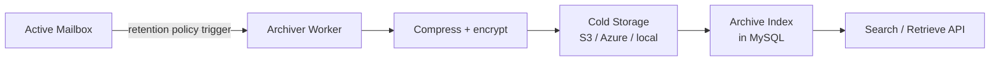

# Archiving

> **Enterprise Edition** — This feature is available in [Mailyte Enterprise](https://mailyte.com). The Community Edition does not include this functionality.

**Long-term email storage with compliance-grade retention policies.**

!!! warning "Under Construction"
    Archiving is currently in development. This page describes the planned functionality. The feature is not yet available for use.

## What's planned

The archiving feature will provide long-term storage for email messages that need to be retained for compliance, legal hold, or auditing purposes -- separate from the active mailbox storage.

### Why a separate archive?

Active mailboxes are optimized for fast access (Dovecot + maildir). But compliance retention often requires keeping emails for 3, 5, or even 10 years. Storing all of that in active mailboxes would waste expensive fast storage on messages nobody reads. The archive moves old emails to cheaper storage (S3, Azure Blob, or local cold storage) while keeping them searchable and retrievable.

## Planned architecture

### Planned features

- **Per-organization retention policies.** Set different retention periods for different orgs (e.g., financial services might need 7 years, a startup might want 1 year).
- **Automatic archival.** Emails older than the retention threshold are automatically moved from active storage to the archive.
- **Legal hold.** Flag specific mailboxes or time ranges as "held" to prevent archival deletion, even after the normal retention period expires.
- **Compressed and encrypted storage.** Archived emails are compressed (gzip) and encrypted at rest before being stored.
- **Searchable index.** Even after emails are moved to cold storage, they remain searchable through the archive API. The index stores metadata (sender, recipient, subject, date, message ID) while the actual content lives in cold storage.
- **Compliance export.** Export archived emails in standard formats (EML, MBOX, PST) for legal discovery or audit requests.

## Configuration (planned)

| Variable | Planned Default | Description |
|----------|----------------|-------------|
| `ARCHIVE_ENABLED` | `false` | Enable archiving |
| `ARCHIVE_RETENTION_DAYS` | `365` | Default retention period |
| `ARCHIVE_STORAGE_BACKEND` | `s3` | Storage backend (s3, azure, local) |
| `ARCHIVE_COMPRESSION` | `gzip` | Compression algorithm |
| `ARCHIVE_ENCRYPTION` | `true` | Encrypt archived emails at rest |
| `ARCHIVE_BATCH_SIZE` | `500` | Emails to archive per batch |

## Things to know

- **This feature doesn't exist yet.** Don't configure archive-related settings or expect archival behavior. When it ships, migration docs will be provided.
- **Active mailbox storage and quotas are already available.** See [Storage & Quotas](storage-quotas.md) for current storage management.
- **RAG search will integrate with the archive.** Once archiving is live, the [AI-Powered Search](rag-integration.md) feature will be able to index and search archived emails alongside active ones.
