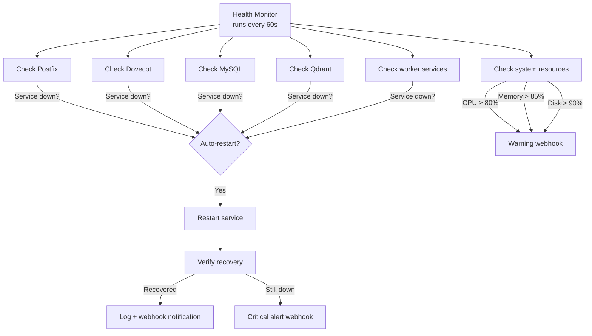

# Auto-Healing

**When a service crashes, the health monitor detects it and restarts it automatically -- usually before anyone notices.**

The Health Monitor is a background service that continuously checks the status of every critical component (Postfix, Dovecot, MySQL, Qdrant, and all worker services). When something goes down, it attempts an automatic restart and sends a webhook notification. Think of it as a watchdog that never sleeps.

## How it works



### What gets monitored

**Services:**

| Service | Check Method | Auto-Restart |
|---------|-------------|-------------|
| Postfix (SMTP) | Process check + port 25 connectivity | Yes |
| Dovecot (IMAP) | Process check + port 143/993 connectivity | Yes |
| MySQL | Connection test + query execution | Yes |
| Qdrant | HTTP health endpoint | Yes |
| Redis | Connection test + PING | Yes |

**System resources:**

| Resource | Threshold | Alert Type |
|----------|-----------|------------|
| CPU usage | > 80% | Warning |
| Memory usage | > 85% | Warning |
| Disk usage | > 90% | Warning |
| Load average | > 4.0 | Warning |

### The restart sequence

When a service fails:

1. **Detection.** The health check fails (process not running, port unreachable, or health endpoint returns error).
2. **Status change detection.** The monitor compares the current status to the last known status. Only transitions (healthy -> unhealthy) trigger actions.
3. **Restart attempt.** The monitor uses `supervisord` to restart the service.
4. **Verification.** After a brief wait, the monitor re-checks the service. If it's back up, success is logged.
5. **Notification.** A webhook is sent with the service name, failure reason, and recovery status.
6. **Prometheus metrics.** The restart counter and health gauge are updated for dashboards.

## Configuration

### Health check settings

| Variable | Default | Description |
|----------|---------|-------------|
| `HEALTH_CHECK_ENABLED` | `true` | Enable health monitoring |
| `HEALTH_CHECK_INTERVAL` | `60` | Seconds between check cycles |
| `HEALTH_CHECK_TIMEOUT` | `30` | Seconds before a check times out |

### System thresholds

| Variable | Default | Description |
|----------|---------|-------------|
| `MONITOR_CPU_THRESHOLD` | `80` | CPU % that triggers a warning |
| `MONITOR_MEMORY_THRESHOLD` | `85` | Memory % that triggers a warning |
| `MONITOR_DISK_THRESHOLD` | `90` | Disk % that triggers a warning |
| `MONITOR_LOAD_THRESHOLD` | `4.0` | Load average that triggers a warning |

### Service monitoring toggles

| Variable | Default | Description |
|----------|---------|-------------|
| `MONITOR_POSTFIX` | `true` | Monitor Postfix |
| `MONITOR_DOVECOT` | `true` | Monitor Dovecot |
| `MONITOR_MYSQL` | `true` | Monitor MySQL |
| `MONITOR_QDRANT` | `true` | Monitor Qdrant |

### Alert settings

| Variable | Default | Description |
|----------|---------|-------------|
| `ALERT_ERROR_RATE_THRESHOLD` | `0.05` | Error rate (5%) that triggers an alert |
| `ALERT_LATENCY_THRESHOLD_MS` | `1000` | Latency (ms) that triggers an alert |
| `ALERT_QUEUE_SIZE_THRESHOLD` | `1000` | Mail queue size that triggers an alert |

## Prometheus metrics

The health monitor exposes Prometheus metrics for Grafana dashboards:

| Metric | Type | Description |
|--------|------|-------------|
| `service_health_status` | Gauge | 1 = up, 0 = down (labeled by service) |
| `system_cpu_usage_percent` | Gauge | Current CPU usage |
| `system_memory_usage_percent` | Gauge | Current memory usage |
| `system_disk_usage_percent` | Gauge | Current disk usage |
| `service_restart_total` | Counter | Total restarts per service |
| `health_check_duration_seconds` | Histogram | Time to run health checks |
| `webhook_delivery_total` | Counter | Webhook deliveries (success/failure) |

## API endpoints

### Get overall health

```bash
curl http://localhost:8080/health
```

```json
{
  "status": "healthy",
  "timestamp": "2026-03-25T14:30:00Z",
  "services": {
    "postfix": {"status": "up", "last_check": "2026-03-25T14:29:45Z"},
    "dovecot": {"status": "up", "last_check": "2026-03-25T14:29:46Z"},
    "mysql": {"status": "up", "last_check": "2026-03-25T14:29:47Z"},
    "qdrant": {"status": "up", "last_check": "2026-03-25T14:29:48Z"}
  },
  "system": {
    "cpu_percent": 23.5,
    "memory_percent": 61.2,
    "disk_percent": 45.8,
    "load_average": [1.2, 0.9, 0.7]
  }
}
```

### Get service-specific health

```bash
curl http://localhost:8080/health/postfix
```

### Trigger manual restart

```bash
curl -X POST http://localhost:8080/restart/dovecot \
  -H "X-Admin-Token: your-admin-token"
```

!!! warning "Admin token required"
    Manual restarts require the admin token (`ADMIN_TOKEN_SECRET`). This prevents unauthorized service restarts.

### Get Prometheus metrics

```bash
curl http://localhost:8080/metrics
```

## Webhook notifications

When the monitor detects a service failure or recovery, it sends a webhook:

```json
{
  "event": "service.health.changed",
  "timestamp": "2026-03-25T14:30:00Z",
  "data": {
    "service": "dovecot",
    "previous_status": "up",
    "current_status": "down",
    "action_taken": "restart",
    "recovery_successful": true,
    "downtime_seconds": 12,
    "reason": "Process not responding on port 993"
  }
}
```

## Things to know

- **Auto-healing doesn't fix root causes.** If Dovecot crashes because of a corrupted maildir, restarting it will just make it crash again. The monitor will keep restarting and alerting. Look at the logs to find and fix the underlying problem.

- **The check interval is a tradeoff.** Shorter intervals (e.g., 15 seconds) mean faster detection but more system overhead. Longer intervals (e.g., 5 minutes) use less resources but mean longer downtime before recovery. The 60-second default is a good middle ground.

- **System resource alerts are warnings, not actions.** Unlike service failures, high CPU or memory usage doesn't trigger an automatic response (what would it do -- kill processes?). These alerts are informational so you can investigate and scale up if needed.

- **Supervisord does the actual restarting.** The health monitor calls `supervisorctl restart <service>`. This means the services must be managed by supervisord in the Docker container. If you've changed the process management setup, adjust accordingly.

- **The admin token is generated at startup.** Check the container logs for the token, or set `ADMIN_TOKEN_SECRET` explicitly. Without the token, you can read health status but can't trigger restarts.

- **Health checks and Prometheus metrics are separate things.** The `/health` endpoint gives you a human-readable JSON view of current status. The `/metrics` endpoint gives Prometheus-formatted time-series data for Grafana. Both sources reflect the same underlying checks.

- **Cascading failures are possible.** If MySQL goes down, the tracking service, rate limiter, and webhook service might all start failing their health checks. The monitor will try to restart MySQL first, and the dependent services should recover once MySQL is back.
