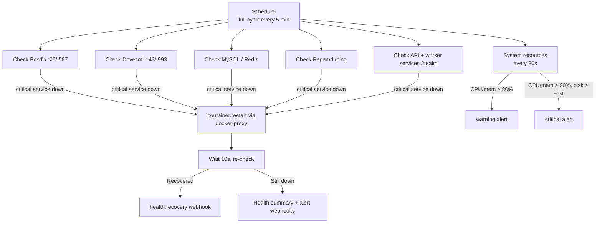

# Auto-Healing

**When a service goes down, the monitoring service detects it and restarts the container automatically.**

The consolidated Monitoring service (port `8085`) runs a background scheduler: every 5 minutes it health-checks all core services, restarts any critical service found down, collects metrics, and dispatches webhook alerts. System resources are sampled every 30 seconds, and backup freshness gauges are republished every minute.

## How it works



### What gets monitored

Service definitions live in `worker/monitoring/services/service_monitor.py` — Postfix (SMTP banner on 25/587), Dovecot (IMAP on 143/993), Rspamd (`/ping` on 11334), MySQL, Redis, the platform API (`/health` on 8080), and the worker services (tracking, webhooks, rate limiter, and the rest) via their HTTP health endpoints. Services marked `critical` are the ones auto-healed; the checks run in parallel each cycle.

### The restart mechanism

Restarts go through the **Docker API**, not supervisord: the monitoring container talks to a `docker-proxy` sidecar (`DOCKER_HOST=tcp://docker-proxy:2375`) that is deliberately scoped to *containers + POST + restarts only* — the monitoring service can restart containers but cannot otherwise drive the Docker daemon. After a restart it waits ~10 seconds, re-checks, and reports the outcome.

### Alert thresholds (hardcoded, not env vars)

| Resource | Warning | Critical |
|----------|---------|----------|
| CPU usage | > 80% | > 90% |
| Memory usage | > 80% | > 90% |
| Disk usage | — | > 85% |

There are no `HEALTH_CHECK_*` / `MONITOR_*` tuning variables; intervals and thresholds are set in code (`worker/monitoring/app.py` and `services/system_monitor.py`).

## Webhook events

Dispatched through the [centralized dispatcher](webhooks.md) (and additionally via the service's own notifier):

| Event | When |
|-------|------|
| `health.service.down` / `health.service.up` | Service state transitions |
| `health.recovery` | An auto-heal attempt completed (success or failure recorded in the payload) |
| `health.system.alert` | A resource threshold was crossed |
| `health.check.failed` | A health check itself errored |

## API endpoints

```
GET  /                       # HTML monitoring dashboard
GET  /health                 # service's own health
GET  /heartbeat              # triggers an async health summary
GET  /api/stats              # current stats
GET  /api/metrics            # enterprise metrics (system, mail, performance, SLA)
GET  /metrics                # Prometheus (this service)
GET  /metrics/prometheus     # aggregated Prometheus view across services
POST /restart/{service_name} # manual restart        (admin token)
POST /auto-heal              # heal-everything sweep  (admin token)
GET  /admin/services/status  # detailed status        (admin token)
GET  /admin/token            # fetch the current admin token (local access)
POST /admin/regenerate-token
```

### The admin token

Restart and admin endpoints require an admin token passed by the caller. The token is generated at startup — an HMAC over a timestamped nonce keyed with `WEBHOOK_SECRET` — and is valid for 24 hours. Fetch it from `GET /admin/token` (or the container logs); regenerate with `POST /admin/regenerate-token`. There is no `ADMIN_TOKEN_SECRET` variable — the signing key is `WEBHOOK_SECRET`.

```bash
TOKEN=$(curl -s http://localhost:8085/admin/token | jq -r .token)
curl -X POST http://localhost:8085/restart/dovecot -H "X-Admin-Token: $TOKEN"
```

## Backup freshness

The monitoring service also watches the [backup](backup-restore.md) pipeline: every minute it republishes Prometheus gauges for the age of the latest full/incremental backup per expected host, so a silently stalled backup timer shows up on dashboards and alerts instead of being discovered during a restore.

## Things to know

- **Auto-healing doesn't fix root causes.** A service crashing on bad data will crash again after restart; the monitor will keep restarting and alerting. Read the logs.

- **Restart authority is deliberately narrow.** The docker-proxy scope means a compromised monitoring service could bounce containers but not exec into them, read volumes, or create new ones.

- **In production the dashboard is loopback-only** (`127.0.0.1:8085`), reachable via SSH tunnel or the internal network — it is not exposed through Traefik.

- **Container-level restarts also exist independently.** Every service in docker-compose runs with `restart: unless-stopped`/`always`, and containers have their own Docker healthchecks — the monitoring service adds cross-service awareness, notifications, and the resource/SLA view on top.

- **Cascading failures resolve from the bottom.** If MySQL goes down, dependent services fail their checks too; once MySQL restarts, dependents recover on their next check cycle.
