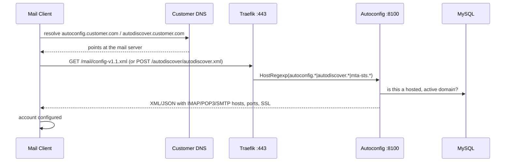

# Client Auto-Setup (Autoconfig / Autodiscover)

**Thunderbird, Outlook, and mobile clients configure themselves from just an email address and password.**

The Autoconfig service (port `8100`) answers the standard client auto-setup protocols — Mozilla Autoconfig, Microsoft Autodiscover (POX and V2/JSON), and MTA-STS — for **every hosted domain**. It has been publicly routed in production since 2026-08-27: Traefik matches `autoconfig.*`, `autodiscover.*`, and `mta-sts.*` for any domain on the TLS entrypoint (a `HostRegexp` router, so each customer domain works without per-domain configuration).

## How it works



The advertised server name comes from `MAIL_HOSTNAME` (the customer-facing hostname the TLS certificate is issued for), falling back to `HOSTNAME`. Clients are handed IMAP 993 (SSL), POP3 995 (SSL), and SMTP submission 587 (STARTTLS) with full-email-address usernames.

## Endpoints

```
GET  /mail/config-v1.1.xml                          # Mozilla Autoconfig (Thunderbird)
GET  /.well-known/autoconfig/mail/config-v1.1.xml   # alternate Mozilla path
POST /autodiscover/autodiscover.xml                 # Microsoft Autodiscover POX (Outlook)
POST /autodiscover/autodiscover.json                # Microsoft Autodiscover V2
GET  /mta-sts.txt                                   # MTA-STS policy
GET  /.well-known/mta-sts.txt                       # standard MTA-STS path
GET  /dns-records/{domain}                          # copy-paste-ready DNS records
GET  /health
GET  /metrics
```

### The DNS record generator

`GET /dns-records/{domain}` returns a structured, copy-paste-ready set of every record a domain needs:

- **MX**, **SPF** (`v=spf1 mx a:<mx-host> ~all`), **DKIM** (the domain's real public key from the database), **DMARC** (`p=quarantine` with `rua`/`ruf`)
- **MTA-STS**: `_mta-sts.{domain}` TXT plus the `mta-sts.{domain}` CNAME for policy hosting
- **TLS-RPT**: `_smtp._tls.{domain}` TXT
- **SRV records**: `_autodiscover._tcp` (443), `_imaps._tcp` (993), `_submission._tcp` (587), `_pop3s._tcp` (995), and CalDAV/CardDAV SRVs
- **CNAMEs** for the auto-setup hosts themselves

## Configuration

| Variable | Default | Description |
|----------|---------|-------------|
| `MAIL_HOSTNAME` | *(falls back to `HOSTNAME`)* | The hostname handed to clients — must match the TLS certificate |
| `DOMAIN` | `example.com` | Platform base domain |
| `MTA_STS_MODE` | `testing` | MTA-STS policy mode (`testing` → `enforce` once verified) |
| `PORT` | `8100` | Service port |

## What a customer domain needs in DNS

For auto-setup to work on `customer.com`, its DNS must point the discovery hosts at the mail server:

```
autoconfig.customer.com     CNAME  mail.yourplatform.com
autodiscover.customer.com   CNAME  mail.yourplatform.com
_autodiscover._tcp.customer.com  SRV  0 1 443 mail.yourplatform.com
mta-sts.customer.com        CNAME  mail.yourplatform.com    (optional, for MTA-STS)
```

Use `GET /dns-records/customer.com` for the exact values.

## Things to know

- **Only hosted, active domains are answered.** The service checks the domain against the database; unknown domains get a 404 rather than leaking configuration.

- **TLS certificates matter.** Clients validate the certificate of `autoconfig.<their-domain>` / `autodiscover.<their-domain>`. Each customer discovery hostname needs a certificate on the Traefik side — plan issuance when onboarding a domain.

- **MTA-STS starts in `testing` mode.** Receivers report but don't enforce; switch `MTA_STS_MODE` to `enforce` after confirming TLS works from major senders, and bump the `id` in the `_mta-sts` TXT record when the policy changes.

- **Autodiscover here covers IMAP/SMTP settings, not Exchange ActiveSync.** EAS clients asking for an Exchange account type are not pointed at the ActiveSync (Enterprise Edition) container (which is itself not publicly routed yet).

- **History:** before 2026-08-27 the Traefik rule was a single literal host, so `autoconfig.<customer-domain>` 404'd for every customer domain, the advertised hostname was the server's internal identity, and no certificates were provisioned — client auto-setup effectively never worked. All four issues were fixed together.
