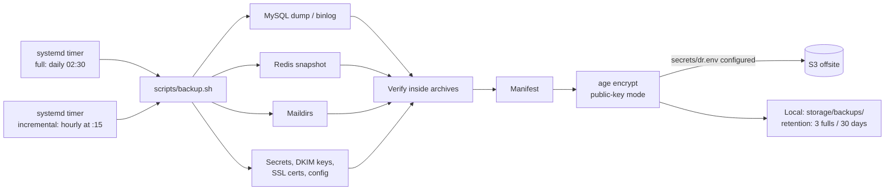

# Backup & Restore

**Scheduled full and incremental backups of the database, mail store, and secrets — encrypted with age and optionally shipped offsite to S3.**

Backups are driven by `scripts/backup.sh` on the **host**, executed by systemd timers (installed via `deployment/systemd/install-timers.sh`). Containers do not back themselves up.

## How it works



The ordering is deliberate: **components → verify → manifest → encrypt → upload → prune**. Verification reads inside the gzip/tar archives (impossible after encryption), and pruning happens last — aggressively only after a successful upload, so a broken offsite path never costs the local copies.

### Schedules (systemd timers)

| Timer | Schedule | What runs |
|-------|----------|-----------|
| `mailyte-backup-full.timer` | Daily at 02:30 | `backup.sh --full` |
| `mailyte-backup-incremental.timer` | Hourly at :15 | `backup.sh --incremental` (MySQL binlog + new mail) |
| `mailyte-mail-sync.timer` | Every 15 minutes | `scripts/mail-sync.sh` (continuous Maildir sync) |

### What gets backed up

| Component | Method |
|-----------|--------|
| **MySQL** | `mysqldump` (full) and binlog capture (incremental), exec'd inside the mysql container |
| **Redis** | Snapshot |
| **Mail storage** | `/var/mail/vhosts` maildirs (full + new-mail incremental) |
| **Secrets** | `secrets/` — always encrypted; `--no-encrypt` refuses to run with secrets included |
| **DKIM keys / SSL certs** | `storage/dkim_keys`, `storage/ssl_certs`, `storage/ssl_private` |
| **Configuration** | Postfix/Dovecot/Rspamd config files |

### What does NOT get backed up

- **Qdrant vector data** — the RAG index is rebuildable by re-indexing.
- **Rate-limit counters** — ephemeral by design; they reset and re-accumulate.

Separately from backups, the [Archiver](archiving.md) continuously stores every accepted message in encrypted S3 within seconds of delivery — that is what protects mail written *between* backup runs.

## Configuration

Local behavior comes from the environment; everything offsite comes from **`secrets/dr.env`** (read by `scripts/lib/dr_common.sh`):

```bash
# secrets/dr.env
S3_BUCKET=mailyte-dr
S3_PREFIX=mailyte/backups
S3_ENDPOINT_URL=            # empty for AWS; set for MinIO/R2/B2
AWS_ACCESS_KEY_ID=...
AWS_SECRET_ACCESS_KEY=...
DR_AGE_RECIPIENT=age1...    # PUBLIC key only — the identity never lands on this host
```

| Variable | Default | Description |
|----------|---------|-------------|
| `BACKUP_DIR` | `<project_root>/storage/backups` | Local backup destination |
| `BACKUP_RETENTION_FULLS` | `3` | Local full backups kept once offsite works |
| `BACKUP_RETENTION_DAYS` | `30` | Age-based prune fallback when offsite is down |
| `DB_PASSWORD`, `DB_NAME`, `MAIL_DATA_DIR` | — | Component settings |

!!! warning "Offsite is opt-in and must be verified"
    Without a populated `secrets/dr.env` (S3 bucket + credentials + age recipient), backups stay on the same server they protect. Encryption uses age in public-key mode on purpose: a compromised host can *create* backups but never *read* them. Check `aws s3 ls` and the `backup_history` table (surfaced at the archiver's `GET /backup/history` and as freshness gauges in the monitoring service) to confirm uploads are actually happening.

## Script usage

```bash
./scripts/backup.sh --full            # everything (default)
./scripts/backup.sh --incremental     # MySQL binlog + new mail only
./scripts/backup.sh --mysql-only | --redis-only | --mail-only | --secrets-only | --config-only
./scripts/backup.sh --pre-deploy      # DB + config, local only (used by deployment/deploy.sh)
./scripts/backup.sh --verify          # verify existing backups
./scripts/backup.sh --no-upload       # skip S3 even if configured
```

## Performing a restore

!!! danger "Restores are destructive"
    Restoring overwrites current data. Verify which backup you're restoring, and take a fresh backup of the current state first.

Use `scripts/restore.sh` (and `scripts/lib/restore_organization.sh` for per-org restores). To rehearse the whole path without touching production, `scripts/dr-drill.sh` runs a disaster-recovery drill against the `deployment/dr-local` environment.

Manual database restore, if you need it:

```bash
ls storage/backups/                      # find the run
# decrypt (needs the age identity, which lives OFF this host)
age -d -i dr_identity.txt < mysql_full_...sql.gz.age | gunzip | \
  docker exec -i mysql mysql -u root -p"$MYSQL_ROOT_PASSWORD" mailserver
```

### Post-restore checklist

1. **Verify Postfix delivers** — send a test message.
2. **Verify Dovecot serves** — log in via IMAP. Remember stored mail is mail_crypt ciphertext; the global key pair (`/etc/dovecot/mail_crypt/`) must be restored too or every mailbox reads as empty/corrupt.
3. **Check DKIM/SSL keys** are back in `storage/` — outbound signing and TLS depend on them.
4. **Rebuild the RAG index** if you use AI search.
5. **Rate limit counters reset** — expected.
6. **Confirm the timers are active**: `systemctl list-timers 'mailyte-*'`.

## Things to know

- **The age identity must live off-server.** `scripts/escrow-secrets.sh` exists to escrow the key material; a backup you can't decrypt because the only identity copy died with the server is not a backup.

- **Verification happens before encryption on every run** — the script reads inside the archives it just wrote. `--verify` re-checks existing runs.

- **`--pre-deploy` is your rollback point.** `deployment/deploy.sh` snapshots the database and config before each release.

- **Only S3-compatible offsite is supported.** The upload path uses the AWS CLI against `S3_ENDPOINT_URL` — AWS, MinIO, Cloudflare R2, Backblaze B2. There is no Azure Blob or GCS support.

- **Test your restores.** `scripts/dr-drill.sh` exists precisely so the restore path is exercised regularly, not discovered during an incident.
