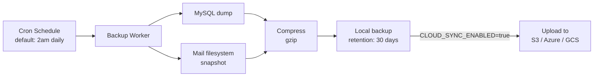

# Backup & Restore

**Automated database and filesystem backups with cloud sync to S3 or Azure.**

Mailyte runs scheduled backups of your database and mail storage, compresses them, and optionally uploads them to cloud storage. If something goes catastrophically wrong, you can restore from any backup point within your retention window.

## How it works



Think of it like Time Machine for your mail server. Every night (or whatever schedule you configure), the system takes a snapshot. The local copy is kept for quick restores; the cloud copy is your off-site safety net.

### What gets backed up

| Component | Method | Contents |
|-----------|--------|----------|
| **MySQL database** | `mysqldump` | All tables -- organizations, domains, mailboxes, quotas, tracking data, templates, rate limit configs |
| **Mail filesystem** | Filesystem copy/tar | All maildirs under `/var/mail/vhosts` |
| **Configuration** | File copy | Postfix, Dovecot, Rspamd config files |
| **Attachments** | Filesystem copy/tar | Stored attachments in `/storage/attachments` |

### What does NOT get backed up automatically

- **Redis data** -- Counters and caches are ephemeral. After a restore, rate limit counters reset to zero and caches rebuild themselves.
- **Qdrant vector database** -- The RAG search index is not included in the default backup. It can be rebuilt by re-indexing emails after a restore.
- **Let's Encrypt certificates** -- Certificates are regenerated automatically on startup via the cert manager.

## Configuration

### Backup schedule

| Variable | Default | Description |
|----------|---------|-------------|
| `BACKUP_ENABLED` | `true` | Enable automated backups |
| `BACKUP_SCHEDULE` | `0 2 * * *` | Cron expression (default: 2am daily) |
| `BACKUP_RETENTION_DAYS` | `30` | Days to keep local backups |
| `BACKUP_COMPRESSION` | `gzip` | Compression algorithm |

### Cloud sync

| Variable | Default | Description |
|----------|---------|-------------|
| `CLOUD_SYNC_ENABLED` | `false` | Enable cloud upload |
| `CLOUD_SYNC_PROVIDER` | `s3` | Provider: `s3`, `azure`, or `gcs` |
| `CLOUD_PROVIDER` | `aws` | Cloud provider selection |

#### AWS S3

| Variable | Default | Description |
|----------|---------|-------------|
| `AWS_ACCESS_KEY_ID` | *(required)* | AWS access key |
| `AWS_SECRET_ACCESS_KEY` | *(required)* | AWS secret key |
| `AWS_DEFAULT_REGION` | `eu-west-2` | AWS region |
| `AWS_BUCKET` | `development-local-1` | S3 bucket name |
| `AWS_S3_PREFIX` | `mailyte` | Key prefix in bucket |

#### Azure Blob Storage

| Variable | Default | Description |
|----------|---------|-------------|
| `AZURE_STORAGE_ACCOUNT` | *(required)* | Azure storage account name |
| `AZURE_STORAGE_KEY` | *(required)* | Azure storage key |
| `AZURE_CONTAINER` | *(required)* | Blob container name |

#### Google Cloud Storage

| Variable | Default | Description |
|----------|---------|-------------|
| `GCS_BUCKET` | *(required)* | GCS bucket name |
| `GCS_CREDENTIALS_FILE` | *(required)* | Path to service account JSON |

## Performing a restore

!!! danger "Restores are destructive"
    Restoring from a backup will overwrite current data. Always verify you're restoring the right backup and consider taking a fresh backup of the current state first.

### Restore the database

```bash
# Find your backup
ls /backup/mysql/

# Decompress and restore
gunzip < /backup/mysql/mailserver_2026-03-25_020000.sql.gz | mysql -u root -p mailserver
```

### Restore the mail filesystem

```bash
# Stop Dovecot first
supervisorctl stop dovecot

# Restore maildirs
tar xzf /backup/mail/vhosts_2026-03-25_020000.tar.gz -C /var/mail/

# Fix permissions
chown -R vmail:vmail /var/mail/vhosts

# Restart Dovecot
supervisorctl start dovecot
```

### Restore from cloud

```bash
# Download from S3
aws s3 cp s3://your-bucket/mailyte/backups/2026-03-25/ /tmp/restore/ --recursive

# Then follow the local restore steps above
```

### Post-restore checklist

After restoring:

1. **Verify Postfix can deliver.** Send a test email.
2. **Verify Dovecot can serve.** Log in via IMAP.
3. **Check DNS records.** SPF, DKIM, DMARC should still be valid.
4. **Rebuild RAG index** if you use AI search: re-index via the RAG admin API.
5. **Rate limit counters are reset.** This is expected -- they'll accumulate naturally.
6. **Check cron is running.** Make sure backups resume on schedule.

## Monitoring backups

The health monitor tracks backup status. If a scheduled backup fails, you'll get a webhook notification. You can also check manually:

```bash
# Check the last backup timestamp
ls -lt /backup/mysql/ | head -5

# Verify cloud sync
aws s3 ls s3://your-bucket/mailyte/backups/ --recursive | tail -5
```

## Things to know

- **Backups run at 2am by default.** This is a cron expression (`0 2 * * *`). Change it to a time when your server has low load. Backups are I/O-intensive, especially the filesystem copy.

- **Cloud sync is optional but strongly recommended.** Local backups protect against software failures and accidental deletions. Cloud backups protect against hardware failures, data center outages, and everything else.

- **Retention is managed automatically.** Local backups older than `BACKUP_RETENTION_DAYS` are deleted by the cleanup job. Cloud backups follow the same policy unless your cloud provider has its own lifecycle rules.

- **Large mail stores take time to back up.** If you have hundreds of gigabytes of mail data, the filesystem backup could take hours. Consider incremental backup strategies for very large deployments (not yet built into the default backup, but you can script rsync-based incrementals).

- **S3 is used for more than backups.** The `AWS_S3_PREFIX=mailyte` setting puts backups under the `mailyte/` prefix in your bucket. Email file storage and attachments also use S3 (in production). Keep your bucket organized and use lifecycle rules to manage costs.

- **Test your restores.** A backup you've never tested restoring is a backup you don't actually have. Periodically spin up a test instance and verify the restore process works end to end.
