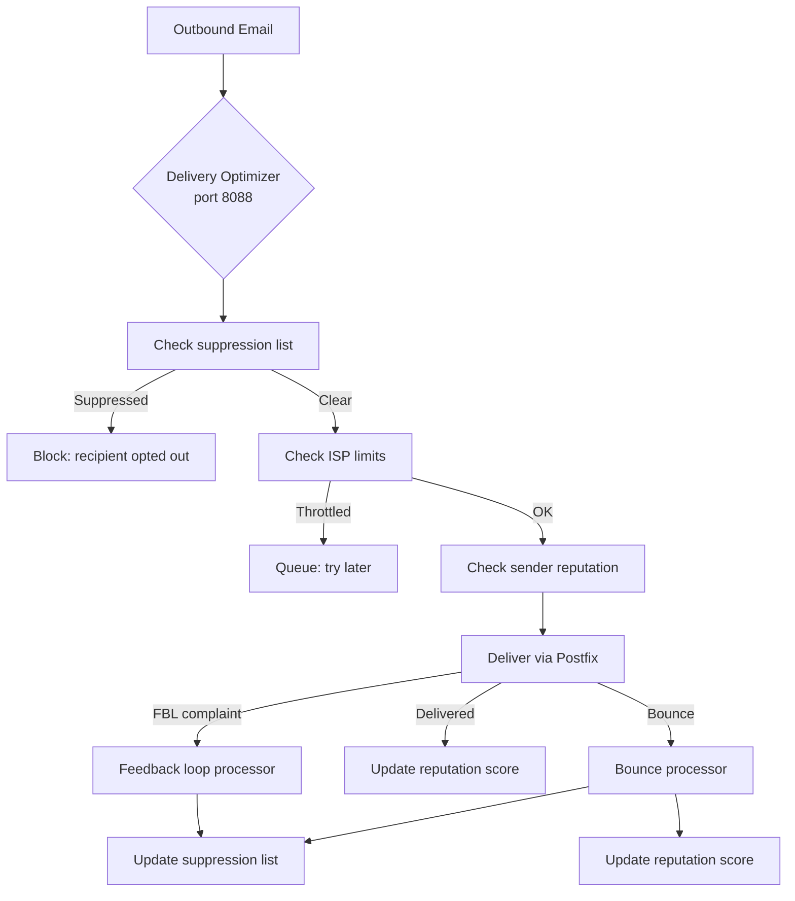

# Deliverability

**Make sure your emails actually reach inboxes -- not spam folders.**

Deliverability is the art and science of getting email accepted by receiving servers. Mailyte's Delivery Optimizer service (port `8088`) handles SPF/DKIM/DMARC authentication, tracks your sending reputation per domain and ISP, manages bounce processing, enforces suppression lists, and throttles delivery to match each ISP's tolerance.

## How it works



Think of the delivery optimizer as a careful postman who knows every ISP's rules. Gmail only wants 100 emails per hour from a new sender? The optimizer respects that. A recipient bounced three times? They're on the suppression list -- no more attempts.

### The authentication trifecta: SPF + DKIM + DMARC

These three DNS-based standards work together to prove your emails are legitimate:

**SPF** (Sender Policy Framework) -- A DNS TXT record that says "only these IP addresses are allowed to send email for my domain." Receiving servers check this to make sure the email came from an authorized source.

**DKIM** (DomainKeys Identified Mail) -- A cryptographic signature added to every outgoing email. The receiving server uses your public key (published in DNS) to verify the signature. If the email was tampered with in transit, the signature won't match.

**DMARC** (Domain-based Message Authentication, Reporting & Conformance) -- A policy that tells receiving servers what to do when SPF or DKIM fails. You can tell them to do nothing (`none`), quarantine the message (`quarantine`), or reject it (`reject`). DMARC also sets up reporting so you can see who's trying to send email pretending to be your domain.

## Configuration

### Authentication

| Variable | Default | Description |
|----------|---------|-------------|
| `ENABLE_DKIM_SIGNING` | `true` | Sign outbound mail with DKIM |
| `ENABLE_SPF_CHECK` | `true` | Verify inbound SPF |
| `ENABLE_DMARC_CHECK` | `true` | Enforce DMARC policies |

### Delivery optimizer

| Variable | Default | Description |
|----------|---------|-------------|
| `DELIVERY_OPTIMIZER_PORT` | `8088` | Service port |
| `DELIVERY_OPTIMIZATION_ENABLED` | `true` | Enable delivery optimization |
| `DELIVERY_RESPECT_ISP_LIMITS` | `true` | Honor ISP sending limits |
| `DELIVERY_AUTO_THROTTLE` | `true` | Auto-adjust sending speed |
| `DELIVERY_ISP_LIMITS` | *(JSON)* | Per-ISP hourly/daily/burst limits |

### Suppression list

| Variable | Default | Description |
|----------|---------|-------------|
| `SUPPRESSION_AUTO_BOUNCE` | `true` | Auto-suppress after bounces |
| `SUPPRESSION_AUTO_COMPLAINT` | `true` | Auto-suppress after complaints |
| `SUPPRESSION_BOUNCE_THRESHOLD_HARD` | `1` | Hard bounces before suppression |
| `SUPPRESSION_BOUNCE_THRESHOLD_SOFT` | `5` | Soft bounces before suppression |
| `SUPPRESSION_RETENTION_DAYS` | `90` | Days to keep suppressed addresses |

### Feedback loops

| Variable | Default | Description |
|----------|---------|-------------|
| `FBL_ENABLED` | `true` | Process feedback loop reports |
| `FBL_PROCESSORS` | `gmail,outlook,yahoo` | ISPs to process FBL from |
| `FBL_AUTO_SUPPRESS` | `true` | Auto-suppress complainers |

### Reputation tracking

| Variable | Default | Description |
|----------|---------|-------------|
| `REPUTATION_TRACKING_ENABLED` | `true` | Track sending reputation |
| `REPUTATION_UPDATE_INTERVAL` | `3600` | Seconds between reputation recalculations |
| `REPUTATION_ALERT_THRESHOLD` | `30` | Score below which to alert (out of 100) |
| `REPUTATION_ISP_TRACKING` | `gmail,outlook,yahoo,aol` | ISPs to track separately |

## ISP sending limits

The delivery optimizer ships with sensible defaults for major ISPs:

| ISP | Hourly Limit | Daily Limit | Burst | Delay (ms) | Concurrent |
|-----|-------------|------------|-------|-----------|------------|
| Gmail | 100 | 2,000 | 10 | 1,000 | 5 |
| Outlook/Hotmail | 300 | 5,000 | 20 | 500 | 10 |
| Yahoo | 200 | 3,000 | 15 | 1,000 | 8 |
| iCloud | 200 | 3,000 | 15 | 800 | 8 |
| AOL | 100 | 1,500 | 10 | 2,000 | 3 |
| Default (others) | 500 | 10,000 | 50 | 100 | 20 |

These can be adjusted per-ISP via the API or the `DELIVERY_ISP_LIMITS` env var (JSON format).

## API endpoints

### Check if email should be sent now

```bash
curl -X POST http://localhost:8088/check \
  -H "Content-Type: application/json" \
  -d '{
    "recipient_domain": "gmail.com",
    "organization_id": "org_123",
    "sender_ip": "203.0.113.10"
  }'
```

Response:

```json
{
  "action": "send",
  "delay_ms": 0,
  "reason": "Within ISP limits"
}
```

Or if throttled:

```json
{
  "action": "delay",
  "delay_ms": 5000,
  "reason": "Approaching Gmail hourly limit (92/100)"
}
```

### Record a send event

```bash
curl -X POST http://localhost:8088/record \
  -H "Content-Type: application/json" \
  -d '{
    "recipient_domain": "gmail.com",
    "organization_id": "org_123",
    "message_id": "<abc123@example.com>"
  }'
```

### Process a bounce

```bash
curl -X POST http://localhost:8088/bounce \
  -H "Content-Type: application/json" \
  -d '{
    "organization_id": "org_123",
    "recipient": "gone@gmail.com",
    "sender": "marketing@yourdomain.com",
    "bounce_type": "hard",
    "bounce_code": "550"
  }'
```

### Get domain reputation

```bash
curl http://localhost:8088/reputation/yourdomain.com
```

```json
{
  "domain": "yourdomain.com",
  "overall_score": 87,
  "isp_scores": {
    "gmail.com": 92,
    "outlook.com": 85,
    "yahoo.com": 78
  },
  "factors": {
    "bounce_rate": 0.02,
    "complaint_rate": 0.001,
    "delivery_rate": 0.97
  }
}
```

### IP warming schedule

```bash
curl -X POST http://localhost:8088/warming/schedule \
  -H "Content-Type: application/json" \
  -d '{
    "ip": "203.0.113.10",
    "target_daily_volume": 50000,
    "warming_days": 30
  }'
```

Creates a gradual ramp-up schedule for a new sending IP, starting low and increasing daily volume over the specified period.

### Get ISP limits

```bash
curl http://localhost:8088/isp-limits
```

### Update ISP limits

```bash
curl -X PUT http://localhost:8088/isp-limits/gmail.com \
  -H "Content-Type: application/json" \
  -d '{
    "hourly": 150,
    "daily": 3000,
    "burst": 15,
    "delay_ms": 800,
    "concurrent": 8
  }'
```

## Things to know

- **New IPs have no reputation.** If you're setting up Mailyte for the first time, receiving servers don't trust your IP yet. Use the IP warming feature to gradually increase sending volume over 2-4 weeks. Trying to blast 50,000 emails on day one from a cold IP will get you blocked.

- **Suppression lists are per-organization.** If a recipient bounces or complains for Org A, they're suppressed for Org A only. Org B can still send to them (unless they bounce/complain there too).

- **Hard bounces are immediate.** One hard bounce (mailbox doesn't exist) immediately suppresses the address. Soft bounces (mailbox full, server temporarily down) get more chances -- 5 by default before suppression.

- **Reputation scores are composite.** The score (0-100) is calculated from bounce rate, complaint rate, delivery rate, and engagement signals. A score below 30 triggers an alert. Below 20, you've probably landed on some blocklists and need to investigate.

- **ISP limits are estimates.** The built-in limits are based on publicly available guidelines and community knowledge. ISPs don't publish exact limits, and they change them without notice. If you're seeing delivery issues to a specific ISP, try lowering the limits.

- **FBL processing requires setup.** To receive feedback loop reports from ISPs, you typically need to register your sending IPs with each ISP's FBL program (Gmail Postmaster Tools, Microsoft SNDS, etc.). The delivery optimizer processes the reports once you receive them, but the registration is manual.

- **DKIM keys need DNS records.** The delivery optimizer handles DKIM signing, but you need to publish the corresponding public key as a DNS TXT record. See the [DNS Setup](../configuration/dns-setup.md) guide for details.
