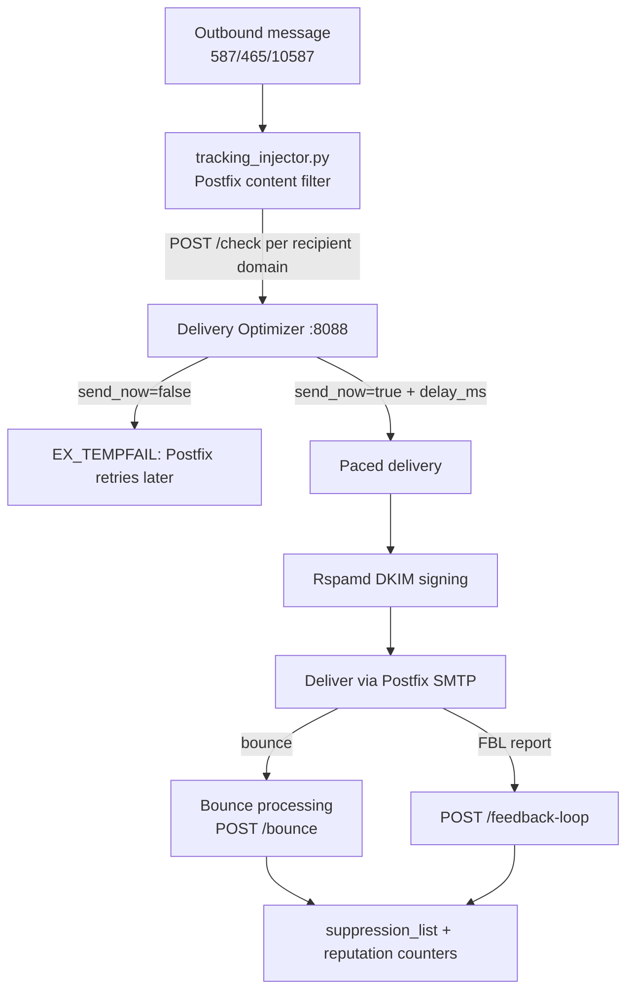

# Deliverability

**Make sure your emails actually reach inboxes — not spam folders.**

Deliverability in Mailyte is a joint effort of several real components: Rspamd signs outbound mail with DKIM, the platform API generates and live-verifies SPF/DKIM/DMARC DNS records, the Delivery Optimizer (container port `8088`, published on host port `8094`) throttles sending per ISP and tracks reputation, and Postfix enforces sender-ownership on the authenticated submission ports.

## How it works



The optimizer is consulted **on the live mail path**: the Postfix content filter calls `POST /check` for every recipient domain before a message proceeds, sleeps `delay_ms` when pacing is requested, tempfails (so Postfix retries) when a limit is reached, and records each attempt with `POST /record`. If the optimizer is unreachable, the filter paces down by a conservative fixed delay rather than sending unthrottled.

### The authentication trifecta: SPF + DKIM + DMARC

**SPF** — a DNS TXT record listing who may send for your domain. Mailyte generates `v=spf1 include:<spf-host> ~all` for each domain (the include host comes from `MAIL_SPF_HOST`, falling back to `spf.<mail hostname>`).

**DKIM** — Rspamd signs all authenticated/locally-originated mail with per-domain 2048-bit RSA keys. Keys are generated by the platform API when a domain is created, stored envelope-encrypted in the database, written to `/var/lib/rspamd/dkim/{domain}.{selector}.key`, and published as `{selector}._domainkey.{domain}` TXT records. Safe key rotation is built in: `POST /api/v1/domains/{id}/dkim/rotate` creates a new selector, and `POST /api/v1/domains/{id}/dkim/{selector}/activate` cuts signing over once the TXT record resolves.

**DMARC** — Mailyte suggests `v=DMARC1; p=quarantine; rua=mailto:dmarc-reports@<domain>` per domain, and verifies the published record. Inbound DMARC evaluation is done by Rspamd.

Live verification: `GET /api/v1/domains/{domain_id}/verify-dns` performs real DNS lookups for MX, SPF, DKIM (the domain's active selector), and DMARC. The SPF check does genuine recursive evaluation (`include:`/`redirect=`/`ip4:`/`mx` with the standard 10-lookup budget), so a record that authorizes the server without the literal include string still passes. Verification was consolidated to this single engine on 2026-08-21 — earlier releases had two rival verify implementations that could never both pass; that is fixed.

### Sender-ownership enforcement (sender-login mismatch)

`reject_sender_login_mismatch` is enforced on the authenticated submission ports **only** — 587 and 465 — placed *before* `permit_sasl_authenticated` so it cannot be short-circuited. An authenticated user (mailbox password or SMTP API key) can only send as addresses their login owns per `smtpd_sender_login_maps`.

!!! danger "Never make sender-login mismatch global"
    Do not add `reject_sender_login_mismatch` to `main.cf`'s global `smtpd_sender_restrictions`. Port 25 inherits the global value and carries unauthenticated inbound mail from the whole internet — with the check global, any inbound message whose envelope sender owns a local mailbox is rejected (`553 5.7.1 ... not logged in`). This broke all such inbound mail in production on 2026-08-22. The full postmortem is inline in `mailer/postfix/config/main.cf`.

## Delivery Optimizer

### ISP sending limits (defaults, seeded into Redis)

| ISP | Hourly | Daily | Burst | Delay (ms) | Concurrent |
|-----|--------|-------|-------|-----------|------------|
| gmail.com / googlemail.com | 100 | 2,000 | 10 | 1,000 | 5 |
| outlook.com / hotmail.com / live.com | 300 | 5,000 | 20 | 500 | 10 |
| yahoo.com | 200 | 3,000 | 15 | 1,000 | 8 |
| icloud.com / me.com | 200 | 3,000 | 15 | 800 | 8 |
| aol.com | 100 | 1,500 | 10 | 2,000 | 3 |
| comcast.net | 150 | 2,000 | 10 | 1,500 | 5 |
| everything else (`_default`) | 500 | 10,000 | 50 | 100 | 20 |

Adjust per-ISP with `PUT /isp-limits/{domain}`; current values via `GET /isp-limits`. Limits are tracked per organization per recipient domain in Redis.

### API endpoints

```bash
# Should this message go now?
curl -X POST http://localhost:8094/check -H "Content-Type: application/json" \
  -d '{"recipient_domain": "gmail.com", "organization_id": "org_123"}'
# => {"send_now": true, "delay_ms": 1000, "hourly_count": 42, ...}
# or {"send_now": false, "reason": "Hourly limit reached for gmail.com", "schedule_for": "..."}

# Record a send
curl -X POST http://localhost:8094/record -H "Content-Type: application/json" \
  -d '{"recipient_domain": "gmail.com", "organization_id": "org_123"}'

# Process a bounce (hard bounces are suppressed immediately)
curl -X POST http://localhost:8094/bounce -H "Content-Type: application/json" \
  -d '{"organization_id": "org_123", "recipient": "gone@gmail.com",
       "sender": "you@yourdomain.com", "bounce_type": "hard", "bounce_code": "550"}'

# Domain reputation (0-100 score computed from bounce/complaint rates)
curl "http://localhost:8094/reputation/gmail.com?organization_id=org_123"

# IP warming
curl -X POST http://localhost:8094/warming/schedule -H "Content-Type: application/json" \
  -d '{"ip_address": "203.0.113.10", "organization_id": "org_123",
       "target_daily_volume": 50000, "warmup_days": 30}'
curl http://localhost:8094/warming/status

# Feedback loop report
curl -X POST http://localhost:8094/feedback-loop -H "Content-Type: application/json" \
  -d '{"organization_id": "org_123", "reporter": "gmail", "feedback_type": "abuse",
       "original_recipient": "user@gmail.com", "original_sender": "you@yourdomain.com"}'
```

Reputation scoring: starts at 100, loses up to 40 points for bounce rate and up to 50 for complaint rate; rated excellent (>=90) / good (>=70) / fair (>=50) / poor. Events `optimizer.domain.throttled`, `optimizer.reputation.changed`, `optimizer.ip.warmed`, and `optimizer.fbl.received` are dispatched through the [webhook system](webhooks.md).

## Suppression list

Hard bounces and abuse-type FBL reports write recipients into the per-organization `suppression_list` table (also fed by the tracking service's bounce/complaint/unsubscribe endpoints, with thresholds — hard bounces suppress immediately, soft bounces after repeated failures).

Since 2026-08-30 the suppression list is **enforced on the authenticated
submission path**: the Postfix rate-limit policy consultation (DATA phase, ports
587/465) also asks the rate limiter whether the recipient is on the sending
organization's suppression list, and a hit is refused with a permanent
`554 5.7.1` naming the suppression — the sender is told in-session, mail is
never silently dropped. The check fails open (a rate-limiter or database outage
never stops mail flow) and results are cached for 60 seconds, so a freshly
added suppression can take up to a minute to start rejecting.

!!! warning "Enforcement scope"
    The Postfix policy protocol only carries the recipient address at the DATA
    stage for **single-recipient** messages — a multi-recipient submission
    passes unchecked (logged by the rate limiter). Mail submitted through the
    internal webmail/API port (10587) bypasses the policy consultation entirely
    and is not checked either. If your application fans out one message to many
    recipients or sends via the webmail API, query the list first
    (`/tracking/suppressions`, or `is_suppressed` semantics via the tracking
    endpoints) — closing these gaps needs an RCPT-stage policy hook in the
    Postfix config, which is tracked separately.

## Things to know

- **New IPs have no reputation.** Use the warming scheduler to ramp a new sending IP over 2–4 weeks; the optimizer enforces the daily warming cap on the send path.

- **ISP limits are estimates.** Built-in numbers reflect public guidelines and community knowledge; ISPs change them silently. Lower them if you see deferrals from a specific ISP.

- **FBL processing requires registration.** Enrolling your IPs with each ISP's feedback-loop program (Google Postmaster Tools, Microsoft SNDS/JMRP, etc.) is manual; the `/feedback-loop` endpoint processes reports once you receive them.

- **DKIM only signs domains that have keys.** A domain created outside the API flow (or before key generation) sends unsigned until a key exists on disk for Rspamd. `verify-dns` tells you whether the public half resolves.

- **Delivery events come from the log ingestor.** `email.delivered` / `email.bounced` / `email.deferred` webhooks and the `mail_logs` table are produced by tailing the Postfix log — see [Analytics](analytics.md).

- For the DNS record values to publish, see [DNS Setup](../configuration/dns-setup.md) and the per-domain generator `GET /api/v1/domains/{id}` / autoconfig's `GET /dns-records/{domain}`.
