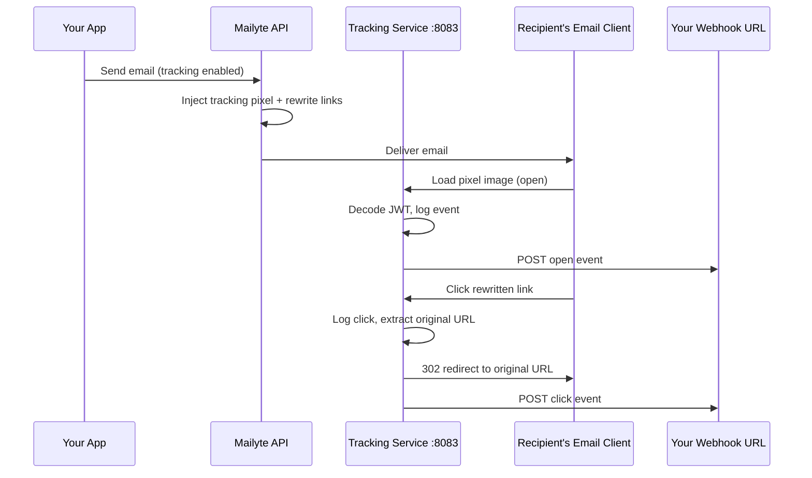

# Email Tracking

**Know when your emails are opened and which links get clicked.**

The tracking service embeds an invisible 1x1 pixel in outgoing emails and rewrites links to pass through a tracking proxy. When a recipient opens the email or clicks a link, Mailyte records the event with metadata like IP address, user agent, and timestamp -- then fires a webhook so your application knows about it in real time.

## How it works



### Open tracking

When tracking is enabled, the service injects a tiny transparent PNG at the end of the email body:

```html
" width="1" height="1" style="display:none" />
```

The `tracking_id` is a base64-encoded token containing the email ID, recipient, domain, and organization. When the recipient's email client loads images, it hits the tracking endpoint, which logs the event and serves the pixel.

!!! info "Image blocking"
    Many email clients block images by default (looking at you, Outlook). Open tracking is a best-effort signal -- it tells you *at least* this many people opened it, not exactly how many. Think of it as a lower bound.

### Click tracking

Every link in the email body gets rewritten to pass through the tracking service:

```
Original: https://example.com/pricing
Tracked:  https://track.yourdomain.com/click/<tracking_id>?url=https%3A%2F%2Fexample.com%2Fpricing
```

The tracking service logs the click, then issues a `302 redirect` to the original URL. The redirect is fast enough that most users never notice.

### Bounce and complaint tracking

The service also provides internal API endpoints that Postfix calls when a message bounces or a recipient reports spam:

- `POST /api/tracking/bounce` -- records hard/soft bounces and adds recipients to the suppression list
- `POST /api/tracking/complaint` -- records spam complaints and suppresses the address

## Configuration

| Variable | Default | Description |
|----------|---------|-------------|
| `TRACKING_ENABLED` | `true` | Master switch for all tracking |
| `OPEN_TRACKING_ENABLED` | `true` | Enable open (pixel) tracking |
| `CLICK_TRACKING_ENABLED` | `true` | Enable click (link rewrite) tracking |
| `TRACKING_DOMAIN` | `yourdomain.com` | Base domain for tracking URLs |
| `TRACKING_SUBDOMAIN` | `track` | Subdomain prefix (e.g., `track.yourdomain.com`) |
| `TRACKING_PROTOCOL` | `https` | Protocol for tracking URLs |
| `TRACKING_REQUIRE_SSL` | `true` | Enforce HTTPS for tracking endpoints |
| `TRACKING_PIXEL_CACHE_CONTROL` | `no-cache, no-store, must-revalidate` | Cache headers on the pixel response |
| `CLICK_REDIRECT_TIMEOUT` | `30` | Seconds before a click redirect times out |
| `CLICK_PRESERVE_QUERY_PARAMS` | `true` | Keep query params when redirecting |
| `TRACKING_BATCH_INSERT_SIZE` | `100` | Batch size for database inserts |
| `TRACKING_RATE_LIMIT_PER_IP` | `1000` | Max tracking requests per IP per window |
| `TRACKING_RATE_LIMIT_WINDOW` | `3600` | Rate limit window in seconds |
| `TRACKING_ANONYMIZE_IP` | `false` | Hash IP addresses before storing |
| `TRACKING_DATA_RETENTION_DAYS` | `365` | Days to keep tracking data |
| `TRACK_USER_AGENT` | `true` | Record user agent string |
| `TRACK_GEOLOCATION` | `true` | Record geographic data |
| `TRACK_DEVICE_INFO` | `true` | Record device type / OS |

### Privacy settings

If you need to comply with GDPR or similar regulations, you can anonymize collected data:

```bash
TRACKING_ANONYMIZE_IP=true          # Hashes IPs before storage
TRACKING_IP_RETENTION_DAYS=30       # Auto-delete IP data after 30 days
TRACKING_DATA_RETENTION_DAYS=90     # Shorter overall retention
TRACK_GEOLOCATION=false             # Disable geo lookups entirely
```

## API endpoints

All tracking endpoints live on port **8083** by default.

### Open tracking pixel

```
GET /open/<tracking_id>
```

Returns a 1x1 transparent PNG. Always returns `200` even if the tracking ID is invalid (so the email doesn't look broken).

### Click redirect

```
GET /click/<tracking_id>?url=<encoded_original_url>
```

Logs the click event and issues a `302` redirect to the original URL. If the tracking ID is invalid, it still redirects -- tracking should never break the user experience.

### Record a bounce

```bash
curl -X POST http://localhost:8083/api/tracking/bounce \
  -H "Content-Type: application/json" \
  -d '{
    "recipient": "bad-address@example.com",
    "bounce_type": "HARD",
    "bounce_reason": "550 User unknown",
    "tracking_info": {
      "organization_id": "org_123",
      "email_id": "msg_456"
    }
  }'
```

### Record a complaint

```bash
curl -X POST http://localhost:8083/api/tracking/complaint \
  -H "Content-Type: application/json" \
  -d '{
    "recipient": "annoyed-user@example.com",
    "complaint_type": "spam",
    "organization_id": "org_123"
  }'
```

## Webhook events

When tracking events fire, they dispatch through the centralized webhook system. Your application receives payloads like:

```json
{
  "event": "tracking.open",
  "timestamp": "2026-03-25T14:30:00Z",
  "data": {
    "email_id": "msg_456",
    "recipient": "user@example.com",
    "ip_address": "203.0.113.42",
    "user_agent": "Mozilla/5.0 (iPhone; CPU iPhone OS 17_0 ...)"
  }
}
```

Event types: `tracking.open`, `tracking.click`, `email.bounced`, `delivery.complaint`.

## Things to know

- **Open tracking is inherently imprecise.** If a client blocks images, you won't see the open. If a client pre-fetches images (Apple Mail Privacy Protection), you might see phantom opens. Don't treat open rates as gospel.

- **Click tracking adds a redirect hop.** This is typically 10-50ms of latency. On slow networks or high-latency endpoints, it could be noticeable. If a tracked link fails, the service still tries to redirect to the original URL.

- **Rate limiting protects the tracking service.** Each IP is limited to 1,000 requests per hour by default. When the limit is hit, the pixel still gets served (so the email renders correctly), but the event isn't logged.

- **Tracking data has retention limits.** By default, data is kept for 365 days. After that, the cleanup worker removes it. Adjust `TRACKING_DATA_RETENTION_DAYS` to match your compliance requirements.

- **Exclude domains from click tracking.** If you don't want to track clicks to your own site or internal tools, set `TRACKING_EXCLUDE_DOMAINS` to a comma-separated list. Mailto and tel links are excluded by default.
