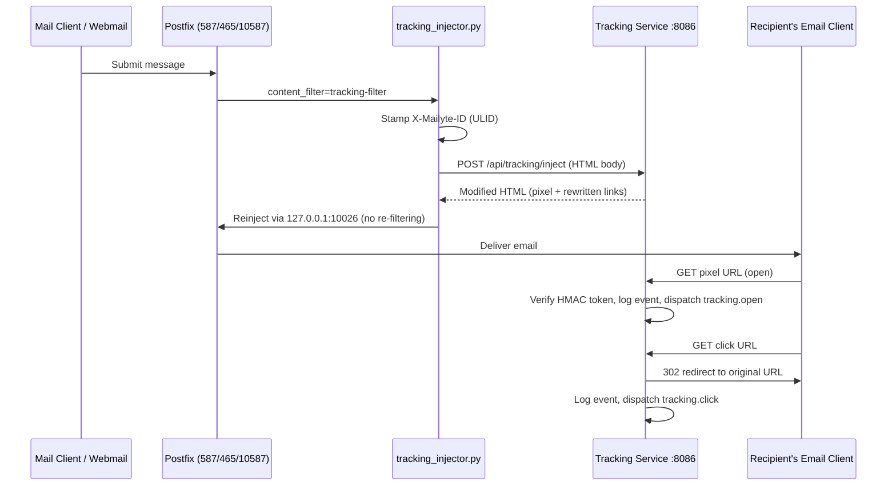

# Email Tracking

**Know when your emails are opened and which links get clicked.**

Tracking is injected by Postfix itself, not by the API: every message submitted on an authenticated port (587/465) or the internal submission listener (10587) passes through a content filter (`mailer/postfix/scripts/tracking_injector.py`) that calls the Tracking service to embed an invisible 1x1 pixel and rewrite links in HTML bodies. When a recipient opens the email or clicks a link, the event is recorded with metadata (IP, user agent, timestamp) and a webhook event is dispatched.

The injection pipeline has been functional in production since 2026-08-08, with the remaining URL bugs (dead tracking hostname, wrong pixel path) fixed by 2026-08-22.

## How it works



Key details of the real pipeline:

- **Only locally-originated mail is filtered.** The content filter sits on the submission ports (587, 465) and the internal submission listener (10587, used by the webmail/API). Port 25 deliberately has no filter — it carries all inbound mail, and rewriting other people's messages would be wrong.
- **Every message gets an `X-Mailyte-ID` header** (a ULID), even when tracking is disabled. This ID ties the message together across tracking, webhooks, message trace, and analytics.
- **The filter is fail-safe.** If the tracking service is unreachable or errors, the original message is delivered unchanged.
- **The same filter also** consults the [Delivery Optimizer](deliverability.md) before sending, captures the message body for the Email Logs detail view, and hands a copy of the raw message to the [Archiver](archiving.md).

### Open tracking

The tracking service appends a transparent pixel to the HTML body:

```html
" width="1" height="1" ... />
```

The `tracking_id` is a URL-safe base64 token carrying the email ID, recipient, tenant, domain, timestamp, and a nonce, signed with HMAC-SHA256 so it cannot be forged or tampered with.

!!! info "Image blocking"
    Many email clients block images by default. Open tracking is a best-effort signal — it tells you *at least* this many people opened it, not exactly how many. Think of it as a lower bound.

### Click tracking

Every trackable link in the HTML body is rewritten to pass through the tracking endpoint:

```
Original: https://example.com/pricing
Tracked:  https://api.yourdomain.com/api/v1/tracking/click/<tracking_id>?url=https%3A%2F%2Fexample.com%2Fpricing
```

The service logs the click, then issues a `302` redirect to the original URL. `mailto:`, `tel:`, `ftp:` and `file:` links are never rewritten, and `TRACKING_EXCLUDE_DOMAINS` can exclude specific domains. UTM parameters are preserved by default.

### Where the URLs point

Tracking URLs are built from `TRACKING_BASE_URL`, which in production defaults to `https://api.${DOMAIN}` — a host that resolves, sits behind Traefik with a valid certificate, and routes `/api/v1/tracking/pixel/{id}` and `/api/v1/tracking/click/{id}` to the tracking service. (The older composed `track.{domain}` scheme via `TRACKING_SUBDOMAIN` still exists as a fallback but was never routed in DNS — set `TRACKING_BASE_URL` explicitly.)

### Bounce and complaint tracking

The service also provides internal endpoints called by the bounce handler and feedback-loop processing:

- `POST /api/tracking/bounce` — records hard/soft bounces, adds the recipient to the suppression list when thresholds are crossed, and dispatches an `email.bounced` webhook event
- `POST /api/tracking/complaint` — records spam complaints, suppresses the address, and dispatches `delivery.complaint`

### Unsubscribe handling

`GET`/`POST /tracking/unsubscribe/{tracking_id}` records an unsubscribe, adds the recipient to the suppression list, and dispatches `tracking.unsubscribe`.

## Configuration

These are the variables the tracking service and injector actually read:

| Variable | Default | Description |
|----------|---------|-------------|
| `TRACKING_ENABLED` | `true` | Master switch (read by both the service and the Postfix injector) |
| `OPEN_TRACKING_ENABLED` | `true` | Enable open (pixel) tracking |
| `CLICK_TRACKING_ENABLED` | `true` | Enable click (link rewrite) tracking |
| `TRACKING_BASE_URL` | `https://api.${DOMAIN}` (prod compose) | Base URL recipients' clients will reach. **Set this**; the composed subdomain fallback is not routed |
| `TRACKING_DOMAIN` / `TRACKING_SUBDOMAIN` / `TRACKING_PROTOCOL` | `$HOSTNAME` / `track` / `https` | Legacy composed-URL fallback, used only when `TRACKING_BASE_URL` is empty |
| `TRACKING_PIXEL_PATH` | `/api/v1/tracking/pixel` | Path prefix for pixel URLs |
| `TRACKING_CLICK_PATH` | `/api/v1/tracking/click` | Path prefix for click URLs |
| `TRACKING_SERVICE_URL` | `http://tracking:8086` | Where the Postfix injector reaches the service |
| `TRACKING_API_TIMEOUT` | `10` | Injector timeout (seconds) for the inject call |
| `TRACKING_PIXEL_CACHE_CONTROL` | `no-cache, no-store, must-revalidate` | Cache headers on the pixel response |
| `CLICK_REDIRECT_TIMEOUT` | `30` | Seconds before a click redirect times out |
| `CLICK_PRESERVE_QUERY_PARAMS` | `true` | Keep query params when redirecting |
| `TRACKING_PRESERVE_UTM_PARAMS` | `true` | Re-append `utm_*` params to the tracked URL |
| `TRACKING_EXCLUDE_DOMAINS` | *(empty)* | Comma-separated domains never rewritten |
| `TRACKING_EXCLUDE_PATTERNS` | `mailto:,tel:,ftp:,file:` | URL prefixes never rewritten |
| `TRACKING_BATCH_INSERT_SIZE` | `100` | Batch size for database inserts |
| `TRACKING_RATE_LIMIT_PER_IP` | `1000` | Max tracking requests per IP per window |
| `TRACKING_RATE_LIMIT_WINDOW` | `3600` | Rate limit window in seconds |
| `TRACKING_ANONYMIZE_IP` | `false` | Truncate IPs before storing (last octet / last 64 bits zeroed) |
| `TRACKING_IP_RETENTION_DAYS` | `90` | IP retention |
| `TRACKING_DATA_RETENTION_DAYS` | `365` | Days to keep tracking data |
| `TRACK_USER_AGENT` | `true` | Record user agent string |
| `TRACK_GEOLOCATION` | `true` | Store geo fields on events if provided |
| `TRACK_DEVICE_INFO` | `true` | Record device fields |

Body capture and archiving on the same filter: `BODY_CAPTURE_ENABLED` (default `true`), `BODY_CAPTURE_MAX_BYTES` (`262144`), `BODY_RETENTION_DAYS` (`30`), `ARCHIVE_OUTBOUND_ENABLED` (default `true`), `ARCHIVE_SERVICE_URL`, `ARCHIVE_TIMEOUT` (`3`).

!!! warning "IP anonymization truncates, it does not hash"
    With `TRACKING_ANONYMIZE_IP=true`, IPv4 addresses lose their last octet (`203.0.113.42` → `203.0.113.0`) and IPv6 addresses their last 64 bits before storage.

## API endpoints

The tracking service listens on port **8086**. The public paths below are also proxied by the platform API under `/api/v1/tracking/`.

### Open tracking pixel

```
GET /open/<tracking_id>                          (direct)
GET /api/v1/tracking/pixel/<tracking_id>         (via the API, what injected mail uses)
```

Returns a 1x1 transparent PNG. Always returns `200` even for invalid tracking IDs, so the email never looks broken.

### Click redirect

```
GET /click/<tracking_id>?url=<encoded_original_url>       (direct)
GET /api/v1/tracking/click/<tracking_id>?url=...          (via the API)
```

Logs the click and issues a `302` redirect. Invalid tracking IDs still redirect — tracking never breaks the user experience.

### Inject tracking into HTML (internal)

```
POST /api/tracking/inject
```

Called by the Postfix content filter. Takes `html_content`, `email_id`, `recipient`, `tenant_id`, `domain_id` and returns the modified HTML plus injection stats.

### Record a bounce

```bash
curl -X POST http://localhost:8086/api/tracking/bounce \
  -H "Content-Type: application/json" \
  -d '{
    "recipient": "bad-address@example.com",
    "bounce_type": "HARD",
    "bounce_reason": "550 User unknown",
    "tracking_info": {"organization_id": "org_123", "email_id": "msg_456"}
  }'
```

### Record a complaint

```bash
curl -X POST http://localhost:8086/api/tracking/complaint \
  -H "Content-Type: application/json" \
  -d '{"recipient": "annoyed-user@example.com", "complaint_type": "spam", "organization_id": "org_123"}'
```

### Stats

```
GET /api/tracking/stats/<email_id>
GET /api/tracking/tenant/<tenant_id>/stats
GET /api/tracking/stats/domain/<domain>
GET /api/tracking/stats/summary?hours=24
```

### Suppression

```
POST   /tracking/suppress
DELETE /tracking/suppress/<email>
GET    /tracking/unsubscribe/<tracking_id>
```

## Webhook events

Tracking events are dispatched through the [centralized webhook dispatcher](webhooks.md) to the globally configured webhook URL (requires `WEBHOOK_URLS`/`WEBHOOK_SECRET` to be set):

Event types: `tracking.open`, `tracking.click`, `tracking.unsubscribe`, `email.bounced`, `delivery.complaint`.

## Things to know

- **Only the first HTML part of a message is processed**, and tracking tokens are generated for the **first recipient** of a multi-recipient message. Per-recipient tracking for fan-out sends is not implemented — send one message per recipient if you need per-recipient attribution.

- **Open tracking is inherently imprecise.** Image blocking undercounts; prefetching (Apple Mail Privacy Protection) overcounts. Treat open rates as a trend, not gospel.

- **Rate limiting protects the tracking service.** Each IP is limited to 1,000 tracking requests per hour by default. When the limit is hit, the pixel is still served but the event is not logged.

- **Plain-text-only messages are not tracked** (there is nothing to inject into), but they still get an `X-Mailyte-ID`, body capture, and archiving.

- **Tenant attribution comes from the sender domain.** The injector resolves the sending domain (or mailbox) to its organization in MySQL; unknown senders fall back to the `DEFAULT_ORGANIZATION_ID` / `DEFAULT_DOMAIN_ID` identifiers.
