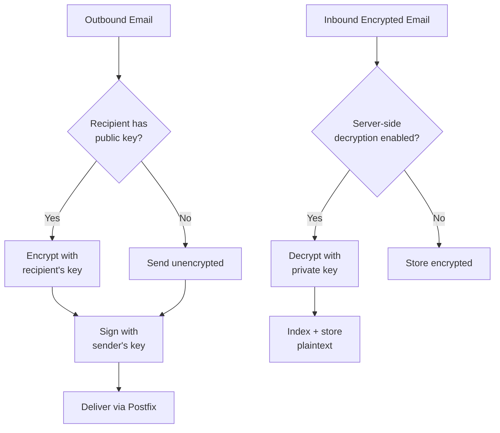

# Encryption

> **Enterprise Edition** — This feature is available in [Mailyte Enterprise](https://mailyte.com). The Community Edition does not include this functionality.

**End-to-end email encryption using PGP/GPG and S/MIME standards.**

!!! warning "Under Construction"
    Encryption support is currently in development. This page describes the planned functionality. The feature is not yet available for use.

## What's planned

Mailyte will support two industry-standard email encryption protocols:

- **PGP/GPG** -- The open-source standard. Users generate key pairs, publish their public keys, and anyone with the public key can send them encrypted mail. Popular in the developer and security community.
- **S/MIME** -- The enterprise standard. Uses X.509 certificates (similar to HTTPS certs) for signing and encryption. Built into Outlook, Apple Mail, and most corporate email clients.

### The goal

When this feature ships, you'll be able to:

1. **Store PGP public keys and S/MIME certificates** per mailbox through the API.
2. **Automatically encrypt outbound emails** when the recipient has a known public key/cert on file.
3. **Decrypt inbound emails** server-side (optional) so they can be indexed, searched, and archived.
4. **Sign outbound emails** to prove they came from your server and weren't tampered with.

## Planned architecture

## Planned configuration

| Variable | Planned Default | Description |
|----------|----------------|-------------|
| `ENCRYPTION_PGP_ENABLED` | `false` | Enable PGP/GPG support |
| `ENCRYPTION_SMIME_ENABLED` | `false` | Enable S/MIME support |
| `ENCRYPTION_SERVER_DECRYPT` | `false` | Decrypt inbound messages server-side |
| `ENCRYPTION_AUTO_ENCRYPT` | `true` | Auto-encrypt when recipient key is known |
| `ENCRYPTION_KEY_STORE_PATH` | `/storage/keys` | Path to key/cert storage |
| `ENCRYPTION_KEYSERVER` | `keys.openpgp.org` | PGP keyserver for key lookups |

## Things to know

- **This feature doesn't exist yet.** No encryption-related settings are functional.
- **TLS in transit is already active.** Mailyte already encrypts email in transit via STARTTLS (Postfix) and TLS (Dovecot IMAP). The encryption feature described here is about encrypting message *content* end-to-end, so even the server can't read it (unless server-side decryption is enabled).
- **Server-side decryption is a tradeoff.** If you enable it, encrypted emails can be indexed, searched, and archived. But it means the server holds private keys and can read the content. For maximum security, leave it off and let email clients handle decryption.
- **Key management is the hard part.** PGP and S/MIME work great in theory, but in practice, managing keys/certs at scale is complex. The planned API will handle key storage, but key distribution (getting recipients' public keys) often requires external infrastructure like LDAP directories or keyservers.
