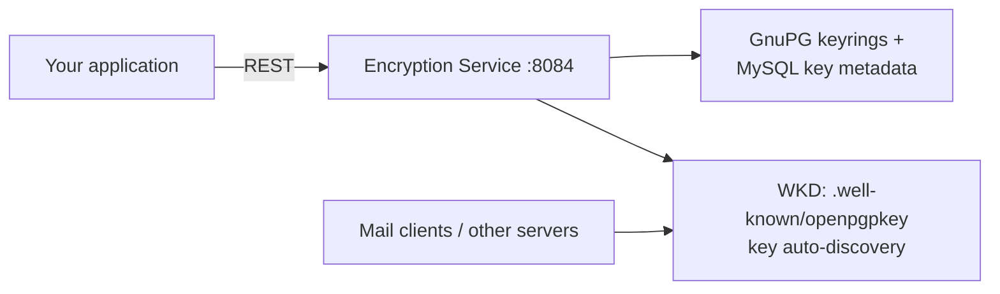

# Encryption

**PGP and S/MIME key management with on-demand encrypt/decrypt/sign/verify — plus what is already encrypted without you doing anything.**

The Encryption service (container port `8084`, published on host port `8093`) is a working key-management and crypto API backed by GnuPG and MySQL. It is **not wired into the mail flow** — outbound mail is not automatically encrypted and inbound mail is not automatically decrypted. Use the API from your own application or workflows.

## What is encrypted today, automatically

| Layer | Mechanism | Status |
|-------|-----------|--------|
| Mail in transit | STARTTLS/TLS on Postfix (25/587/465) and Dovecot (IMAP/POP3) | Active |
| Mail at rest | Dovecot `mail_crypt` with a global key pair + LZ4 compression (`config/mailer/dovecot/local.conf`, `mail_crypt_save_version = 2`) — every stored message is ciphertext on disk | Active |
| Archived mail | age client-side encryption to two recipients before upload ([Archiving](archiving.md)) | Active |
| Private keys in the DB | Envelope encryption (AES-256-GCM under a file-held KEK) for `dkim_keys.private_key`, `pgp_keys.private_key`, `smime_certs.private_key` (`shared/envelope_encryption.py`) | Active |

## What the Encryption service provides



### API endpoints

```
POST   /pgp/generate              # Generate a PGP key pair for a user
POST   /pgp/import                # Import a PGP public/private key
GET    /pgp/keys?email=           # List PGP keys for a user
GET    /pgp/keys/{fingerprint}    # Export a public key (armored)
DELETE /pgp/keys/{fingerprint}    # Delete a key
POST   /pgp/encrypt               # Encrypt a message for a recipient
POST   /pgp/decrypt               # Decrypt with the user's private key
POST   /pgp/sign                  # Sign a message
POST   /pgp/verify                # Verify a signed message
GET    /.well-known/openpgpkey/hu/{hash}   # Web Key Directory serving
POST   /smime/import              # Import an S/MIME certificate
GET    /smime/certs?email=        # List S/MIME certs
GET    /health
GET    /metrics
```

Key generation and import dispatch `encryption.key.generated` / `encryption.key.imported` webhook events.

### Web Key Directory (WKD)

The service serves PGP public keys at the standard WKD path, so OpenPGP-capable clients (Thunderbird, GnuPG's `--locate-keys`) can auto-discover a recipient's key from their email address — provided the WKD path is routed on the `openpgpkey.` host for the domain.

## Things to know

- **No automatic encryption in the mail path.** There is no milter or filter that encrypts outbound messages when a recipient key is known, and no server-side decryption of inbound PGP mail. Earlier drafts of this page described that as planned; as of 2026-08-30 it remains unbuilt. Clients doing end-to-end PGP/S/MIME work normally — the server just stores and serves keys.

- **S/MIME support is storage-only.** Import and listing of certificates work; there are no S/MIME encrypt/sign operations in the API yet.

- **The mail_crypt global key is precious.** All at-rest mail encryption uses one global key pair mounted into Dovecot (`/etc/dovecot/mail_crypt/`). Losing it means losing every stored mailbox. Keep it in your backup/escrow path (see [Backup & Restore](backup-restore.md) — `scripts/escrow-secrets.sh`).

- **`mail_crypt_save_version = 2` keeps new mail encrypted.** Setting it to 0 would write new mail in cleartext while still reading old ciphertext — only do that as a deliberate move away from at-rest encryption.

- **Key custody trade-off.** Keys generated or imported through this service live on the server (protected by envelope encryption). That enables server-side workflows but means the operator holds the material — for strict end-to-end guarantees, generate keys client-side and only upload public keys.
