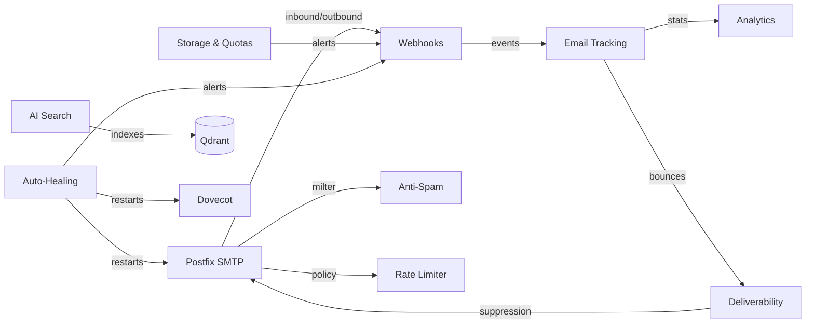

# Features Overview

Mailyte packs a lot into one box. This page gives you a bird's-eye view of every feature, where it lives, and how ready it is for production use.

---

## In this section

-   :material-email-search:{ .lg .middle } **Email Tracking**

    ---

    Pixel opens, click tracking, bounce and complaint logging — know what happens after you hit send.

    [:octicons-arrow-right-24: Email tracking](email-tracking.md)

-   :material-shield-bug:{ .lg .middle } **Anti-Spam Protection**

    ---

    ML spam detection, Bayesian filtering, ClamAV antivirus, DNSBL checks, and greylisting.

    [:octicons-arrow-right-24: Anti-spam](anti-spam.md)

-   :material-speedometer:{ .lg .middle } **Rate Limiting**

    ---

    Redis-backed sliding window limits at the org, domain, and mailbox level.

    [:octicons-arrow-right-24: Rate limiting](rate-limiting.md)

-   :material-harddisk:{ .lg .middle } **Storage & Quotas**

    ---

    Per-mailbox, per-domain, and per-org quota tracking with alerts.

    [:octicons-arrow-right-24: Storage & quotas](storage-quotas.md)

-   :material-webhook:{ .lg .middle } **Webhooks**

    ---

    Real-time event delivery with retry logic, HMAC signing, and automatic cleanup.

    [:octicons-arrow-right-24: Webhooks](webhooks.md)

-   :material-brain:{ .lg .middle } **AI-Powered Search**

    ---

    Qdrant vector DB, semantic search over email content — ask questions, get answers.

    [:octicons-arrow-right-24: AI search](rag-integration.md)

---

## Feature Status Legend

| Badge | Meaning |
|-------|---------|
| :material-check-circle:{ .stable } **Stable** | Production-ready, battle-tested |
| :material-flask:{ .beta } **Beta** | Working and usable, still being refined |
| :material-hammer-wrench:{ .dev } **In Development** | Actively being built -- not ready yet |

---

## Feature Matrix

| Feature | Status | Service / Port | Description |
|---------|--------|---------------|-------------|
| [Email Tracking](email-tracking.md) | :material-check-circle: **Stable** | Tracking / `8083` | Pixel opens, click tracking, bounce & complaint logging |
| [Anti-Spam Protection](anti-spam.md) | :material-check-circle: **Stable** | Rspamd / `11333` | ML spam detection, Bayesian filtering, ClamAV, greylisting |
| [Rate Limiting](rate-limiting.md) | :material-check-circle: **Stable** | Rate Limiter / `8082` | Redis-backed sliding window limits at org, domain, and mailbox levels |
| [Storage & Quotas](storage-quotas.md) | :material-check-circle: **Stable** | Storage Usage / `8084` | Per-mailbox, per-domain, and per-org quota tracking |
| [Webhooks](webhooks.md) | :material-check-circle: **Stable** | Webhooks / `8081` | Real-time event delivery with retry, HMAC signing, and cleanup |
| [Templates](templates.md) | :material-flask: **Beta** | Templates / `8087` | Jinja2-based email templates with versioning. A/B testing in development |
| [Analytics](analytics.md) | :material-check-circle: **Stable** | Tracking / `8083` | Delivery stats, geo data, device detection, time-series aggregation |
| [Archiving](archiving.md) | :material-hammer-wrench: **In Development** | -- | Long-term email storage with compliance retention policies |
| [Encryption](encryption.md) | :material-hammer-wrench: **In Development** | -- | PGP/GPG and S/MIME end-to-end encryption |
| [ActiveSync](activesync.md) | :material-hammer-wrench: **In Development** | -- | Microsoft Exchange ActiveSync protocol support |
| [Backup & Restore](backup-restore.md) | :material-check-circle: **Stable** | Cron / Cloud Sync | Automated DB + filesystem backups, S3/Azure cloud sync |
| [Deliverability](deliverability.md) | :material-check-circle: **Stable** | Delivery Optimizer / `8088` | SPF/DKIM/DMARC, reputation tracking, bounce handling, suppression lists |
| [AI-Powered Search](rag-integration.md) | :material-flask: **Beta** | RAG / `8090` | Qdrant vector DB, semantic search over email content |
| [Auto-Healing](auto-healing.md) | :material-check-circle: **Stable** | Health Monitor | Detects failed services and restarts them automatically |
| [Multi-Tenant Support](multi-tenant.md) | :material-check-circle: **Stable** | All services | Organization-based isolation for data, config, and quotas |

---

## Capabilities at a glance

| Category | Capabilities |
|----------|-------------|
| **Mail protocols** | SMTP (25, 587, 465), IMAP (143, 993), POP3 (110, 995), STARTTLS, implicit TLS |
| **Spam defense** | Bayesian classification, DNSBL, SPF/DKIM/DMARC validation, ClamAV, greylisting, content analysis |
| **Tracking** | Open pixels, click wrapping, bounce detection, complaint feedback loops |
| **Analytics** | Delivery rates, engagement metrics, geo/device breakdown, time-series aggregation |
| **Delivery** | DKIM signing, SPF alignment, DMARC policies, reputation monitoring, suppression lists |
| **Storage** | Per-mailbox quotas, per-domain limits, per-org caps, usage alerts, automatic cleanup |
| **AI / Search** | Vector embeddings via Qdrant, semantic search queries, RAG-based email retrieval |
| **Automation** | Webhook events, auto-healing, cert rotation, scheduled backups, cloud sync |
| **Multi-tenancy** | Org-scoped API keys, isolated data, per-tenant quotas and rate limits |

---

## How features connect

Most features don't operate in isolation -- they talk to each other through the centralized webhook dispatcher and shared database. Here's a simplified view of how the major pieces fit together:

---

## Feature deep dives by use case

=== "I'm sending transactional email"

    Focus on these features first:

    1. **[Deliverability](deliverability.md)** -- set up SPF, DKIM, and DMARC correctly
    2. **[Email Tracking](email-tracking.md)** -- track opens, clicks, and bounces
    3. **[Webhooks](webhooks.md)** -- get real-time delivery notifications in your app
    4. **[Rate Limiting](rate-limiting.md)** -- protect your sender reputation

=== "I'm hosting mailboxes for customers"

    Focus on these features first:

    1. **[Multi-Tenant Support](multi-tenant.md)** -- isolate each customer's data
    2. **[Storage & Quotas](storage-quotas.md)** -- set and enforce per-customer limits
    3. **[Anti-Spam Protection](anti-spam.md)** -- keep inboxes clean
    4. **[Backup & Restore](backup-restore.md)** -- protect customer data

=== "I'm building a product on top of Mailyte"

    Focus on these features first:

    1. **[Webhooks](webhooks.md)** -- integrate email events into your product
    2. **[AI-Powered Search](rag-integration.md)** -- add smart email search
    3. **[Templates](templates.md)** -- manage email templates via API
    4. **[Analytics](analytics.md)** -- surface email insights to your users

---

## Quick links

- **Want to send tracked emails?** Start with [Email Tracking](email-tracking.md).
- **Setting up a new organization?** Read [Multi-Tenant Support](multi-tenant.md) first.
- **Worried about spam?** Check [Anti-Spam Protection](anti-spam.md).
- **Need to search old emails by meaning?** See [AI-Powered Search](rag-integration.md).
- **Something broke?** [Auto-Healing](auto-healing.md) might have already fixed it.

---

## Related sections

- [API Reference](../api/index.md) -- control every feature programmatically
- [Architecture](../architecture/index.md) -- understand how features map to services
- [Security](../security/index.md) -- how features are secured
- [Getting Started](../getting-started/index.md) -- install and configure everything
