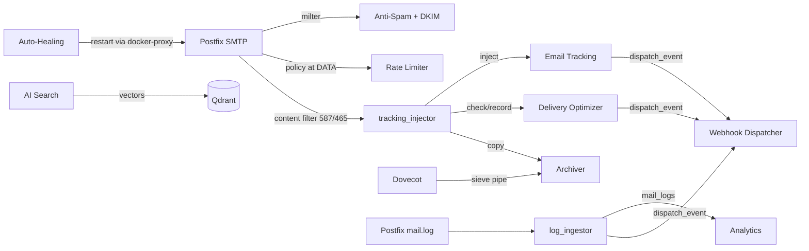

# Features Overview

Mailyte packs a lot into one box. This page gives you a bird's-eye view of every feature, where it lives, and how ready it is for production use. Ports listed are the host-published ports from `docker-compose.yml`; in production every non-mail port is bound to loopback and public traffic goes through Traefik on 443.

---

## In this section

-   :material-email-search:{ .lg .middle } **Email Tracking**

    ---

    Pixel opens and click tracking injected by a Postfix content filter — know what happens after you hit send.

    [:octicons-arrow-right-24: Email tracking](email-tracking.md)

-   :material-shield-bug:{ .lg .middle } **Anti-Spam Protection**

    ---

    Rspamd scoring, Bayesian + neural filtering, greylisting, phishing feeds, postscreen DNSBLs.

    [:octicons-arrow-right-24: Anti-spam](anti-spam.md)

-   :material-key:{ .lg .middle } **SMTP API Keys**

    ---

    Domain-scoped sending credentials with IP allowlists, expiry, rotation, and instant revocation.

    [:octicons-arrow-right-24: SMTP API keys](smtp-credentials.md)

-   :material-webhook:{ .lg .middle } **Webhooks**

    ---

    Signed event delivery with Mailgun-style retries, delivery logs, and a replayable dead-letter queue.

    [:octicons-arrow-right-24: Webhooks](webhooks.md)

-   :material-cellphone-link:{ .lg .middle } **Client Auto-Setup**

    ---

    Thunderbird autoconfig, Outlook autodiscover, and MTA-STS for every hosted domain.

    [:octicons-arrow-right-24: Autoconfig](autoconfig.md)

-   :material-brain:{ .lg .middle } **AI-Powered Search**

    ---

    Qdrant vector DB, semantic search over indexed email content.

    [:octicons-arrow-right-24: AI search](rag-integration.md)

---

## Feature Status Legend

| Badge | Meaning |
|-------|---------|
| :material-check-circle:{ .stable } **Stable** | Working in production |
| :material-flask:{ .beta } **Beta** | Working and usable, still being refined |
| :material-hammer-wrench:{ .dev } **Deployed, not enabled** | Code is deployed but a wiring/config step is still missing |

---

## Feature Matrix

| Feature | Status | Service / Port | Description |
|---------|--------|---------------|-------------|
| [Email Tracking](email-tracking.md) | :material-check-circle: **Stable** | Tracking / `8086` + Postfix filter | Open/click tracking injected at submission; functional since 2026-08-22 |
| [Anti-Spam Protection](anti-spam.md) | :material-check-circle: **Stable** | Rspamd / `11332` milter, `11334` UI | Scoring, Bayes, neural, greylisting, phishing feeds. ClamAV **not** deployed by default |
| [Rate Limiting](rate-limiting.md) | :material-check-circle: **Stable** | Rate Limiter / `8082` | Org/domain/mailbox/credential limits across six windows, enforced at Postfix DATA |
| [Storage & Quotas](storage-quotas.md) | :material-check-circle: **Stable** | Storage Usage / `8092` + Dovecot | Usage roll-ups and alerts; hard enforcement by Dovecot quota |
| [Webhooks](webhooks.md) | :material-flask: **Beta** | Shared dispatcher + Webhooks / `8081` | Delivers all events to one global URL; per-endpoint fan-out not yet implemented |
| [SMTP API Keys](smtp-credentials.md) | :material-check-circle: **Stable** | API + Dovecot passdb | Shipped 2026-08-27; rotation, revocation, IP allowlists, per-key limits |
| [Client Auto-Setup](autoconfig.md) | :material-check-circle: **Stable** | Autoconfig / `8100` | Autoconfig/autodiscover/MTA-STS, publicly routed since 2026-08-27 |
| [Templates](templates.md) | :material-flask: **Beta** | Templates / `8095` | Jinja2 templates with versioning and a starter library. No A/B testing |
| [Analytics](analytics.md) | :material-check-circle: **Stable** | Analytics / `8087` + API | Volume/engagement/deliverability from `mail_logs` + tracking events (producer live since 2026-08-22) |
| [Archiving](archiving.md) | :material-check-circle: **Stable** | Archiver / `8089` | Every accepted message age-encrypted to S3 within seconds; retention + legal holds |
| [Encryption](encryption.md) | :material-flask: **Beta** | Encryption / `8093` | PGP/S/MIME key management API + WKD; not wired into the mail flow. Mail at rest is already encrypted (Dovecot mail_crypt) |
| [ActiveSync](activesync.md) | :material-hammer-wrench: **Deployed, not enabled** | Z-Push / `8084` | Real Z-Push 2.7.4 (mail-only IMAP backend), but no public Traefik route yet |
| [Backup & Restore](backup-restore.md) | :material-check-circle: **Stable** | Host systemd timers | Full daily + hourly incremental, age-encrypted, S3 offsite via `secrets/dr.env` |
| [Deliverability](deliverability.md) | :material-check-circle: **Stable** | Delivery Optimizer / `8094` + Rspamd | DKIM signing, DNS verification, ISP throttling on the live send path, reputation, IP warming |
| [AI-Powered Search](rag-integration.md) | :material-flask: **Beta** | RAG / `8091` + Qdrant | Semantic search; indexing is API-driven, not automatic |
| [Auto-Healing](auto-healing.md) | :material-check-circle: **Stable** | Monitoring / `8085` | 5-minute health sweeps; container restarts via a scoped docker-proxy |
| [Multi-Tenant Support](multi-tenant.md) | :material-check-circle: **Stable** | All services | Organization-scoped isolation for data, config, and quotas |

---

## Capabilities at a glance

| Category | Capabilities |
|----------|-------------|
| **Mail protocols** | SMTP (25, 587, 465), IMAP (143, 993), POP3 (110, 995), Sieve/ManageSieve (4190), JMAP, CalDAV/CardDAV |
| **Spam defense** | Postscreen weighted DNSBLs, Rspamd scoring, Bayes + neural, greylisting, fuzzy hashing, phishing feeds |
| **Sending** | SMTP API keys, sender-login enforcement (587/465), DKIM signing, per-ISP throttling, IP warming |
| **Tracking** | Open pixels, click wrapping, unsubscribes, bounce + complaint recording |
| **Analytics** | Delivery/engagement/deliverability metrics from real mail logs and tracking events |
| **Storage** | Per-mailbox/domain/org usage, Dovecot quota enforcement, alerts |
| **Durability** | Continuous encrypted mail archive (S3 + spool), full/incremental backups, legal holds |
| **AI / Search** | Vector embeddings (local by default), per-org Qdrant collections |
| **Automation** | Webhook events, auto-healing, DNS verification, client auto-setup |
| **Multi-tenancy** | Org-scoped API keys, isolated data, per-tenant quotas, rate limits, and spam policy |

---

## How features connect

Most features talk to each other through the shared webhook dispatcher, the Postfix content filter, and the shared database:

---

## Feature deep dives by use case

=== "I'm sending transactional email"

    Focus on these features first:

    1. **[Deliverability](deliverability.md)** — set up SPF, DKIM, and DMARC and verify them via the API
    2. **[SMTP API Keys](smtp-credentials.md)** — send with a revocable credential, not a mailbox password
    3. **[Email Tracking](email-tracking.md)** — track opens, clicks, and bounces
    4. **[Webhooks](webhooks.md)** — get delivery notifications in your app

=== "I'm hosting mailboxes for customers"

    Focus on these features first:

    1. **[Multi-Tenant Support](multi-tenant.md)** — isolate each customer's data
    2. **[Client Auto-Setup](autoconfig.md)** — let their mail clients configure themselves
    3. **[Storage & Quotas](storage-quotas.md)** — set and enforce per-customer limits
    4. **[Anti-Spam Protection](anti-spam.md)** — keep inboxes clean
    5. **[Backup & Restore](backup-restore.md)** + **[Archiving](archiving.md)** — protect customer data

=== "I'm building a product on top of Mailyte"

    Focus on these features first:

    1. **[Webhooks](webhooks.md)** — integrate email events into your product
    2. **[AI-Powered Search](rag-integration.md)** — add smart email search
    3. **[Templates](templates.md)** — manage email templates via API
    4. **[Analytics](analytics.md)** — surface email insights to your users

---

## Quick links

- **Want to send tracked emails?** Start with [Email Tracking](email-tracking.md).
- **Setting up a new organization?** Read [Multi-Tenant Support](multi-tenant.md) first.
- **Onboarding a domain?** [Deliverability](deliverability.md) and [Client Auto-Setup](autoconfig.md) cover DNS and clients.
- **Worried about spam?** Check [Anti-Spam Protection](anti-spam.md).
- **Something broke?** [Auto-Healing](auto-healing.md) might have already fixed it.

---

## Related sections

- [API Reference](../api/index.md) — control every feature programmatically
- [Architecture](../architecture/index.md) — understand how features map to services
- [Security](../security/index.md) — how features are secured
- [Getting Started](../getting-started/index.md) — install and configure everything
