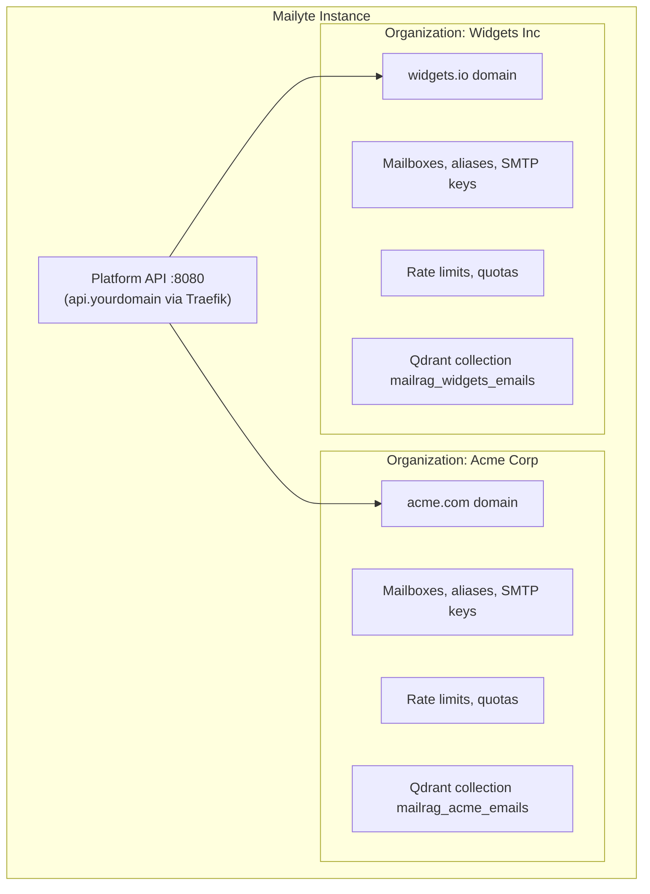
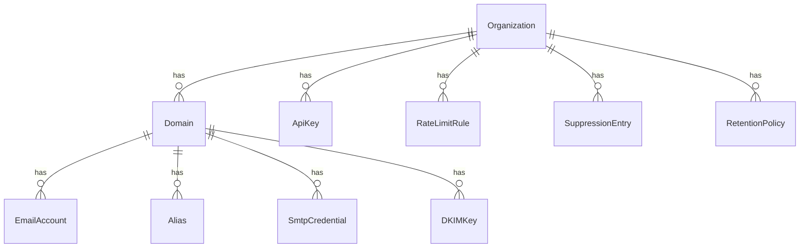

# Multi-Tenant Support

**Run multiple organizations on one Mailyte instance with organization-scoped data isolation.**

Every major entity — domains, mailboxes, aliases, rate limits, quotas, templates, tracking data, archives, SMTP credentials, and AI search collections — carries an `organization_id` and is filtered by it. Org A cannot see Org B's data through the API, even though they share the same server.

## How it works



### The org model

An **organization** is the top-level entity:

- **Domains** belong to exactly one organization.
- **Mailboxes and aliases** belong to a domain (and therefore an org).
- **SMTP API keys** are domain-scoped credentials under the org.
- **Rate limits** apply at org, domain, and mailbox level ([Rate Limiting](rate-limiting.md)).
- **Storage quotas** roll up mailbox → domain → org (Storage & Quotas (Enterprise Edition)).
- **Spam policy** can be overridden per org via the Rspamd settings sync ([Anti-Spam](anti-spam.md)).
- **Templates, tracking data, archives, suppression lists** are all org-scoped rows.
- **RAG search** uses a separate Qdrant collection per org (AI-Powered Search (Enterprise Edition)).

### How isolation is enforced

| Layer | Mechanism |
|-------|-----------|
| **API** | Two credential scopes: **organization-scoped** API keys see only their own org's rows; **platform-scoped** keys (operators/console) see everything. Every `/api` route carries a `require_api_key` guard, and org-scope queries filter by the key's `organization_id`. |
| **Database** | Tenant tables carry `organization_id`; queries and indexes are scoped. |
| **Postfix** | Virtual domain/mailbox/alias maps come from MySQL; sender-login maps tie each SASL login to the addresses it may send as (enforced on 587/465). |
| **Dovecot** | Mailboxes live under `/var/mail/vhosts/{domain}/{user}` per domain tree; auth is per-mailbox against MySQL. |
| **Qdrant** | Collection per org (`mailrag_{org}_emails`). |
| **Redis** | Rate-limit and optimizer counters are keyed by org (and domain/mailbox). |

!!! warning "Webhooks are the exception today"
    Webhook *delivery* is not per-organization: all events go to one globally configured URL signed with one global secret ([details](webhooks.md)). Per-org endpoint registrations can be stored via the API but do not receive event traffic yet. If you multiplex tenants behind one receiving endpoint, route on the envelope's `org_id` field yourself.

## Authentication

All platform API requests use the `X-API-Key` header. Keys live in the `api_keys` table with a scope (`platform` or `organization`), a permission level, and optional role gates. In production the API is reachable at `https://api.<your-domain>` via Traefik (host port `8083` → container `8080` locally).

## API examples

### Create an organization (platform-scoped key)

```bash
curl -X POST https://api.yourdomain.com/api/v1/organizations \
  -H "Content-Type: application/json" \
  -H "X-API-Key: <platform-key>" \
  -d '{"name": "Acme Corp", "admin_email": "admin@acme.com"}'
```

### Add a domain

```bash
curl -X POST https://api.yourdomain.com/api/v1/domains \
  -H "Content-Type: application/json" \
  -H "X-API-Key: <key>" \
  -d '{"domain": "acme.com", "organization_id": "<org-ulid>"}'
```

Creating a domain generates its DKIM keypair and the DNS records the customer must publish; `GET /api/v1/domains/{id}/verify-dns` live-checks them.

### Set org-specific rate limits

```bash
curl -X POST http://localhost:8082/set_limits \
  -H "Content-Type: application/json" \
  -d '{"type": "organization", "identifier": "<org-ulid>", "direction": "outbound",
       "hourly_limit": 20000, "daily_limit": 200000, "monthly_limit": 2000000}'
```

### Issue a domain-scoped SMTP credential

```bash
curl -X POST https://api.yourdomain.com/api/v1/smtp-credentials/ \
  -H "X-API-Key: <key>" -H "Content-Type: application/json" \
  -d '{"domain_id": "<domain-ulid>", "name": "CI mailer"}'
```

See [SMTP API Keys](smtp-credentials.md).

## Data model



## Things to know

- **IDs are ULIDs and permanent.** An org's ID is used across MySQL, Redis, and Qdrant; changing it would require cross-system migration.

- **Cross-org queries need platform scope.** Organization-scoped keys always filter to their own org; global views (total volume across orgs, platform monitoring) go through platform-scoped keys and the `/api/v1/platform/*` routes.

- **Deleting an org is a big operation.** It must cascade through domains, mailboxes, mail data, Qdrant collections, Redis keys, and tenant rows — deliberately not a one-click action.

- **Resource sharing is implicit.** All orgs share one Postfix, Dovecot, MySQL, Redis, and Qdrant. Rate limits and quotas are how you keep one org from starving the others.

- **Sender identity is enforced per login, not per org.** `smtpd_sender_login_maps` (backed by MySQL) decides which addresses each SASL login may use on the submission ports; an SMTP API key may send as any address at its domain.
