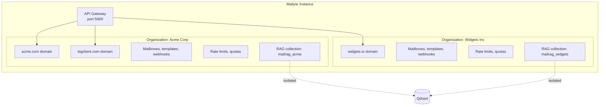
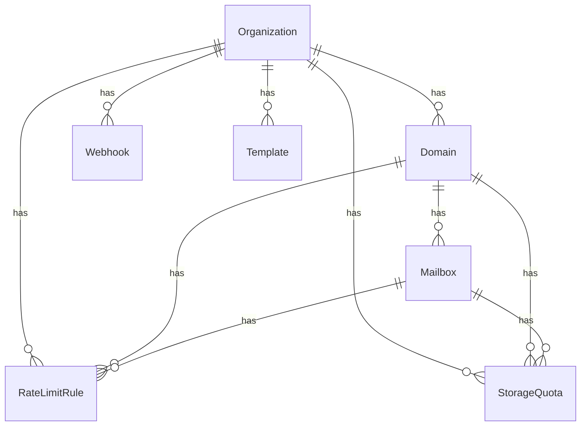

# Multi-Tenant Support

> **Enterprise Edition** — This feature is available in [Mailyte Enterprise](https://mailyte.com). The Community Edition does not include this functionality.


**Run multiple organizations on one Mailyte instance with complete data isolation.**

Every piece of Mailyte -- mailboxes, domains, rate limits, webhooks, templates, analytics, storage quotas, and AI search -- is scoped to an organization. Org A can't see Org B's data, even though they share the same server. This is the foundation that makes Mailyte work as a platform for hosting multiple customers.

## How it works



### The org model

An **organization** is the top-level entity. Everything hangs off it:

- **Domains** belong to an organization. A domain can only belong to one org.
- **Mailboxes** belong to a domain (and therefore to an org).
- **Rate limits** can be set at org, domain, or mailbox level.
- **Storage quotas** roll up from mailbox to domain to org.
- **Webhooks** are configured per-org. Each org gets its own webhook URL and secret.
- **Templates** are scoped to the org that created them.
- **Analytics** are aggregated per-org, per-domain, and per-mailbox.
- **RAG search** uses a separate Qdrant collection per org, so vector data is physically isolated.

### How isolation is enforced

Isolation happens at multiple layers:

| Layer | Mechanism |
|-------|-----------|
| **API** | Every API request includes an org identifier. Queries are filtered by org ID. |
| **Database** | All tables include an `organization_id` column. Indexes and queries are scoped. |
| **Postfix** | Virtual domain maps are per-org. Postfix only accepts mail for domains belonging to the server. |
| **Dovecot** | Each org's mail is stored in separate directory trees under `/var/mail/vhosts/{domain}/`. |
| **Qdrant** | Each org gets its own collection (e.g., `mailrag_org_123`). |
| **Redis** | Rate limit keys are prefixed with the org ID. |
| **Webhooks** | Each org has its own webhook URL and HMAC secret. |

## Configuration

Multi-tenancy is on by default. There's no single switch to disable it -- the org model is baked into the data architecture.

### RAG multi-tenancy

| Variable | Default | Description |
|----------|---------|-------------|
| `RAG_ENABLE_MULTI_TENANCY` | `true` | Create separate Qdrant collections per org |
| `RAG_TENANT_ISOLATION_LEVEL` | `collection` | Isolation level (`collection` or `filter`) |

The `collection` level creates a physically separate Qdrant collection per org. The `filter` level uses a single collection with metadata filters -- faster to set up but slightly weaker isolation.

### Default org settings

When a new org is created, it inherits defaults from these env vars:

| Variable | Applied To | Description |
|----------|-----------|-------------|
| `ORG_OUTBOUND_HOURLY_DEFAULT` | Rate limiting | Default outbound hourly limit |
| `ORG_OUTBOUND_DAILY_DEFAULT` | Rate limiting | Default outbound daily limit |
| `ORG_OUTBOUND_MONTHLY_DEFAULT` | Rate limiting | Default outbound monthly limit |
| `DOMAIN_*_DEFAULT` | Rate limiting | Default domain-level limits |
| `MAILBOX_*_DEFAULT` | Rate limiting | Default mailbox-level limits |

## API examples

### Create an organization

```bash
curl -X POST http://localhost:5000/api/v1/organizations \
  -H "Content-Type: application/json" \
  -H "X-Admin-Token: your-admin-token" \
  -d '{
    "name": "Acme Corp",
    "plan": "enterprise",
    "admin_email": "admin@acme.com"
  }'
```

### Add a domain to an org

```bash
curl -X POST http://localhost:5000/api/v1/organizations/org_acme/domains \
  -H "Content-Type: application/json" \
  -H "X-Admin-Token: your-admin-token" \
  -d '{
    "domain": "acme.com"
  }'
```

### Set org-specific rate limits

```bash
curl -X POST http://localhost:8082/set_limits \
  -H "Content-Type: application/json" \
  -d '{
    "type": "organization",
    "identifier": "org_acme",
    "direction": "outbound",
    "hourly_limit": 20000,
    "daily_limit": 200000,
    "monthly_limit": 2000000
  }'
```

### Configure org webhook

```bash
curl -X POST http://localhost:5000/api/v1/organizations/org_acme/webhooks \
  -H "Content-Type: application/json" \
  -H "X-Admin-Token: your-admin-token" \
  -d '{
    "url": "https://acme.com/webhooks/mailyte",
    "secret": "acme-webhook-secret-here",
    "events": ["email.smtp.inbound", "email.smtp.outbound", "tracking.open", "tracking.click"]
  }'
```

### Get org-level stats

```bash
curl http://localhost:5000/api/v1/organizations/org_acme/stats?period=monthly
```

## Data model

Here's a simplified view of how the main entities relate:



## Things to know

- **Organization IDs are permanent.** Once assigned, an org ID is used across all services (database, Redis, Qdrant). Changing an org ID would require a data migration across every system. Use meaningful, stable identifiers.

- **Deleting an org is a big operation.** It needs to cascade through domains, mailboxes, mail data, Qdrant collections, Redis keys, webhook configs, templates, and tracking data. This is intentionally not a one-click operation to prevent accidents.

- **Cross-org queries aren't possible through the API.** The API always filters by org. If you need a global view (e.g., total emails across all orgs), use direct database queries or the admin endpoints.

- **Webhook secrets should be unique per org.** If Org A and Org B share a webhook secret, a compromise of one means the other's webhooks can be forged. Always generate unique secrets.

- **RAG collections are created on demand.** The first time an org indexes an email, its Qdrant collection is created. Empty orgs don't consume Qdrant resources.

- **Resource sharing is implicit.** All orgs share the same Postfix, Dovecot, MySQL, Redis, and Qdrant instances. Rate limits and quotas are how you prevent one org from starving others. Set them appropriately for your hosting model.

- **Plan your org structure early.** Deciding what constitutes an "organization" (one company? one department? one billing account?) affects everything downstream. Most SaaS setups map one customer = one organization.
