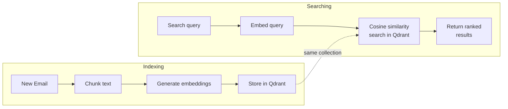

# AI-Powered Search

> **Enterprise Edition** — This feature is available in [Mailyte Enterprise](https://mailyte.com). The Community Edition does not include this functionality.


**Search your emails by meaning, not just keywords. "Find that message about the quarterly budget" actually works.**

The RAG (Retrieval-Augmented Generation) service (port `8090`) turns email content into vector embeddings and stores them in a Qdrant vector database. When you search, your query is also embedded and compared against stored vectors using cosine similarity. The result: semantic search that understands what you mean, even when you don't use the exact words from the email.

## How it works



### The pipeline, step by step

1. **Chunking.** Long emails are split into chunks (default: 1,000 characters with 200-character overlap). This is important because embedding models have sequence length limits, and smaller chunks give more precise search results.

2. **Embedding.** Each chunk is converted into a dense vector (a list of numbers) by an embedding model. Mailyte supports multiple providers -- local models run on your hardware with zero data leaving your server, or you can use cloud APIs for higher quality.

3. **Storage.** Vectors are stored in Qdrant, a purpose-built vector database. Each organization gets its own Qdrant collection for data isolation.

4. **Search.** Your search query goes through the same embedding model, producing a query vector. Qdrant finds the stored vectors most similar to the query vector (cosine distance) and returns the matching email chunks with relevance scores.

### Embedding providers

| Provider | Model | Privacy | Quality | Speed |
|----------|-------|---------|---------|-------|
| **Sentence Transformers** (default) | `all-MiniLM-L6-v2` | Data stays local | Good | Fast |
| **HuggingFace** | `sentence-transformers/all-MiniLM-L6-v2` | Data stays local | Good | Fast |
| **Ollama** | `nomic-embed-text` | Data stays local | Good | Medium |
| **OpenAI** | `text-embedding-ada-002` | Data sent to OpenAI | Excellent | Fast |
| **Azure OpenAI** | Configurable | Data sent to Azure | Excellent | Fast |
| **Cohere** | `embed-english-v3.0` | Data sent to Cohere | Excellent | Fast |

The default (`sentence_transformers`) runs entirely on your server. Your email content never leaves your infrastructure.

## Configuration

### Core settings

| Variable | Default | Description |
|----------|---------|-------------|
| `RAG_MODE` | `local` | Operating mode |
| `RAG_HOST` | `0.0.0.0` | Service bind address |
| `RAG_PORT` | `8090` | Service port |
| `RAG_WORKERS` | `1` | Uvicorn worker processes |
| `RAG_ENABLE_MULTI_TENANCY` | `true` | Org-level data isolation |

### Qdrant settings

| Variable | Default | Description |
|----------|---------|-------------|
| `QDRANT_HOST` | `localhost` | Qdrant server host |
| `QDRANT_PORT` | `6333` | Qdrant HTTP port |
| `QDRANT_GRPC_PORT` | `6334` | Qdrant gRPC port |
| `QDRANT_PREFER_GRPC` | `true` | Use gRPC for better performance |
| `QDRANT_COLLECTION_PREFIX` | `mailrag` | Collection name prefix |
| `QDRANT_VECTOR_SIZE` | `1536` | Vector dimensions (must match embedding model) |
| `QDRANT_DISTANCE_METRIC` | `cosine` | Similarity metric |

### Embedding settings

| Variable | Default | Description |
|----------|---------|-------------|
| `EMBEDDING_PROVIDER` | `sentence_transformers` | Which embedding provider to use |
| `EMBEDDING_MODEL_NAME` | `all-MiniLM-L6-v2` | Model name |
| `EMBEDDING_PRIVACY_MODE` | `true` | Enforce local-only processing |
| `EMBEDDING_BATCH_SIZE` | `100` | Emails to embed per batch |
| `EMBEDDING_MAX_SEQ_LENGTH` | `512` | Max tokens per chunk |
| `EMBEDDING_ENABLE_FALLBACK` | `true` | Fall back to another provider on failure |

### Chunking settings

| Variable | Default | Description |
|----------|---------|-------------|
| `CHUNK_SIZE` | `1000` | Characters per chunk |
| `CHUNK_OVERLAP` | `200` | Overlap between chunks |
| `CHUNK_STRATEGY` | `recursive` | Chunking algorithm |
| `CHUNK_PRESERVE_SENTENCES` | `true` | Avoid splitting mid-sentence |

### Search settings

| Variable | Default | Description |
|----------|---------|-------------|
| `SEARCH_STRATEGY` | `semantic` | Search type |
| `SEARCH_TOP_K` | `10` | Max results to return |
| `SEARCH_SCORE_THRESHOLD` | `0.7` | Minimum similarity score (0-1) |
| `SEARCH_ENABLE_RERANKING` | `true` | Re-rank results for better accuracy |
| `SEARCH_ENABLE_CACHING` | `true` | Cache frequent queries |
| `SEARCH_CACHE_TTL` | `300` | Cache TTL in seconds |

### What gets indexed

| Variable | Default | Description |
|----------|---------|-------------|
| `INDEX_EMAIL_HEADERS` | `true` | Index subject, from, to |
| `INDEX_EMAIL_BODY` | `true` | Index email body text |
| `INDEX_ATTACHMENTS` | `true` | Index attachment text content |
| `ANONYMIZE_PERSONAL_DATA` | `true` | Redact PII before indexing |

## API endpoints

The RAG service is a FastAPI application, so it comes with interactive docs at `http://localhost:8090/docs`.

### Search emails

```bash
curl -X POST http://localhost:8090/api/v1/organizations/org_123/search \
  -H "Content-Type: application/json" \
  -d '{
    "query": "quarterly budget review meeting",
    "top_k": 5,
    "score_threshold": 0.7
  }'
```

```json
{
  "results": [
    {
      "email_id": "msg_789",
      "subject": "Q3 Budget Review - Action Items",
      "from": "finance@company.com",
      "score": 0.92,
      "chunk": "...the quarterly budget review highlighted several areas where we need to cut spending...",
      "metadata": {
        "date": "2026-03-10",
        "has_attachments": true
      }
    }
  ],
  "total": 1,
  "search_time_ms": 45
}
```

### Index emails

```bash
curl -X POST http://localhost:8090/api/v1/organizations/org_123/index \
  -H "Content-Type: application/json" \
  -d '{
    "emails": [
      {
        "email_id": "msg_789",
        "subject": "Q3 Budget Review",
        "from": "finance@company.com",
        "body": "The quarterly budget review highlighted..."
      }
    ]
  }'
```

### Service health

```bash
curl http://localhost:8090/health/
```

Returns health status of Qdrant, the embedding model, and overall service readiness.

### Admin endpoints

```bash
# View configuration
curl http://localhost:8090/config

# Admin dashboard
curl http://localhost:8090/admin/stats
```

## Things to know

- **Vector size must match your embedding model.** If you use `all-MiniLM-L6-v2`, the vectors are 384 dimensions. If you use OpenAI's `text-embedding-ada-002`, they're 1,536 dimensions. Set `QDRANT_VECTOR_SIZE` accordingly, or you'll get errors on indexing.

- **Privacy mode is on by default.** With `EMBEDDING_PRIVACY_MODE=true`, the service will refuse to use cloud-based embedding providers (OpenAI, Azure, Cohere). This is a safety rail for organizations that can't send email content to third parties. Turn it off explicitly if you want to use cloud embeddings.

- **Re-indexing is needed if you change the embedding model.** Vectors from different models aren't compatible. If you switch from `all-MiniLM-L6-v2` to OpenAI, you need to re-index all emails in the new model's vector space.

- **Multi-tenancy means separate Qdrant collections.** Each organization gets its own collection (e.g., `mailrag_org_123`). Search queries are scoped to the requesting org's collection, so Org A can never accidentally find Org B's emails.

- **The fallback mechanism helps with resilience.** If your primary embedding provider fails (model OOM, API down), the service can fall back to a secondary provider. This means search might use a different model temporarily, and result quality might differ, but the service stays up.

- **Qdrant needs its own resources.** On a server with millions of emails, the Qdrant database can consume significant memory (it keeps vector indices in RAM for fast search). Plan your server sizing accordingly. A rough guide: 1 million 384-dimensional vectors ~ 1.5 GB RAM.

- **Search quality improves with good chunking.** The default settings work well for typical emails. But if you're indexing very long emails or attachments, you might want to increase `CHUNK_SIZE` and `CHUNK_OVERLAP` for better context preservation. Experiment and see what gives the best results for your data.
