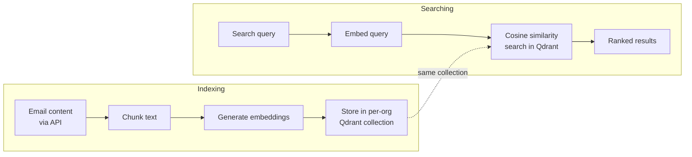

# AI-Powered Search

**Search your emails by meaning, not just keywords.**

The RAG (Retrieval-Augmented Generation) service (container port `8090`, published on host port `8091`) turns email content into vector embeddings stored in a Qdrant vector database. Searches embed the query the same way and rank stored vectors by cosine similarity — semantic search that works even when you don't use the exact words from the email.

## How it works



1. **Chunking.** Long emails are split into chunks (default 1,000 characters, 200-character overlap).
2. **Embedding.** Each chunk becomes a dense vector. The default provider (`sentence_transformers`, model `all-MiniLM-L6-v2`) runs locally — email content never leaves your infrastructure. OpenAI, Azure OpenAI, HuggingFace, and Ollama backends are supported via configuration.
3. **Storage.** Vectors land in Qdrant, one collection per organization (`{prefix}_{org_id}_{type}`, e.g. `mailrag_org123_emails`).
4. **Search.** The query vector is compared against the org's collection; matches return with relevance scores.

!!! warning "Indexing is API-driven, not automatic"
    Nothing in the mail flow indexes messages as they arrive. Content reaches Qdrant when your application (or the tenant surface) calls the indexing endpoints, or when a reindex is triggered per organization. Plan an ingestion step if you want the whole mailbox searchable.

## Configuration

### Core settings

| Variable | Default | Description |
|----------|---------|-------------|
| `RAG_MODE` | `local` | Operating mode |
| `RAG_HOST` / `RAG_PORT` / `RAG_WORKERS` | `0.0.0.0` / `8090` / `1` | Service binding |
| `RAG_ENABLE_MULTI_TENANCY` | `true` | Per-org Qdrant collections |
| `RAG_TENANT_ISOLATION_LEVEL` | `collection` | `collection` (separate collections) or `filter` |

### Qdrant settings

| Variable | Default | Description |
|----------|---------|-------------|
| `QDRANT_HOST` / `QDRANT_PORT` / `QDRANT_GRPC_PORT` | `localhost` / `6333` / `6334` | Qdrant location |
| `QDRANT_COLLECTION_PREFIX` | `mailrag` | Collection name prefix |
| `QDRANT_VECTOR_SIZE` | derived from the embedding model (`384` for the default) | Vector dimensions — set explicitly only to override |
| `QDRANT_DISTANCE_METRIC` | `cosine` | Similarity metric |

!!! note "Vector size follows the embedding model (fixed 2026-08-30)"
    `QDRANT_VECTOR_SIZE` used to default to **1536** (OpenAI ada-002) while the
    default local model produces **384**-dimensional vectors, so indexing into a
    fresh collection failed on the stock configuration. The vector size is now
    derived from the configured embedding model when the variable is unset, and
    collection creation always asks the **active** model for its dimension —
    logging a clear warning when an explicitly-set `QDRANT_VECTOR_SIZE`
    disagrees, and creating the collection at the model's dimension so indexing
    works.

### Embedding settings

| Variable | Default | Description |
|----------|---------|-------------|
| `EMBEDDING_PROVIDER` | `sentence_transformers` | `sentence_transformers`, `huggingface`, `ollama`, `openai`, `azure_openai` |
| `EMBEDDING_MODEL_NAME` | `all-MiniLM-L6-v2` | Model name |
| `EMBEDDING_PRIVACY_MODE` | `true` | Refuse cloud providers; local-only processing |
| `EMBEDDING_ENABLE_FALLBACK` | `true` | Fall back to another provider on failure |
| `EMBEDDING_BATCH_SIZE` / `EMBEDDING_MAX_SEQ_LENGTH` | `100` / `512` | Batch and sequence limits |
| `OPENAI_API_KEY`, `AZURE_OPENAI_*`, `HF_*` | — | Cloud/provider credentials when used |

### Chunking and search

| Variable | Default | Description |
|----------|---------|-------------|
| `CHUNK_SIZE` / `CHUNK_OVERLAP` | `1000` / `200` | Chunking parameters |
| `CHUNK_STRATEGY` / `CHUNK_PRESERVE_SENTENCES` | `recursive` / `true` | Chunking behavior |
| `SEARCH_STRATEGY` | `semantic` | Search type |
| `SEARCH_TOP_K` / `SEARCH_SCORE_THRESHOLD` | `10` / `0.7` | Result count and minimum score |
| `SEARCH_ENABLE_RERANKING` | `true` | Re-rank results |
| `SEARCH_CACHE_TTL` | `300` | Query cache TTL (seconds) |

## API endpoints

### Via the platform API (authenticated with `X-API-Key`, org-scoped)

The real gateway routes (see [RAG System](../api/rag-system.md) for bodies and
details):

```
POST /api/v1/rag/search                          # semantic search
GET  /api/v1/rag/rag/index/status/{domain}
POST /api/v1/rag/rag/index/trigger
GET  /api/v1/rag/collections/{domain}
POST /api/v1/rag/collections/{domain}
GET  /api/v1/rag/collections/{domain}/stats
POST /api/v1/rag/documents/{collection_id}       # add documents
GET  /api/v1/rag/organizations/{org_id}/collections
GET/PUT /api/v1/rag/organizations/{org_id}/rag/config
GET  /api/v1/rag/organizations/{org_id}/rag/stats
GET  /api/v1/rag/organizations/{org_id}/rag/documents
POST /api/v1/rag/organizations/{org_id}/rag/reindex
GET  /api/v1/rag/health
```

### Direct service endpoints (compose network / host port 8091)

```
GET  /api/v1/organizations/                             # list org RAG configs
GET/POST/DELETE /api/v1/organizations/{org_id}/config   # per-org indexing config
GET  /api/v1/organizations/{org_id}/indexing-status
POST /api/v1/organizations/{org_id}/reindex
GET  /api/v1/organizations/available-fields             # what can be indexed
GET  /health/                                           # Qdrant + embedding health
GET  /config                                            # effective configuration
GET  /admin/collections, /admin/metrics, /admin/embedding/models, ...
```

Interactive OpenAPI docs are served at `/docs` on the service.

## Things to know

- **Vector size follows your embedding model** — derived automatically; see the note above. Switching models still means re-indexing everything; vectors from different models are not comparable.

- **Privacy mode is on by default.** With `EMBEDDING_PRIVACY_MODE=true` the service refuses cloud embedding providers. Turn it off explicitly (and set the provider + API key) to use OpenAI or Azure.

- **Multi-tenancy is collection-per-org.** Search is scoped to the requesting organization's collection; Org A cannot find Org B's content. Collections are created on demand at first index.

- **Qdrant needs its own resources.** Vector indices live in RAM for fast search — roughly 1.5 GB per million 384-dimensional vectors. In production Qdrant is bound to loopback (`127.0.0.1:6333`).

- **RAG operations emit webhooks** — `rag.indexing.started`, `rag.indexing.complete`, `rag.search.complete`, and `rag.ai.transaction` flow through the [webhook system](webhooks.md).
